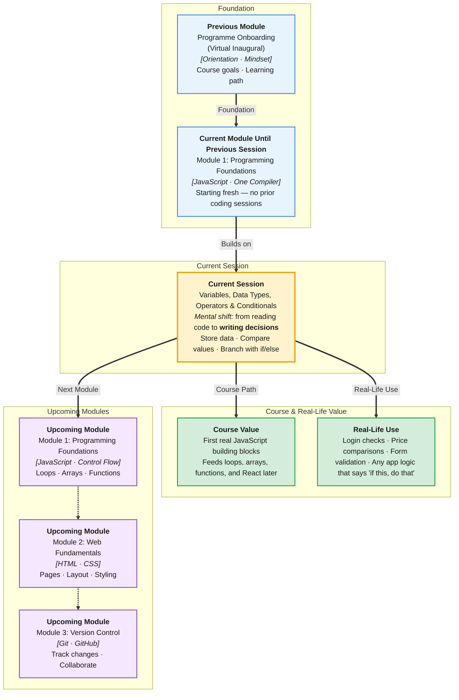

# Pre-Read: Variables, Data Types, Operators & Conditionals

## Session Mindmap

This diagram shows where this session sits in the course.



## 1. What You'll Learn

In this pre-read, you'll discover:

- How to **open One Compiler** and run your first JavaScript program
- How to **store information** using `let` and `const`
- How to **work with basic data types** like text, numbers, and true/false values
- How to **compare values and make decisions** with operators and `if/else`
- How to **trace what a program prints** step by step

---

## 2. Detailed Explanation

### What Is a Program?

A **program** (a set of instructions a computer follows) is like a recipe. You write steps. The computer runs them in order.

**One Compiler** is an online tool where you write and run JavaScript without installing anything. Open it, pick JavaScript, click Run, and see output instantly.

### Variables: Labeled Boxes for Data

A **variable** (a named container that holds a value) stores data you want to reuse.

- **`let`** — use when the value might change later
- **`const`** — use when the value should stay the same

Think of `let` as a sticky note you can rewrite. Think of `const` as a nameplate glued to a desk.

```javascript
let score = 10;
const userName = "Asha";
score = 15; // OK — score can change
```

### Core Data Types (Kinds of Values)

| Type | Meaning | Example |
|------|---------|---------|
| **string** (text) | Words and characters | `"hello"` |
| **number** (numeric value) | Whole or decimal numbers | `42`, `3.5` |
| **boolean** (true or false) | Yes/no decisions | `true`, `false` |
| **null** (empty on purpose) | "Nothing here, by design" | `null` |
| **undefined** (not set yet) | "No value assigned yet" | `undefined` |

### Why It Matters

Every app you use stores and compares data: login passwords, cart totals, dark mode on/off. Variables and types are the first building blocks. Without them, code cannot remember anything or make choices.

**Benefits:**
- You can build interactive programs that respond to input
- You can keep track of changing values like scores or counters
- You can write logic that behaves differently in different situations

### Operators: Tools for Working with Values

**Arithmetic operators** do math: `+`, `-`, `*`, `/`, `%` (remainder).

**Comparison operators** ask questions: `===` (equal?), `!==` (not equal?), `>`, `<`, `>=`, `<=`.

**Logical operators** combine conditions: `&&` (and), `||` (or), `!` (not).

**Assignment operators** put values into variables: `=`, `+=`, `-=`.

An **expression** (code that produces a value) can be as simple as `5 + 3` or `age >= 18`.

### Conditionals: Making Decisions

**`if/else`** lets your program choose a path:

```javascript
let age = 20;
if (age >= 18) {
  console.log("Adult ticket");
} else {
  console.log("Child ticket");
}
```

Use **`else if`** when you have more than two options:

```javascript
let marks = 75;
if (marks >= 90) {
  console.log("A");
} else if (marks >= 75) {
  console.log("B");
} else {
  console.log("C");
}
```

### Tracing Values

**Tracing** means following the program line by line and writing down what each variable holds. This skill helps you debug before you even run the code.

---

## 3. Practice Exercises

**Exercise 1 — Variables**
Create two variables: `city` (const) set to your city name, and `temperature` (let) set to any number. Print both with `console.log`.

**Exercise 2 — Decision**
Set `isLoggedIn` to `true` or `false`. Write an `if/else` that prints `"Welcome back"` if true, otherwise `"Please log in"`.

**Exercise 3 — Trace**
What will this print? Write your guess before running it in One Compiler:

```javascript
let x = 5;
x = x + 3;
if (x > 6) {
  console.log("big");
} else {
  console.log("small");
}
```
