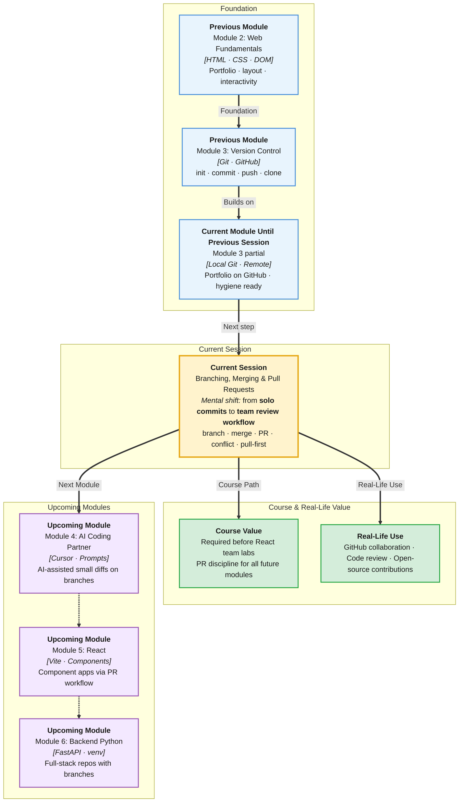

```mermaid
flowchart TB
    subgraph foundation ["Foundation"]
        direction TB
        P1["<b>Previous Module</b><br/>Module 2: Web Fundamentals<br/><i>[HTML · CSS · DOM]</i><br/>Portfolio · layout · interactivity"]
        P2["<b>Previous Module</b><br/>Module 3: Version Control<br/><i>[Git · GitHub]</i><br/>init · commit · push · clone"]
        CM["<b>Current Module Until Previous Session</b><br/>Module 3 partial<br/><i>[Local Git · Remote]</i><br/>Portfolio on GitHub · hygiene ready"]
    end

    subgraph current ["Current Session"]
        CS["<b>Current Session</b><br/>Branching, Merging & Pull Requests<br/><i>Mental shift:</i> from <b>solo commits</b> to <b>team review workflow</b><br/>branch · merge · PR · conflict · pull-first"]
    end

    subgraph value ["Course & Real-Life Value"]
        CV["<b>Course Value</b><br/>Required before React team labs<br/>PR discipline for all future modules"]
        RL["<b>Real-Life Use</b><br/>GitHub collaboration · Code review · Open-source contributions"]
    end

    subgraph future ["Upcoming Modules"]
        direction TB
        U1["<b>Upcoming Module</b><br/>Module 4: AI Coding Partner<br/><i>[Cursor · Prompts]</i><br/>AI-assisted small diffs on branches"]
        U2["<b>Upcoming Module</b><br/>Module 5: React<br/><i>[Vite · Components]</i><br/>Component apps via PR workflow"]
        U3["<b>Upcoming Module</b><br/>Module 6: Backend Python<br/><i>[FastAPI · venv]</i><br/>Full-stack repos with branches"]
    end

    P1 ==>|&nbsp;Foundation&nbsp;| P2
    P2 ==>|&nbsp;Builds on&nbsp;| CM
    CM ==>|&nbsp;Next step&nbsp;| CS
    CS ==>|&nbsp;Course Path&nbsp;| CV
    CS ==>|&nbsp;Real-Life Use&nbsp;| RL
    CS ==>|&nbsp;Next Module&nbsp;| U1
    U1 -.-> U2
    U2 -.-> U3

    classDef previous fill:#E8F4FD,stroke:#4A90D9,stroke-width:2px,color:#1a1a1a
    classDef current fill:#FFF3CD,stroke:#E6A817,stroke-width:3px,color:#1a1a1a
    classDef value fill:#D4EDDA,stroke:#28A745,stroke-width:2px,color:#1a1a1a
    classDef future fill:#F3E8FF,stroke:#9B59B6,stroke-width:2px,color:#1a1a1a

    class P1,P2,CM previous
    class CS current
    class CV,RL value
    class U1,U2,U3 future

    linkStyle default stroke-width:3px
```
