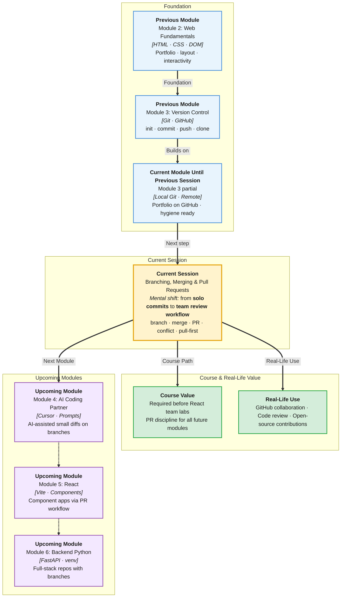

# Pre-Read: Branching, Merging & Pull Requests

## Session Mindmap

This diagram shows where this session sits in the course.



## 1. What You'll Learn

In this pre-read, you'll discover:

- How **branches** let you work on features without breaking the main codebase
- How to **create, switch, and merge branches** using `git branch`, `git switch`, and `git merge`
- Why **pull-before-push** prevents overwriting teammates' work on shared repos
- How to **open and merge a Pull Request** on GitHub — the industry standard review workflow
- How to **recognize and resolve a basic merge conflict** when two people edit the same line
- What a **short code review** looks like before merging to `main`

---

## 2. Detailed Explanation

### Why Branches Exist

Last session you pushed your portfolio to GitHub on `main`. Imagine you want to add a dark mode feature. A teammate is fixing the contact form on the same project. If you both edit files on `main` at the same time, chaos follows.

A **branch** (an independent line of development in Git) solves this. Think of `main` as the published book. A branch is a draft chapter you write separately. When the chapter is ready and reviewed, you merge it back.

**Analogy:** `main` is the master recipe in a restaurant kitchen. Branches are test dishes chefs prepare on the side. Only approved dishes get added to the master recipe.

> **In the Real World:** At **GitHub**, **Stripe**, and **Atlassian**, no engineer pushes directly to production `main` without a Pull Request. Teams run hundreds of feature branches per week. Your internship Day 1 task will likely be: "Create a branch, make a change, open a PR."

### Branch Commands You Need

| Command | What it does |
|---------|--------------|
| `git branch` | List all local branches |
| `git branch feature-name` | Create a new branch |
| `git switch feature-name` | Move to that branch |
| `git switch -c feature-name` | Create and switch in one step |
| `git merge feature-name` | Bring branch changes into current branch |

**Mental model:** Branches are cheap pointers to commits. Creating one takes seconds. Deleting after merge is normal.

```bash
git switch -c add-dark-mode
# edit styles.css
git add styles.css
git commit -m "Add dark mode toggle styles"
git switch main
git merge add-dark-mode
```

### Pull Before Push

When working on a **shared repository** (multiple people have access), always **pull** before **push**:

```bash
git pull origin main
# make your changes
git add .
git commit -m "Update nav links"
git push origin main
```

**Why?** Your teammate may have pushed commits you do not have. `git pull` downloads their work and merges it into yours. Pushing without pulling risks rejection or messy conflicts.

> **In the Real World:** **Slack** and **Discord** engineering teams use bots that remind developers to pull latest `main` before starting work. Out-of-date branches cause the most beginner merge conflicts.

### Pull Requests on GitHub

A **Pull Request (PR)** (a request to merge your branch into another branch, with a review step) is how teams collaborate on GitHub:

1. Push your feature branch: `git push -u origin add-dark-mode`
2. On GitHub, click **Compare & pull request**
3. Write a clear title and description
4. Request review from a teammate or mentor
5. After approval, click **Merge pull request**

**PR description template:**

```markdown
## What changed
- Added dark mode toggle button
- Updated CSS variables for theme switching

## How to test
1. Open index.html
2. Click the moon icon
3. Background should turn dark
```

### Merge Conflicts — What They Look Like

A **merge conflict** happens when Git cannot automatically combine two edits to the same lines.

```css
<<<<<<< HEAD
background-color: white;
=======
background-color: #1a1a2e;
>>>>>>> add-dark-mode
```

**Your job:** Delete the conflict markers (`<<<<<<<`, `=======`, `>>>>>>>`), keep the correct code (or combine both), then:

```bash
git add styles.css
git commit -m "Resolve dark mode merge conflict"
```

Do not panic. Conflicts are normal. Seniors resolve them daily.

### Code Review Basics

Before merging, a reviewer checks:

| Check | Question |
|-------|----------|
| Correctness | Does the code do what the PR claims? |
| Readability | Are names and structure clear? |
| Scope | Is the PR small and focused? |
| Hygiene | No secrets, no debug `console.log` spam? |

**As author:** Respond politely to feedback. Push fixes to the same branch — the PR updates automatically.

### Why It Matters

You already have a GitHub portfolio. Branches and PRs unlock:

- **Team projects** without stepping on each other
- **Interview credibility** — recruiters look for PR history
- **React deployment** next module — Vercel deploys from `main`; features ship via branches

**Benefits:**
- Safe experimentation on branches
- Review catches bugs before production
- Professional workflow matching every tech company

### Messy to Clear

**Messy workflow:**
- Everyone commits directly to `main`
- No PR descriptions
- Force push to fix mistakes
- 47 files changed in one PR

**Professional workflow:**
- Feature branch per task
- Pull before push every time
- PR with 3–10 file changes and test steps
- Mentor review before merge

### Building Blocks Checklist

- [ ] I can create and switch to a feature branch
- [ ] I understand why I pull before I push on shared repos
- [ ] I know what a Pull Request is on GitHub
- [ ] I can recognize conflict markers in a file
- [ ] I can write a short PR description with test steps

---

## 3. Practice Exercises

**Exercise 1 — Create a branch**
On your portfolio repo, run `git switch -c update-readme`. Edit README with one new line. Commit with message `Add live demo placeholder to README`. Run `git log --oneline` and confirm you are on the new branch.

**Exercise 2 — Merge locally**
Switch back to `main` with `git switch main`. Merge your branch: `git merge update-readme`. Verify README change appears on `main`.

**Exercise 3 — Push and open a PR**
Push the branch to GitHub: `git push -u origin update-readme`. Open a Pull Request on GitHub targeting `main`. Write a 2-sentence description.

**Exercise 4 — Pull before push**
If working with a classmate on a shared repo, have them push a change first. Run `git pull origin main` before making your edit. Push your change and confirm both commits exist in history.

**Exercise 5 — Conflict practice**
With mentor guidance, create a deliberate conflict: two branches edit the same line in `styles.css`. Attempt merge, identify conflict markers, resolve, and commit. Document what you kept and why in the commit message.
