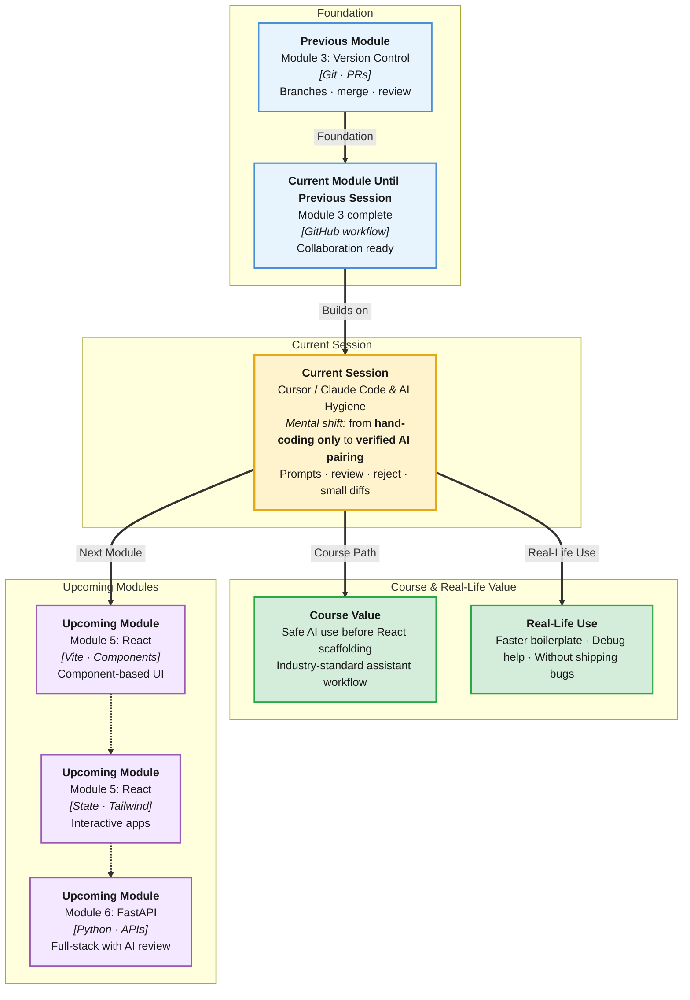

# Pre-Read: Cursor / Claude Code Setup & AI Hygiene

## Session Mindmap

This diagram shows where this session sits in the course.



## 1. What You'll Learn

In this pre-read, you'll discover:

- How to **set up Cursor or Claude Code** for your first guided coding task
- How to write **clear prompts** with intent, context, and constraints
- How to **review AI-generated code** before accepting it — like a senior engineer would
- When to **reject** unsafe, wrong, or over-scoped suggestions
- Why the **small-diff habit** keeps AI assistance under your control
- How teams at startups and enterprises use AI **without** shipping silent bugs

---

## 2. Detailed Explanation

### What Is AI-Assisted Coding?

Tools like **Cursor** and **Claude Code** use large language models to suggest code, explain errors, and scaffold features. They do not replace your thinking — they **accelerate** it when used with discipline.

> **In the Real World:** Engineers at **Shopify**, **Stripe**, and Indian startups use Copilot-style tools daily. Companies that ban AI entirely are rare; companies that use AI **without review** risk incidents. The winning pattern: **AI proposes, human verifies.**

**Analogy:** AI is a fast junior intern — enthusiastic, sometimes wrong, needs supervision.

### Setting Up Cursor (Overview)

1. Download Cursor from official site
2. Sign in and open your portfolio or React project folder
3. Open AI chat / Composer panel
4. Connect to your codebase context (open relevant files)
5. Run a tiny first task: "Add a comment explaining this function"

**First task should be small** — not "build entire app."

### Writing a Clear Coding Prompt

Weak prompt:
```
fix my code
```

Strong prompt:
```
In app.js, the click counter shows NaN after 3 clicks.
Expected: increment by 1 each click.
Constraint: use only getElementById and addEventListener — no frameworks.
Show me the fix and explain the bug in one sentence.
```

**Strong prompts include:**
| Part | Example |
|------|---------|
| **Intent** | "Add form validation for empty email" |
| **Context** | "File: index.html, form id=signup" |
| **Constraints** | "No libraries, beginner JS only" |
| **Output** | "Show only changed lines" |

### Reviewing AI Output Before Accept

**Checklist before Accept:**
- [ ] Does it solve the actual problem?
- [ ] Do I understand every line?
- [ ] Any hardcoded secrets or API keys?
- [ ] Any removed code I still need?
- [ ] Does it match course constraints (no advanced libs)?

> **In the Real World:** A developer accepted AI code that deleted error handling — production payments failed. **Always read the diff.**

### When to Reject Suggestions

**Reject if:**
- Suggests `eval()` or unsafe patterns
- Rewrites 500 lines when you asked for 5
- Invents files or APIs that do not exist
- Adds npm packages not allowed in assignment
- Contradicts your working logic without explanation

**[Script:]** "Reject is not failure. Reject is quality control."

### Small-Diff Habit

**Bad workflow:**
1. Prompt: "Build my whole portfolio"
2. Accept 40 files
3. Nothing works, no idea why

**Good workflow:**
1. Prompt: "Add footer with three social links to index.html"
2. Review 8 lines
3. Test in browser
4. Commit with Git
5. Next small prompt

**Benefits:**
- Easier debugging
- Cleaner Git history
- You stay in control of architecture

### AI Hygiene Rules for This Course

1. **Verify in browser or terminal** after every accept
2. **Never commit** code you cannot explain
3. **Disclose AI use** in README if mentor requires
4. **Keep prompts** inside learning objectives — no skipping fundamentals
5. **Pair AI with Git** — one small commit per verified change

### Messy to Clear

**Messy:** Blind accept → broken deploy → "AI is useless"

**Clear:** Targeted prompt → review → test → commit → repeat

### Building Blocks Checklist

- [ ] Cursor/Claude Code installed and opens my project
- [ ] I can write a prompt with intent + constraints
- [ ] I use a review checklist before accept
- [ ] I know when to reject
- [ ] I work in small diffs with Git commits

---

## 3. Practice Exercises

**Exercise 1 — Setup**
Open your portfolio in Cursor. Ask AI to explain what `app.js` does in 3 bullet points. Verify accuracy.

**Exercise 2 — Prompt upgrade**
Rewrite: "make button work" into a strong prompt with file name, expected behavior, and constraints.

**Exercise 3 — Review**
Given a sample AI snippet with an off-by-one bug, list 3 review checklist items that would catch it.

**Exercise 4 — Small diff**
Ask AI to add `alt` text to one image only. Accept only if change is under 5 lines. Test page.

**Exercise 5 — Reject practice**
Prompt AI for something out of scope (e.g. "add React to plain HTML project"). Practice rejecting and narrowing prompt.
