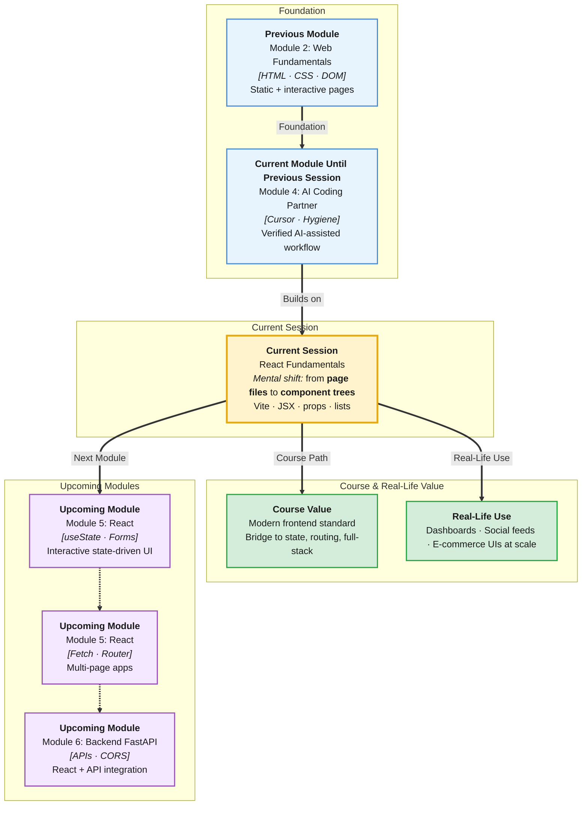

# Pre-Read: React Fundamentals

## Session Mindmap

This diagram shows where this session sits in the course.



## 1. What You'll Learn

In this pre-read, you'll discover:

- **Why React exists** and how component-based UI changed products like Facebook, Instagram, and Airbnb
- How to **create a React project with Vite** in minutes
- How to write **functional components** in JSX
- How **props** pass data from parent to child — like function arguments for UI
- How to **render lists** with `map` and why `key` matters for performance
- How React connects to the **HTML/CSS/JS skills** you already built

---

## 2. Detailed Explanation

### Why Not Plain HTML Forever?

Your portfolio used one `index.html` file. A real app like **Zomato** has hundreds of screens: menus, carts, orders, profiles. Copy-pasting HTML does not scale.

**React** is a JavaScript library for building UIs from **reusable components**.

**Component analogy:** LEGO bricks. `<Button />`, `<Navbar />`, `<ProductCard />` — assemble screens from bricks.

> **In the Real World:** **Meta** created React for complex feeds. **Netflix**, **WhatsApp Web**, and **Gmail** use React or similar component models. React job postings remain among the highest in frontend hiring.

### Vite + React Setup

```bash
npm create vite@latest my-react-app -- --template react
cd my-react-app
npm install
npm run dev
```

Open `http://localhost:5173` — default React app runs.

**Project structure (key files):**
```
src/
  App.jsx       # root component
  main.jsx      # entry point
  index.css     # global styles
index.html      # shell with <div id="root">
```

### What Is JSX?

**JSX** looks like HTML inside JavaScript:

```jsx
function Welcome() {
  return <h1>Hello, React!</h1>;
}
```

Browser does not understand JSX directly — Vite **compiles** it to JavaScript.

**Rule:** One component returns **one parent element** (or use `<>...</>` fragment).

### Functional Components

```jsx
function Greeting() {
  return <p>Welcome to IITP</p>;
}

export default Greeting;
```

Use in `App.jsx`:

```jsx
import Greeting from './Greeting';

function App() {
  return (
    <div>
      <Greeting />
    </div>
  );
}
```

### Props — Passing Data Down

**Props** (properties passed into components) are read-only inputs.

```jsx
function UserCard({ name, role }) {
  return (
    <div>
      <h2>{name}</h2>
      <p>{role}</p>
    </div>
  );
}

// Parent:
<UserCard name="Priya" role="Student" />
```

**Analogy:** Props are like parameters to a function — but for UI pieces.

### Rendering Lists with map and key

```jsx
const skills = ["HTML", "CSS", "JavaScript", "Git"];

function SkillList() {
  return (
    <ul>
      {skills.map((skill) => (
        <li key={skill}>{skill}</li>
      ))}
    </ul>
  );
}
```

**Why `key`?** React uses keys to track which list items changed. Use **stable unique** ids — not array index when list can reorder (mention index OK for static beginner lists).

> **In the Real World:** Product lists on **Amazon** re-render when filters change — React keys help efficient updates.

### React vs Your DOM Labs

| Plain DOM (Session 8) | React |
|-----------------------|-------|
| `document.querySelector` | Declarative components |
| Manual `textContent` updates | State drives UI (next session) |
| One HTML file | Component tree in JSX |

You still write JavaScript — React organizes it.

### Messy to Clear

**Messy:** 800-line `App.jsx` with everything inside.

**Clear:** Small components — `Header`, `ProjectList`, `Footer` — composed in `App`.

### Building Blocks Checklist

- [ ] I can run `npm create vite` and `npm run dev`
- [ ] I recognize JSX syntax
- [ ] I can pass props to a child component
- [ ] I can render a list with `map` and `key`
- [ ] I can explain components in one sentence

---

## 3. Practice Exercises

**Exercise 1 — Setup**
Create Vite React app. Change default heading to your name. Confirm hot reload works.

**Exercise 2 — Component**
Create `CourseCard.jsx` showing course title and duration as props. Render two cards in `App`.

**Exercise 3 — Props**
Pass `isOnline={true}` prop and display "Online" or "Offline" in component.

**Exercise 4 — List**
Render array of 5 project names as `<li>` with `map` and `key`.

**Exercise 5 — Compare**
In 2 sentences, explain how React components relate to functions you wrote in Module 1 JavaScript.
