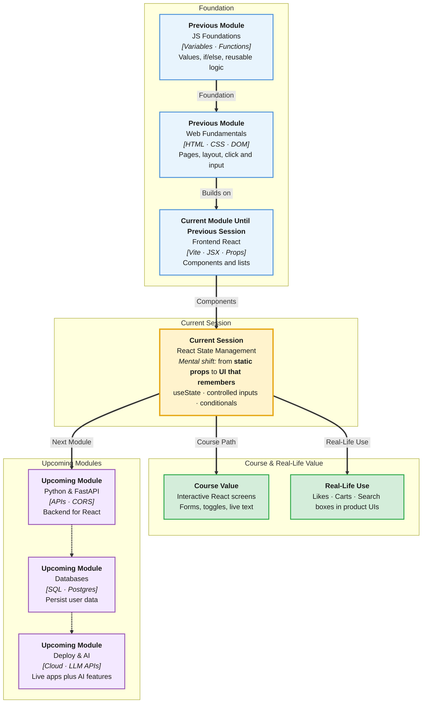

# Pre-Read: React State Management

## Session Mindmap

This diagram shows where this session sits in the course.



## 1. What You'll Learn

In this pre-read, you'll discover:

- How **`useState`** stores values that can change inside a component
- How to bind **controlled form inputs** so the input always matches state
- How **conditional rendering** with `&&` and ternary shows the right UI
- Why a **state update re-renders** the component
- How to sketch **one small interactive screen** driven by state

---

## 2. Detailed Explanation

### From Static Props to Living Screens

Last session, components showed **props** — data that flows in from a parent. Props do not change inside the child. Real products need memory: a cart count, a typed search, a like that stays filled.

**State** is data a component owns and can update. When state changes, React **re-renders** that component — it runs the function again and draws the new UI.

**One-line definition:** State is component-owned data that triggers a fresh render when it changes.

**Analogy:** Props are a printed menu. State is the kitchen ticket that updates when the cook adds an item. The screen (UI) reprints from the latest ticket.

> **In the Real World:** The like button on **Instagram**, the quantity stepper on **Amazon**, and the search box on **Swiggy** all keep UI in sync with changing values. That pattern is state.

### Why It Matters

**Real-world hook:** Users expect the page to react instantly. Without state, you would hand-edit the DOM like in your earlier labs — React’s job is to do that for you from one source of truth.

**Benefits:**
- **One source of truth** — the number on screen matches the number in memory
- **Less DOM spaghetti** — you describe UI from data, not querySelector chains
- **Forms that make sense** — typed text lives in state, so you can validate and submit it

### useState — The Building Block

Import the hook and call it inside a **function component**:

```jsx
import { useState } from "react";

function Counter() {
  const [count, setCount] = useState(0);
  return <p>{count}</p>;
}
```

| Piece | Meaning |
|-------|---------|
| `useState(0)` | Start with `0` |
| `count` | Current value (read it in JSX) |
| `setCount` | Function that schedules a new value |

**Rule:** Never write `count = count + 1`. Always call `setCount`. Direct assignment does not tell React to re-render.

**Updating from the previous value:**

```jsx
setCount((prev) => prev + 1);
```

Use this form when the next value depends on the current one (counters, toggles).

### State Update Means Re-render

**Mental model:** `setCount(1)` does not instantly change `count` on the next line. React queues the update, then **calls your component function again** with the new state.

```jsx
function Demo() {
  const [n, setN] = useState(0);
  const handleClick = () => {
    setN(n + 1);
    console.log(n); // still the old n in this click
  };
  return <button onClick={handleClick}>{n}</button>;
}
```

The **button label** updates on the next render. That is the re-render idea — stay with it; you do not need extra libraries yet.

> **In the Real World:** **WhatsApp Web** chat input and **Gmail** compose windows re-render as you type. Each keystroke updates state; React redraws the input from that state.

### Controlled Text Inputs

An **uncontrolled** input keeps its own value in the DOM. A **controlled** input’s `value` comes from React state, and `onChange` writes back to state.

```jsx
function NameField() {
  const [name, setName] = useState("");
  return (
    <input
      value={name}
      onChange={(e) => setName(e.target.value)}
    />
  );
}
```

**Analogy:** The input is a display. State is the notebook. Every keystroke copies the notebook to the display.

**Why It Matters:** You can show a live preview, disable Submit when empty, or clear the field with `setName("")`.

### Conditional Rendering — && and Ternary

**Show something only if a condition is true** (`&&`):

```jsx
{error && <p>Please type a name.</p>}
```

If `error` is falsy, React shows nothing. If it is truthy, React shows the `<p>`.

**Choose between two UIs** (ternary):

```jsx
{isLoggedIn ? <p>Welcome back</p> : <p>Please sign in</p>}
```

| Pattern | Use when |
|---------|----------|
| `condition && <UI />` | Show or hide one piece |
| `a ? <A /> : <B />` | Pick one of two pieces |

Stay simple: login banners, empty cart messages, “typing…” hints — not nested jungles.

> **In the Real World:** **Netflix** shows “Continue watching” only if you have history (`&&`). **LinkedIn** shows a profile vs a guest CTA with a ternary-style branch.

### Messy to Clear

**Messy:** Three separate DOM scripts updating a heading, a list, and a button label by id.

**Clear:** One `App` with `useState` for the message, JSX that reads that state, and a button that calls `setMessage`.

### One Small Interactive Screen

Wire these together: a text field, a greeting that uses the name, and a message if the field is empty.

```jsx
function HelloScreen() {
  const [name, setName] = useState("");
  return (
    <div>
      <input value={name} onChange={(e) => setName(e.target.value)} />
      {name ? <p>Hi, {name}</p> : <p>Type your name</p>}
    </div>
  );
}
```

That is a **state-driven screen**: input → state → conditional UI.

### Building Blocks Checklist

- [ ] I import `useState` from `"react"`
- [ ] I call `useState` only at the top of a function component
- [ ] I update with the setter, not by assigning the variable
- [ ] My inputs use `value` + `onChange` (controlled)
- [ ] I can hide or swap UI with `&&` or a ternary
- [ ] I can explain “setState → React re-renders” in one sentence

---

## 3. Practice Exercises

**Exercise 1 — Counter**  
Create a component with `count` starting at `0`. One button adds 1. Confirm the number on screen changes.

**Exercise 2 — Controlled input**  
Bind an `<input>` to `title`. Show `{title}` in an `<h2>` under the field as you type.

**Exercise 3 — Empty state**  
If `title` is `""`, show `<p>No title yet</p>` using `&&` or a ternary.

**Exercise 4 — Toggle**  
`const [on, setOn] = useState(false)`. A button sets `on` to the opposite. Show `"On"` or `"Off"` with a ternary.

**Exercise 5 — Mini screen**  
Combine a name input and a “Liked” boolean. Show a greeting and “Thanks!” only when liked is true. Keep it one component.
