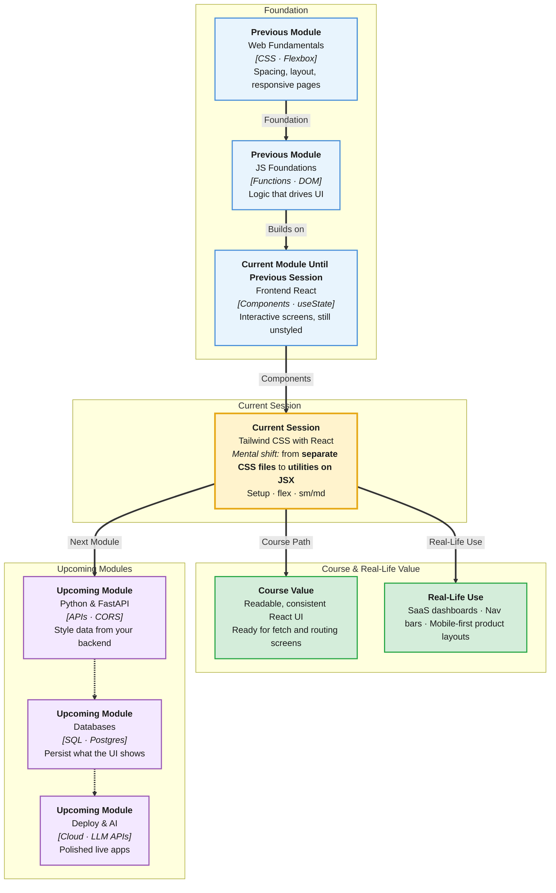

# Pre-Read: Tailwind CSS with React

## Session Mindmap

This diagram shows where this session sits in the course.



## 1. What You'll Learn

In this pre-read, you'll discover:

- How to **set up Tailwind** in a Vite React project
- How **utility classes** set spacing, color, and typography
- How **flex utilities** build a simple row or column layout
- How **`sm:` and `md:` prefixes** change styles at breakpoints
- How to **restyle an existing React component** using Tailwind only

---

## 2. Detailed Explanation

### CSS Files vs Utility Classes

You already wrote CSS with Flexbox and Grid. That still works in React (`className` + a `.css` file). **Tailwind CSS** is a different habit: you style in JSX with small **utility classes**.

**One-line definition:** Tailwind is a CSS toolkit of ready-made class names for spacing, color, type, flex, and more.

**Analogy:** Instead of sewing a custom shirt (a long CSS file), you snap LEGO studs onto the piece (`p-4`, `text-lg`, `flex`). Same look, faster assembly.

> **In the Real World:** Teams at **Vercel**, many **startup dashboards**, and lots of **SaaS** landing pages ship Tailwind. **GitHub**’s newer UI work and countless **Shopify**-style storefronts use utility-first CSS. Recruiters recognize Tailwind on resumes.

### Why It Matters

**Real-world hook:** Product designers iterate in Figma daily. Utility classes let you match padding and type without bouncing to a 400-line stylesheet.

**Benefits:**
- **Speed** — change `bg-blue-600` without naming a new class
- **Consistency** — spacing scale (`p-2`, `p-4`, `p-8`) stays even
- **React-friendly** — styles sit next to the component you are editing

### Set Up Tailwind in Vite React

Exact install commands can shift with Tailwind versions. In class you will follow the **current Vite + React official steps**. The idea stays the same:

1. Create or open a Vite React app
2. Install Tailwind and its Vite plugin (or PostCSS path, as docs show)
3. Import Tailwind in your CSS entry (`index.css`)
4. Restart `npm run dev`

**Mental model:** Vite bundles CSS. Tailwind scans your `.jsx` files for class names and generates only the CSS you used.

Stay with the trainer’s commands in lecture. Do not mix random blog posts from 2022.

### Core Utility Classes

| Goal | Example classes | Meaning |
|------|-----------------|---------|
| Spacing | `p-4`, `px-6`, `mt-2`, `gap-3` | padding, margin, gap |
| Color | `bg-slate-100`, `text-slate-800`, `bg-blue-600` | background and text |
| Typography | `text-sm`, `text-xl`, `font-bold` | size and weight |
| Shape | `rounded-lg`, `shadow` | corners and depth |

```jsx
function Card() {
  return (
    <div className="p-4 bg-white rounded-lg shadow">
      <h2 className="text-xl font-bold text-slate-800">Title</h2>
      <p className="mt-2 text-sm text-slate-600">Short note</p>
    </div>
  );
}
```

**Rule:** In JSX use **`className`**, not `class`.

### Flex Layout Utilities

You know Flexbox. Tailwind names the same ideas:

| CSS you know | Tailwind |
|--------------|----------|
| `display: flex` | `flex` |
| `flex-direction: column` | `flex-col` |
| `justify-content: space-between` | `justify-between` |
| `align-items: center` | `items-center` |
| `gap: 1rem` | `gap-4` |

```jsx
function Row() {
  return (
    <div className="flex items-center justify-between gap-4">
      <span>Logo</span>
      <span>Menu</span>
    </div>
  );
}
```

**Simple layout:** one navbar row, or a card with icon + text in a row. Not a full design system.

> **In the Real World:** **Airbnb** search bars and **Notion** top bars are flex rows: logo left, actions right. You will build that pattern with `flex` + `justify-between`.

### Responsive Prefixes — sm and md

**Mobile first:** write the small-screen style, then override at larger widths.

| Prefix | Typical idea |
|--------|----------------|
| (none) | Default (phones first) |
| `sm:` | Wider than the small breakpoint |
| `md:` | Wider than the medium breakpoint |

```jsx
<div className="flex flex-col md:flex-row gap-4">
  <section>Main</section>
  <aside>Side</aside>
</div>
```

On a phone: column. From `md` up: row. Same idea as your CSS Grid responsive lab — now as prefixes.

> **In the Real World:** **Amazon** product pages stack on mobile and sit side-by-side on desktop. **YouTube** nav is compact on phone, expanded on `md`.

### Messy to Clear

**Messy:** `App.css` with `#hero .title span` fighting a component rename.

**Clear:** `className="text-2xl font-bold text-slate-900"` on the heading in JSX.

### Restyle with Tailwind Only

Take last session’s `IntroCard` (or any small component). Remove custom CSS classes. Rebuild look with utilities: padding, background, flex row for input + button, `md:flex-row` if you stacked on mobile.

You are not adding new React features — only **className** strings.

### Building Blocks Checklist

- [ ] Tailwind is installed and `index.css` imports it
- [ ] I use `className` in JSX
- [ ] I can set padding, text size, and background
- [ ] I can make a flex row with `items-center` and `gap-*`
- [ ] I can add `sm:` or `md:` for a layout change
- [ ] I restyled one existing component without a new CSS file of my own

---

## 3. Practice Exercises

**Exercise 1 — Setup**  
Confirm Tailwind works: a `div` with `bg-blue-600 text-white p-4` shows a blue box.

**Exercise 2 — Type and color**  
Style a heading `text-2xl font-bold` and a paragraph `text-slate-600`.

**Exercise 3 — Flex row**  
Put a title and a button in `flex items-center justify-between`.

**Exercise 4 — Responsive**  
`flex-col md:flex-row` on a wrapper with two children. Resize the browser.

**Exercise 5 — Restyle**  
Pick your state-session card. Delete its old CSS class names. Rebuild with Tailwind utilities only.
