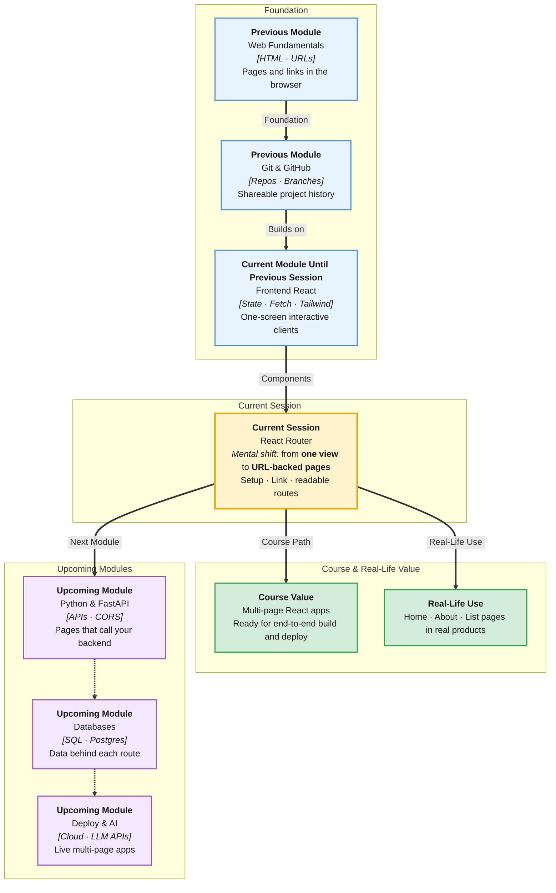

```mermaid
flowchart TB
    subgraph foundation ["Foundation"]
        direction TB
        P1["<b>Previous Module</b><br/>Web Fundamentals<br/><i>[HTML · URLs]</i><br/>Pages and links in the browser"]
        P2["<b>Previous Module</b><br/>Git & GitHub<br/><i>[Repos · Branches]</i><br/>Shareable project history"]
        CM["<b>Current Module Until Previous Session</b><br/>Frontend React<br/><i>[State · Fetch · Tailwind]</i><br/>One-screen interactive clients"]
    end

    subgraph current ["Current Session"]
        CS["<b>Current Session</b><br/>React Router<br/><i>Mental shift:</i> from <b>one view</b> to <b>URL-backed pages</b><br/>Setup · Link · readable routes"]
    end

    subgraph value ["Course & Real-Life Value"]
        CV["<b>Course Value</b><br/>Multi-page React apps<br/>Ready for end-to-end build and deploy"]
        RL["<b>Real-Life Use</b><br/>Home · About · List pages in real products"]
    end

    subgraph future ["Upcoming Modules"]
        direction TB
        U1["<b>Upcoming Module</b><br/>Python & FastAPI<br/><i>[APIs · CORS]</i><br/>Pages that call your backend"]
        U2["<b>Upcoming Module</b><br/>Databases<br/><i>[SQL · Postgres]</i><br/>Data behind each route"]
        U3["<b>Upcoming Module</b><br/>Deploy & AI<br/><i>[Cloud · LLM APIs]</i><br/>Live multi-page apps"]
    end

    P1 ==>|&nbsp;Foundation&nbsp;| P2
    P2 ==>|&nbsp;Builds on&nbsp;| CM
    CM ==>|&nbsp;Components&nbsp;| CS
    CS ==>|&nbsp;Course Path&nbsp;| CV
    CS ==>|&nbsp;Real-Life Use&nbsp;| RL
    CS ==>|&nbsp;Next Module&nbsp;| U1
    U1 -.-> U2
    U2 -.-> U3

    classDef previous fill:#E8F4FD,stroke:#4A90D9,stroke-width:2px,color:#1a1a1a
    classDef current fill:#FFF3CD,stroke:#E6A817,stroke-width:3px,color:#1a1a1a
    classDef value fill:#D4EDDA,stroke:#28A745,stroke-width:2px,color:#1a1a1a
    classDef future fill:#F3E8FF,stroke:#9B59B6,stroke-width:2px,color:#1a1a1a

    class P1,P2,CM previous
    class CS current
    class CV,RL value
    class U1,U2,U3 future

    linkStyle default stroke-width:3px
```
