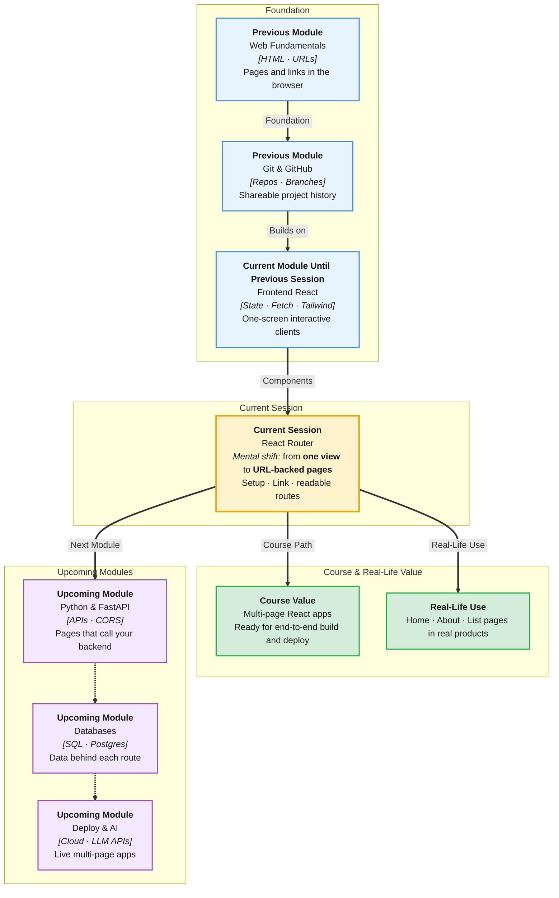

# Pre-Read: React Router

## Session Mindmap

This diagram shows where this session sits in the course.



## 1. What You'll Learn

In this pre-read, you'll discover:

- How to **set up React Router** in a Vite React project
- How to **define routes** for two or three pages
- How to **navigate with `Link`** instead of full page reloads
- How to **map each route to a page component**
- How to keep the **route list simple and readable**

---

## 2. Detailed Explanation

### One App, Several Screens

A Vite React app still has one `index.html`. **Netflix** is not one infinite scroll of every page. You move from Home to a title to Account. In React, that movement is **client-side routing**.

**React Router** is the library that shows a different component for a different URL path — without a full browser reload.

**One-line definition:** React Router maps a path like `/about` to a React page component.

**Analogy:** A mall directory. `/` is the food court. `/about` is the info desk. You walk (click a **Link**). You do not rebuild the mall (full refresh).

> **In the Real World:** **Airbnb** `/homes` vs `/experiences`, **GitHub** `/` vs `/issues`, **LinkedIn** feed vs `/in/you`, **Gmail** inbox vs settings — URL in the bar matches the screen. React apps at **Vercel** and **Shopify** admin UIs do the same.

### Why It Matters

**Real-world hook:** Users bookmark `/about`. Share links. Use Back. Routing makes those URLs real inside a single-page app.

**Benefits:**
- **Shareable URLs** — send `/posts`, not “click twice then scroll”
- **Faster feel** — no full reload between pages
- **Clear structure** — each page is a component you already know how to write

### Set Up in Vite React

Install the package the trainer specifies (commonly `react-router-dom`). Wrap the tree in a **router provider** in `main.jsx`. Put **route definitions** in `App.jsx` (or a tiny `routes` list — keep it readable).

You do not need nested layouts, loaders, or auth guards in this session.

### Routes for Two or Three Pages

**Route:** a pair of **path** + **element** (the page component).

Typical beginner set:

| Path | Page component | Role |
|------|----------------|------|
| `/` | `Home` | Landing |
| `/about` | `About` | Static info |
| `/posts` | `Posts` | Optional third page |

```jsx
<Routes>
  <Route path="/" element={<Home />} />
  <Route path="/about" element={<About />} />
</Routes>
```

**Rule:** Paths start with `/`. The component is normal React — props, state, Tailwind, fetch — nothing magic except where it is mounted.

### Link — Navigate Without Reload

Plain `<a href="/about">` can **reload** the whole Vite app. **`Link`** from React Router updates the URL and swaps the page component.

```jsx
import { Link } from "react-router-dom";

<nav>
  <Link to="/">Home</Link>
  <Link to="/about">About</Link>
</nav>
```

**`to`** is the path. Style the `Link` with Tailwind `className` if you want.

> **In the Real World:** **YouTube** left nav and **Amazon** header links feel instant because they are in-app navigation, not new HTML documents every time.

### Map Route to Page Component

Keep pages in files:

```
src/pages/Home.jsx
src/pages/About.jsx
src/pages/Posts.jsx
```

Each file exports a function component. `App.jsx` only wires **Routes** and a small **nav**. That is readable route structure.

### Messy to Clear

**Messy:** One `App.jsx` with `if (page === "about")` and buttons that set `page`. URLs never change. Back button breaks.

**Clear:** URL is the source of truth. `Route` list at the top of `App`. Pages in `pages/`.

### Keep It Simple

Do not nest five layouts. Do not add `useParams` unless the trainer demos one extra. Two or three flat routes is the goal.

### Building Blocks Checklist

- [ ] `react-router-dom` installed and the app wrapped in the router
- [ ] Two or three `<Route>` entries with clear paths
- [ ] Nav uses `<Link to="...">`
- [ ] Each path renders its own page component
- [ ] `App.jsx` route list is short enough to read in one glance

---

## 3. Practice Exercises

**Exercise 1 — Install wrap**  
Install the router. Wrap `App` as shown in class. Confirm the app still runs.

**Exercise 2 — Two routes**  
`Home` at `/` and `About` at `/about`. Each page is an `<h1>` plus one sentence.

**Exercise 3 — Link nav**  
Add a nav with two `Link`s. Click them. Confirm the URL bar changes and the page does not fully reload.

**Exercise 4 — Third page**  
Add `/posts` with a `Posts` component (even a static list). Wire a third `Link`.

**Exercise 5 — Readability**  
Move page components into `src/pages/`. Leave only nav + `Routes` in `App.jsx`. Screenshot the file — it should look like a table of contents.
