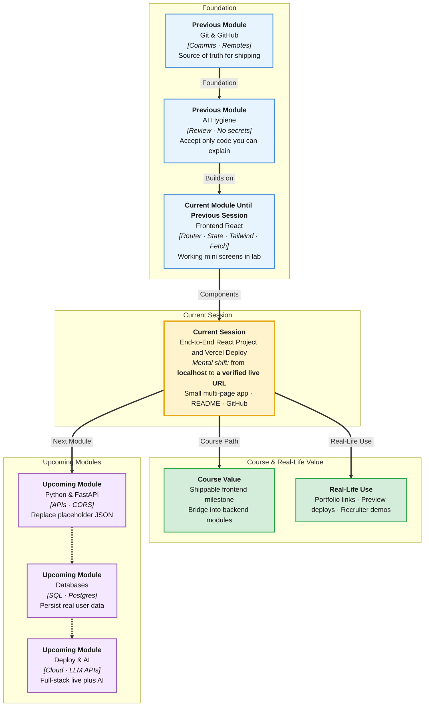

```mermaid
flowchart TB
    subgraph foundation ["Foundation"]
        direction TB
        P1["<b>Previous Module</b><br/>Git & GitHub<br/><i>[Commits · Remotes]</i><br/>Source of truth for shipping"]
        P2["<b>Previous Module</b><br/>AI Hygiene<br/><i>[Review · No secrets]</i><br/>Accept only code you can explain"]
        CM["<b>Current Module Until Previous Session</b><br/>Frontend React<br/><i>[Router · State · Tailwind · Fetch]</i><br/>Working mini screens in lab"]
    end

    subgraph current ["Current Session"]
        CS["<b>Current Session</b><br/>End-to-End React Project and Vercel Deploy<br/><i>Mental shift:</i> from <b>localhost</b> to <b>a verified live URL</b><br/>Small multi-page app · README · GitHub"]
    end

    subgraph value ["Course & Real-Life Value"]
        CV["<b>Course Value</b><br/>Shippable frontend milestone<br/>Bridge into backend modules"]
        RL["<b>Real-Life Use</b><br/>Portfolio links · Preview deploys · Recruiter demos"]
    end

    subgraph future ["Upcoming Modules"]
        direction TB
        U1["<b>Upcoming Module</b><br/>Python & FastAPI<br/><i>[APIs · CORS]</i><br/>Replace placeholder JSON"]
        U2["<b>Upcoming Module</b><br/>Databases<br/><i>[SQL · Postgres]</i><br/>Persist real user data"]
        U3["<b>Upcoming Module</b><br/>Deploy & AI<br/><i>[Cloud · LLM APIs]</i><br/>Full-stack live plus AI"]
    end

    P1 ==>|&nbsp;Foundation&nbsp;| P2
    P2 ==>|&nbsp;Builds on&nbsp;| CM
    CM ==>|&nbsp;Components&nbsp;| CS
    CS ==>|&nbsp;Course Path&nbsp;| CV
    CS ==>|&nbsp;Real-Life Use&nbsp;| RL
    CS ==>|&nbsp;Next Module&nbsp;| U1
    U1 -.-> U2
    U2 -.-> U3

    classDef previous fill:#E8F4FD,stroke:#4A90D9,stroke-width:2px,color:#1a1a1a
    classDef current fill:#FFF3CD,stroke:#E6A817,stroke-width:3px,color:#1a1a1a
    classDef value fill:#D4EDDA,stroke:#28A745,stroke-width:2px,color:#1a1a1a
    classDef future fill:#F3E8FF,stroke:#9B59B6,stroke-width:2px,color:#1a1a1a

    class P1,P2,CM previous
    class CS current
    class CV,RL value
    class U1,U2,U3 future

    linkStyle default stroke-width:3px
```
