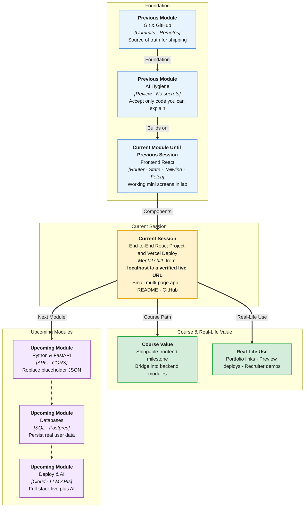

# Pre-Read: End-to-End React Project & Vercel Deploy

## Session Mindmap

This diagram shows where this session sits in the course.

## 1. What You'll Learn

In this pre-read, you'll discover:

- How to **finish a small multi-page React + Tailwind app** end to end
- How to **reuse** components, state, fetch, and routing you already practiced
- How to **review AI-generated code** before you accept it
- How to keep a **clean README** and **meaningful commits**
- How to **deploy to Vercel from GitHub** and check the live URL

---

## 2. Detailed Explanation

### End to End Means Small and Shippable

“End to end” here is **not** a huge product. It is: local app → GitHub → **live URL**. Scope stays a **small multi-page** app (Home + one or two other routes).

**One-line definition:** You reuse React skills, keep Git history readable, and host the frontend on Vercel.

**Analogy:** You baked a tray of cookies (lab screen). Today you box them, label the box (README), and put them in a shop window (Vercel). You do not open a factory.

> **In the Real World:** **Vercel** hosts the **v0** marketing site, countless **Next.js** apps, and many Vite React frontends. **GitHub → Vercel** is how indie hackers and teams at startups preview every push. **Netlify** is a cousin; this session uses Vercel.

### Why It Matters

**Real-world hook:** Recruiters click links. `localhost:5173` is not a link. A Vercel URL is.

**Benefits:**
- **Proof of work** — share on LinkedIn or a resume
- **Same pipeline** as many product teams (Git is the source of truth)
- **Habit** — README and commits are how teammates (and future you) survive

### Build a Small Multi-Page React + Tailwind App

Reuse, do not invent:

| Skill | Use it for |
|-------|------------|
| Components + props | Header, page sections |
| `useState` | One interactive bit (toggle, input, counter) |
| Tailwind | Layout, nav, cards, `md:` if useful |
| `fetch` | Optional: JSONPlaceholder on a Posts page |
| React Router | `/`, `/about`, maybe `/posts` |

If fetch fails offline, keep static content on that page and note it. The deploy LO still holds.

### Reuse Prior Skills on Purpose

Before adding a library, ask: can I do this with what we taught? Extra state libraries, auth, and payment are **out of scope**.

### Review AI-Generated Code Before Accepting It

Cursor and chat tools will happily write a 200-line `App.jsx`. **You** own every line you commit.

**Review checklist:**

- [ ] I can explain each import
- [ ] No API keys in the repo
- [ ] No extra packages I did not install on purpose
- [ ] Routes and components match the simple structure from class
- [ ] I ran the app and clicked every `Link`

> **In the Real World:** **GitHub Copilot** and in-house AI at **Microsoft** and **Google** still require human review. Shipping unread AI is how secrets and broken builds leak.

### Clean README and Meaningful Commits

**README** (short):

- Project name and one-sentence purpose
- `npm install` / `npm run dev`
- Live URL after deploy
- Stack: React, Vite, Tailwind, React Router (if used)

**Commits** (examples):

- `Add Home and About routes`
- `Style nav with Tailwind flex`
- `Fetch sample posts for Posts page`

Avoid `update` and `final final 2`. You already practiced Git hygiene.

### Deploy to Vercel from GitHub

Typical flow (trainer will click it live):

1. Push the Vite React app to **GitHub** (no `node_modules`, thanks to `.gitignore`)
2. Sign in to **Vercel** with GitHub
3. Import the repo, framework preset **Vite**, deploy
4. Open the **production URL**
5. Click through pages; fix if blank (often wrong root directory or build command)

**Verify:** HTTPS URL loads. Router links work. If a path 404s on refresh, trainer may show Vercel SPA rewrite — only if it appears. Stay with “verify the live URL.”

> **In the Real World:** **Vercel** preview URLs on pull requests are how **frontend teams** at modern startups review UI. Production is the same button with a custom domain later.

### Messy to Clear

**Messy:** Uncommitted broken main, empty README, deploy from a zip upload, AI dump you cannot run.

**Clear:** Small pages, reviewed code, three good commits, README with live link.

### Building Blocks Checklist

- [ ] Multi-page app runs locally
- [ ] I reused taught skills only
- [ ] I rejected or edited AI output I did not understand
- [ ] README explains run + live URL
- [ ] GitHub has the source
- [ ] Vercel URL works in an incognito window

---

## 3. Practice Exercises

**Exercise 1 — Sitemap**  
List 2–3 paths and what each page shows. Keep it on one sticky note.

**Exercise 2 — AI review drill**  
Paste 10 lines of AI JSX. Delete anything you cannot explain. That is the bar.

**Exercise 3 — README draft**  
Write the title, three run steps, and a placeholder `Live: (add after deploy)`.

**Exercise 4 — Commit plan**  
Write three commit messages you intend to make (features, not “fix”).

**Exercise 5 — Deploy dry-run**  
Confirm GitHub login works. Confirm the repo has no `node_modules`. You will connect Vercel in class.
