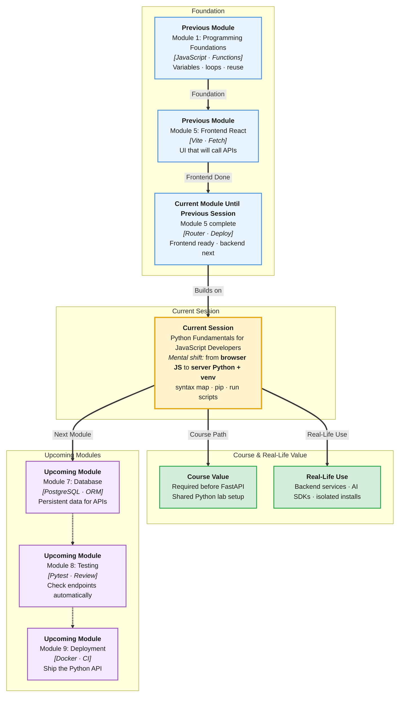

```mermaid
%%{init: {'flowchart': {'nodeSpacing': 42, 'rankSpacing': 52, 'diagramPadding': 16}}}%%
flowchart TB
    subgraph foundation ["Foundation"]
        direction TB
        P1["<b>Previous Module</b><br/>Module 1: Programming Foundations<br/><i>[JavaScript · Functions]</i><br/>Variables · loops · reuse"]
        P2["<b>Previous Module</b><br/>Module 5: Frontend React<br/><i>[Vite · Fetch]</i><br/>UI that will call APIs"]
        CM["<b>Current Module Until Previous Session</b><br/>Module 5 complete<br/><i>[Router · Deploy]</i><br/>Frontend ready · backend next"]
    end

    subgraph current ["Current Session"]
        CS["<b>Current Session</b><br/>Python Fundamentals for JavaScript Developers<br/><i>Mental shift:</i> from <b>browser JS</b> to <b>server Python + venv</b><br/>syntax map · pip · run scripts"]
    end

    subgraph value ["Course & Real-Life Value"]
        CV["<b>Course Value</b><br/>Required before FastAPI<br/>Shared Python lab setup"]
        RL["<b>Real-Life Use</b><br/>Backend services · AI SDKs · isolated installs"]
    end

    subgraph future ["Upcoming Modules"]
        direction TB
        U1["<b>Upcoming Module</b><br/>Module 7: Database<br/><i>[PostgreSQL · ORM]</i><br/>Persistent data for APIs"]
        U2["<b>Upcoming Module</b><br/>Module 8: Testing<br/><i>[Pytest · Review]</i><br/>Check endpoints automatically"]
        U3["<b>Upcoming Module</b><br/>Module 9: Deployment<br/><i>[Docker · CI]</i><br/>Ship the Python API"]
    end

    P1 ==>|&nbsp;Foundation&nbsp;| P2
    P2 ==>|&nbsp;Frontend Done&nbsp;| CM
    CM ==>|&nbsp;Builds on&nbsp;| CS
    CS ==>|&nbsp;Course Path&nbsp;| CV
    CS ==>|&nbsp;Real-Life Use&nbsp;| RL
    CS ==>|&nbsp;Next Module&nbsp;| U1
    U1 -.-> U2
    U2 -.-> U3

    classDef previous fill:#E8F4FD,stroke:#4A90D9,stroke-width:2px,color:#1a1a1a
    classDef current fill:#FFF3CD,stroke:#E6A817,stroke-width:3px,color:#1a1a1a
    classDef value fill:#D4EDDA,stroke:#28A745,stroke-width:2px,color:#1a1a1a
    classDef future fill:#F3E8FF,stroke:#9B59B6,stroke-width:2px,color:#1a1a1a

    class P1,P2,CM previous
    class CS current
    class CV,RL value
    class U1,U2,U3 future

    linkStyle default stroke-width:3px
```
