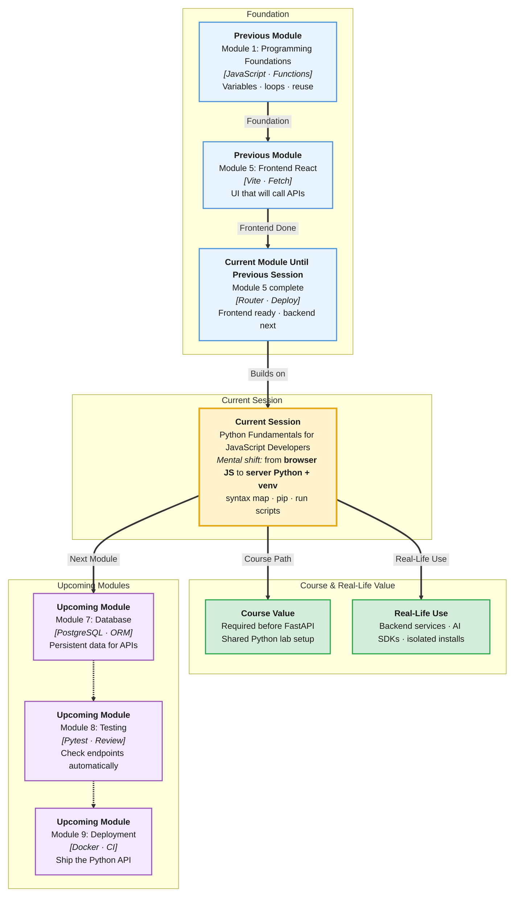

# Pre-Read: Python Fundamentals for JavaScript Developers

## Session Mindmap

This diagram shows where this session sits in the course.



## 1. What You'll Learn

In this pre-read, you'll discover:

- How **JavaScript ideas** map to **Python syntax**
- How to write Python with **variables**, **conditionals**, **loops**, and **functions**
- What a **virtual environment (venv)** is and why teams use it
- How to **install a package with pip** inside a venv
- How to **run a short Python script** on your machine

---

## 2. Detailed Explanation

### You Already Know Programming

You wrote **JavaScript** (the language of the browser). **Python** is another language. The ideas stay the same. The spelling changes.

**One-line definition:** Python is a language used for **backends**, data work, and AI APIs.

**Analogy:** You know how to drive a car. Python is a different car. Pedals still mean go and stop. The dashboard looks new.

> **In the Real World:** **Instagram**, **Spotify**, and **Dropbox** run large Python backends. Many AI tools ship Python SDKs first. Your React app will soon talk to a Python API.

### Why It Matters

You cannot run FastAPI in the browser. The server needs Python.

Benefits:

- You reuse **if**, **loops**, and **functions** from JavaScript
- A **venv** keeps class packages off your system Python
- **pip** is how you add FastAPI next session

### Python vs JavaScript (Side by Side)

| Idea | JavaScript | Python |
|------|------------|--------|
| Variable | `let count = 3;` | `count = 3` |
| Constant habit | `const name = "Asha";` | `name = "Asha"` (convention: do not reassign) |
| Text | `"hello"` | `"hello"` or `'hello'` |
| True / false | `true` / `false` | `True` / `False` |
| List of items | `[1, 2, 3]` | `[1, 2, 3]` (**list**) |
| Named fields | `{ name: "Asha" }` | `{ "name": "Asha" }` (**dict**) |
| Block | `{ }` curly braces | **Indentation** (spaces) |
| Else-if | `else if` | `elif` |
| Print | `console.log(x)` | `print(x)` |
| Function | `function add(a, b) { return a + b; }` | `def add(a, b): return a + b` |
| Nothing | `null` / `undefined` | `None` |

**Common trap:** Python is picky about spaces. Mix tabs and spaces and the file fails.

### Types You Will Use

**int** — whole numbers (`18`, `0`).  
**float** — decimals (`18.5`).  
**str** — text (`"campus"`).  
**bool** — `True` or `False`.  
**list** — ordered items, like a JS array.  
**dict** — key-value pairs, like a JS object (keys are usually strings).

```python
age = 21
score = 88.5
name = "Priya"
is_enrolled = True
skills = ["html", "css", "js"]
student = {"name": "Priya", "age": 21}
```

### Conditionals and Loops

```python
if score >= 40:
    print("pass")
elif score >= 20:
    print("retest")
else:
    print("fail")

for skill in skills:
    print(skill)
```

**for** walks a list. **while** repeats until a condition is false. Same job as JS `for` / `while`.

### Functions

```python
def greet(name):
    return "Hello, " + name

print(greet("IITP"))
```

**def** means define. Colon starts the body. Indent the body. **return** sends a value back, like JS.

### Virtual Environment (venv)

**venv** is a private folder of Python packages for one project.

**Analogy:** A lunchbox for this class. Do not mix it with yesterday's lunch (other projects).

| Without venv | With venv |
|--------------|-----------|
| Packages install globally | Packages stay in the project |
| Version clashes between courses | FastAPI version is isolated |
| Hard to share setup | Teammates run the same `pip install` |

Create and activate (macOS / Linux):

```bash
python3 -m venv .venv
source .venv/bin/activate
```

Windows (PowerShell): `.\.venv\Scripts\Activate.ps1`

Your prompt often shows `(.venv)` when it is on.

### pip

**pip** installs packages **into the active venv**.

```bash
pip install requests
```

Install only after you **activate**. Otherwise the package goes to the wrong Python.

### Run a Script

Save `hello.py`:

```python
print("backend starts here")
```

Run:

```bash
python hello.py
```

You should see `backend starts here`.

### Messy to Clear

**Messy:** Install packages on system Python. Class code breaks at home.

**Clear:** Create `.venv`, activate, `pip install`, run `python script.py`.

### Building Blocks Checklist

- [ ] I can map JS `let`, arrays, and objects to Python
- [ ] I can write `if` / `elif` / `else` and a `for` loop
- [ ] I can write a `def` function with `return`
- [ ] I can create and activate a venv
- [ ] I can `pip install` inside the venv and run a `.py` file

---

## 3. Practice Exercises

**Exercise 1 — Map it**  
Write a 4-row table on paper: JS `true`, `null`, array, object → Python names.

**Exercise 2 — Script**  
Create `grade.py`. Store `marks = 72`. Print `"pass"` if `marks >= 40`, else `"fail"`.

**Exercise 3 — Loop + function**  
Write `def double(n): return n * 2`. Loop over `[1, 2, 3]` and print each doubled value.

**Exercise 4 — venv**  
In a new folder, create `.venv`, activate it, and confirm the prompt shows `(.venv)`.

**Exercise 5 — pip**  
With the venv active, run `pip install requests`. Then run `python -c "import requests; print('ok')"`.
