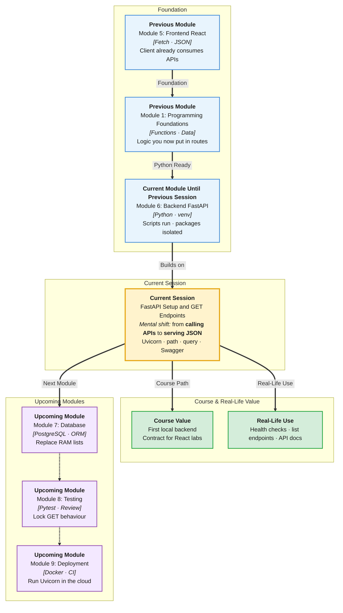

# Pre-Read: FastAPI Setup & GET Endpoints

## Session Mindmap

This diagram shows where this session sits in the course.



## 1. What You'll Learn

In this pre-read, you'll discover:

- How to **create a FastAPI app** and run it with **Uvicorn**
- How a **GET** route returns **JSON**
- The difference between **path parameters** and **query parameters**
- How to **test in Swagger UI** at `/docs`
- How to **serve data from an in-memory store** (a Python list or dict)

---

## 2. Detailed Explanation

### The Backend Is a Waiter

Your React app already used **fetch** to GET JSON from the internet. Today you **own** the kitchen.

**One-line definition:** **FastAPI** is a Python framework for building HTTP APIs. **Uvicorn** is the process that listens on a port and runs your app.

**Analogy:** FastAPI is the restaurant menu and recipes. Uvicorn is the open door and the host who takes orders.

> **In the Real World:** Teams expose JSON APIs so a React site, a mobile app, and an admin tool share one backend. Swagger-style docs are how frontend and backend agree on URLs.

### Why It Matters

- React needs a stable URL like `GET /items`
- JSON is the common language you already parsed with `fetch`
- Swagger lets you click and try before you write frontend code

### Minimal App

Activate your **venv**. Install:

```bash
pip install fastapi uvicorn
```

`main.py`:

```python
from fastapi import FastAPI

app = FastAPI()

@app.get("/")
def home():
    return {"message": "ok"}
```

Run:

```bash
uvicorn main:app --reload
```

Open `http://127.0.0.1:8000`. You should see JSON. Open `http://127.0.0.1:8000/docs` for **Swagger UI**.

`main:app` means file `main.py`, variable `app`. `--reload` restarts when you save.

### GET Returns JSON

**GET** means "read." FastAPI turns a **dict** into JSON for you.

You do not write `JSON.stringify`. Return a dict. The client receives JSON.

### Path vs Query

| Kind | Where it lives | Example URL | Typical use |
|------|----------------|-------------|-------------|
| **Path parameter** | Inside the path | `/items/3` | One resource id |
| **Query parameter** | After `?` | `/items?limit=2` | Filters, search, paging |

```python
@app.get("/items/{item_id}")
def read_item(item_id: int):
    return {"id": item_id}

@app.get("/search")
def search(q: str = ""):
    return {"q": q}
```

### In-Memory Store

An **in-memory store** is a list or dict in Python RAM. Restart the server and data resets. That is OK for this session.

```python
items = [
    {"id": 1, "name": "Notebook"},
    {"id": 2, "name": "Pen"},
]
```

A GET can return the whole list. Another GET can return one dict by id.

### Messy to Clear

**Messy:** Hard-code JSON in React and pretend it is a backend.

**Clear:** One FastAPI app, GET routes, Swagger checks, React will call it later.

### Building Blocks Checklist

- [ ] I can start Uvicorn and open `/` and `/docs`
- [ ] I can write `@app.get` that returns a dict
- [ ] I can use a path param and a query param
- [ ] I can try the route in Swagger
- [ ] I can return items from a list in memory

---

## 3. Practice Exercises

**Exercise 1 — Run**  
Create `main.py` with `GET /` returning `{"course": "IITP"}`. Run Uvicorn. Open the URL.

**Exercise 2 — JSON GET**  
Add `GET /health` returning `{"status": "up"}`. Confirm in the browser.

**Exercise 3 — Path**  
Add `GET /students/{student_id}`. Return `{"id": student_id}`. Try id `7` in Swagger.

**Exercise 4 — Query**  
Add `GET /greet?name=Priya` that returns `{"hello": name}`. Change the query and retry.

**Exercise 5 — Store**  
Put three campus events in a list. `GET /events` returns the list. Do not use a database yet.
