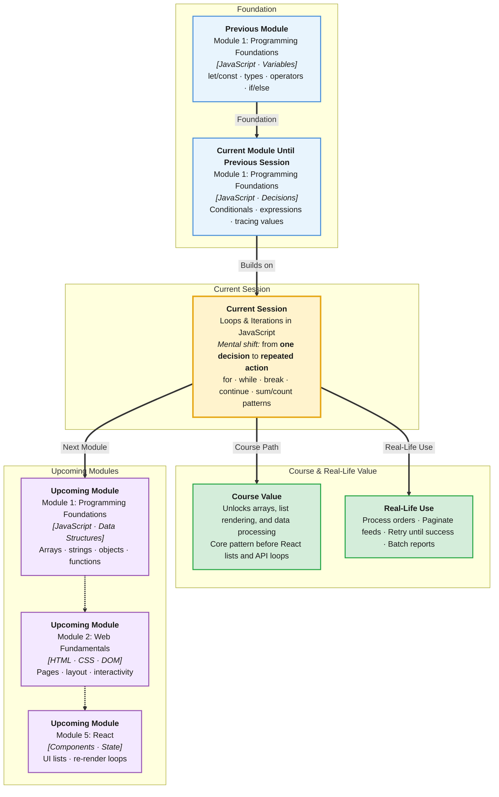

# Pre-Read: Loops & Iterations in JavaScript

## Session Mindmap

This diagram shows where this session sits in the course.



## 1. What You'll Learn

In this pre-read, you'll discover:

- How to **repeat actions automatically** with `for` and `while` loops
- When to **choose `for` vs `while`** for a given problem
- How to **stop or skip** loop steps using `break` and `continue`
- How to **sum and count** using loop patterns you will reuse everywhere
- How to **solve short loop exercises** confidently in One Compiler

---

## 2. Detailed Explanation

### Why Loops Exist

Imagine printing numbers 1 to 100 without a loop. You would write 100 lines. A **loop** (code that repeats a block until a condition is met) does that work for you.

**Analogy:** A loop is like a dishwasher cycle — same steps repeated until the job is done.

### The `for` Loop — Known Repetitions

Use a **`for` loop** when you know **how many times** to repeat.

```javascript
for (let i = 1; i <= 5; i++) {
  console.log(i);
}
```

- **Initialization** — start value (`let i = 1`)
- **Condition** — keep going while true (`i <= 5`)
- **Update** — change after each round (`i++`)

### The `while` Loop — Unknown Repetitions

Use a **`while` loop** when you repeat **until a condition changes**.

```javascript
let count = 1;
while (count <= 5) {
  console.log(count);
  count++;
}
```

**Warning:** If the condition never becomes false, you get an **infinite loop** (runs forever).

### `break` and `continue`

- **`break`** — exit the loop immediately (like leaving a game early)
- **`continue`** — skip the rest of this round and go to the next one

```javascript
for (let i = 1; i <= 5; i++) {
  if (i === 3) continue;
  console.log(i);
}
// Prints 1, 2, 4, 5 — skips 3
```

### Common Patterns

**Counting:** Start at 0 or 1, increment each time.

**Summing:** Start `sum = 0`, add each value inside the loop.

```javascript
let sum = 0;
for (let n = 1; n <= 4; n++) {
  sum = sum + n;
}
console.log(sum); // 10
```

### Why It Matters

Loops power feeds, search results, game levels, and data processing. Without loops, programs cannot scale.

**Benefits:**
- Handle 10 or 10,000 items with the same few lines
- Automate boring repetitive tasks
- Build patterns used in arrays and APIs later

### Choosing `for` vs `while`

| Situation | Best choice |
|-----------|-------------|
| Fixed number of times | `for` |
| Repeat until user quits or data ends | `while` |
| Counting 1 to N | `for` |

---

## 3. Practice Exercises

**Exercise 1 — Countdown**
Use a `for` loop to print numbers from 5 down to 1.

**Exercise 2 — Sum**
Use a loop to find the sum of numbers 1 through 10. What is the answer?

**Exercise 3 — Skip evens**
Print only odd numbers from 1 to 10. Hint: use `continue` when a number is even.
