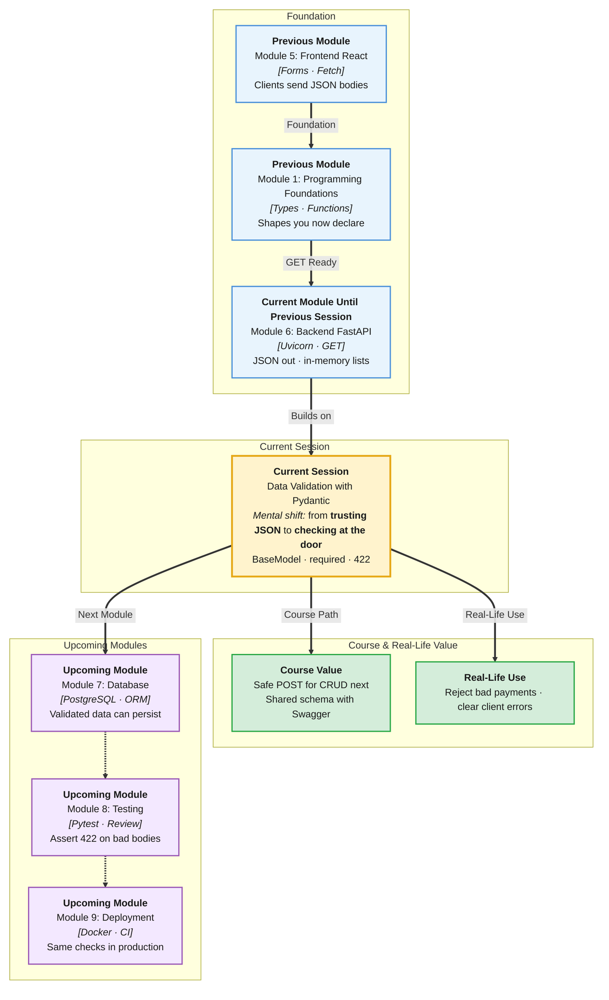

# Pre-Read: Data Validation with Pydantic

## Session Mindmap

This diagram shows where this session sits in the course.



## 1. What You'll Learn

In this pre-read, you'll discover:

- How to create a **Pydantic BaseModel** with **typed fields**
- How to mark fields **required** or **optional with defaults**
- How to **trigger and read a validation error**
- How to **attach a model as a FastAPI request body**
- **Why validation belongs at the API boundary**

---

## 2. Detailed Explanation

### Bad JSON Will Arrive

React users type anything. Mobile apps send old fields. Typos happen.

**One-line definition:** **Pydantic** checks incoming data against a **model** (a typed shape) before your route logic runs.

**Analogy:** A security desk at campus gate. ID must match the list. Wrong type? You do not enter the building.

> **In the Real World:** Payment APIs reject a missing `amount` before they charge a card. Support teams read the error JSON and fix the client. Validation at the door saves the database from junk.

### Why It Matters

- Your route can assume types after the model passes
- Error messages are automatic and consistent
- Frontend and backend share one idea of "a Task"

### BaseModel with Types

```python
from pydantic import BaseModel

class Item(BaseModel):
    name: str
    price: float
```

**Typed fields** mean `name` must be text and `price` must be a number.

### Required vs Optional

| Field style | Meaning | Example |
|-------------|---------|---------|
| `name: str` | **Required** — must be sent | `"Notebook"` |
| `tag: str = "general"` | **Optional** — default if missing | `"general"` |
| `note: str \| None = None` | Optional empty | `null` |

If `name` is missing, validation fails. If `tag` is missing, Pydantic fills the default.

### Validation Errors

Send `{"price": "free"}` when `price` is `float`. FastAPI returns **422**. The JSON body lists the field and the problem.

**Read the error:** look at `detail` → `loc` (where) and `msg` (what).

You do not write that error by hand. Pydantic builds it.

### Model as Request Body

```python
from fastapi import FastAPI
from pydantic import BaseModel

app = FastAPI()

class Item(BaseModel):
    name: str
    price: float = 0.0

@app.post("/items")
def create_item(item: Item):
    return item
```

The parameter type `Item` tells FastAPI: parse JSON body into `Item`. Swagger shows the schema.

This session uses POST only as the **body vehicle**. Full CRUD is next.

### Why the API Boundary?

The **API boundary** is the moment HTTP JSON becomes Python objects.

| Validate here | Skip here |
|---------------|-----------|
| One check for React, Postman, Swagger | Every function re-checks types |
| Junk never reaches your list | Bad dicts crash later |
| Clear 422 for the client | Mystery 500 |

### Messy to Clear

**Messy:** `data = await request.json()` then hope `data["name"]` exists.

**Clear:** `item: Item` — required fields and types declared once.

### Building Blocks Checklist

- [ ] I can write a `BaseModel` with types
- [ ] I can add a default for an optional field
- [ ] I can cause a 422 and read `detail`
- [ ] I can use the model on a POST body
- [ ] I can explain "validate at the boundary" in one sentence

---

## 3. Practice Exercises

**Exercise 1 — Model**  
Write `Student` with `name: str` and `year: int`. Create one valid instance in a tiny script and `print` it.

**Exercise 2 — Default**  
Add `campus: str = "Patna"`. Build a student with only `name` and `year`. Confirm `campus` is `"Patna"`.

**Exercise 3 — Error**  
In Swagger, POST a body missing `name`. Write down the `loc` and `msg` from `detail`.

**Exercise 4 — Attach**  
Wire `Student` as the body of `POST /students` and return the model.

**Exercise 5 — Boundary**  
In three bullets, answer: why not validate only inside React?
