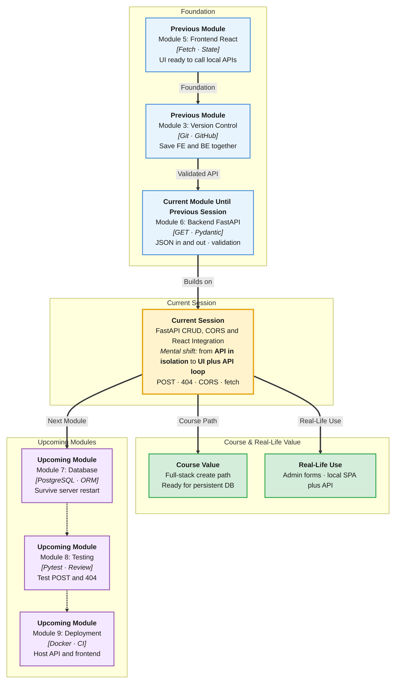

# Pre-Read: FastAPI CRUD, CORS & React Integration

## Session Mindmap

This diagram shows where this session sits in the course.



## 1. What You'll Learn

In this pre-read, you'll discover:

- How to **POST** and **PUT or DELETE** on an **in-memory** resource
- How to return **status codes** and clear **error messages**
- Why **CORS** blocks the browser and how to **enable it for local React**
- How to **call list and create from React with fetch**
- How to **trace one full create flow** from UI to API

---

## 2. Detailed Explanation

### Read Was Not Enough

GET lists data. Real apps also **create**, **update**, and **delete**.

**CRUD** means Create, Read, Update, Delete. You already Read. Today you add write paths on the same Python list.

**Analogy:** A whiteboard at the hostel notice board. GET is reading it. POST is pinning a new note. PUT is replacing a note. DELETE is taking it down. Wipe the board (restart server) and notes vanish. Database comes later.

> **In the Real World:** Every todo app, cart, and admin table is CRUD. **Trello** cards and **Jira** issues follow this pattern. Frontend and backend must share status codes so the UI can show "created" vs "not found."

### Why It Matters

- React `fetch` needs POST with JSON headers
- Browsers enforce **CORS** when React runs on port 5173 and API on 8000
- `404` with a message beats a blank screen

### Status Codes You Will Use

| Code | Meaning | Typical moment |
|------|---------|----------------|
| **200** | OK | GET list, successful PUT |
| **201** | Created | Successful POST |
| **404** | Not found | Unknown id on PUT/DELETE |

**HTTPException** lets FastAPI return `{ "detail": "Item not found" }` with that code.

```python
from fastapi import HTTPException

raise HTTPException(status_code=404, detail="Item not found")
```

### POST, PUT, DELETE (In-Memory)

Keep a list. POST appends a new dict with a new id. PUT replaces fields for that id. DELETE removes it. If id is missing, 404.

Return **201** on create. Mentors will look for that.

### CORS for Local React

**CORS** (Cross-Origin Resource Sharing) is a browser rule. Different origin = different protocol + host + port.

`http://localhost:5173` and `http://127.0.0.1:8000` are different origins.

Without CORS middleware, the browser **blocks** the response even if Uvicorn logged 201.

```python
from fastapi.middleware.cors import CORSMiddleware

app.add_middleware(
    CORSMiddleware,
    allow_origins=["http://localhost:5173"],
    allow_methods=["*"],
    allow_headers=["*"],
)
```

Allow the Vite origin you actually use.

### React fetch: List and Create

```javascript
const res = await fetch("http://127.0.0.1:8000/items", {
  method: "POST",
  headers: { "Content-Type": "application/json" },
  body: JSON.stringify({ name: "Lab", qty: 1 }),
});
const data = await res.json();
```

GET list is `fetch(url)` with no body. After POST, refresh the list.

### Trace One Create Flow

1. User clicks **Add** in React  
2. `fetch` POST JSON to FastAPI  
3. Pydantic validates the body  
4. Python appends to the list  
5. Response **201** + new item JSON  
6. React updates the list on screen  

If step 3 fails, **422**. If CORS is off, the UI never sees step 5.

### Messy to Clear

**Messy:** POST from React, ignore `res.ok`, assume it worked.

**Clear:** Check status. Show `detail` on 404. List GET after create.

### Building Blocks Checklist

- [ ] I can POST into the in-memory list
- [ ] I can PUT or DELETE by id with 404
- [ ] I can set CORS for Vite
- [ ] I can fetch GET and POST from React
- [ ] I can narrate create from click to JSON

---

## 3. Practice Exercises

**Exercise 1 — POST 201**  
POST a new item in Swagger. Confirm status 201 and the item appears on GET list.

**Exercise 2 — Write path**  
Implement PUT **or** DELETE. Hit an unknown id. Confirm 404 and a `detail` message.

**Exercise 3 — CORS**  
Start Vite and FastAPI. Trigger POST from the browser. If blocked, add CORS for the Vite origin and retry.

**Exercise 4 — React list + create**  
Button "Load" GETs the list. Form submit POSTs. Render names.

**Exercise 5 — Trace**  
Write six numbered steps for one successful create, including status code.
