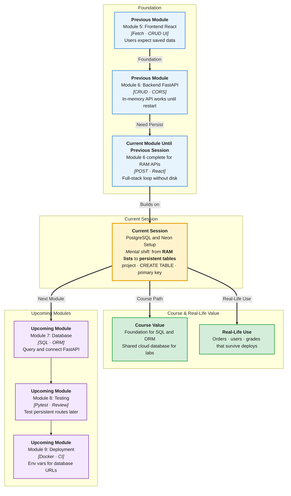

# Pre-Read: PostgreSQL & Neon Setup

## Session Mindmap

This diagram shows where this session sits in the course.



## 1. What You'll Learn

In this pre-read, you'll discover:

- **Why apps need a persistent database** (RAM is not enough)
- How to **create a Neon PostgreSQL project**
- How to **CREATE TABLE** with sensible **column types**
- How to define a **primary key**
- How to **inspect the table in the Neon console**

---

## 2. Detailed Explanation

### Restart Wiped Your Items

Your FastAPI list lived in **memory**. Stop Uvicorn. The posted items are gone. Users do not accept that.

**One-line definition:** A **database** stores tables of rows on disk (in the cloud). Data **persists** after the API process restarts.

**PostgreSQL** is a popular SQL database. **Neon** is a hosted PostgreSQL you can open in the browser.

**Analogy:** In-memory is sticky notes on a laptop lid. Close the lid, notes fly off. PostgreSQL is a filing cabinet. Neon is the cabinet in a locked office you access online.

> **In the Real World:** **Instagram** likes, **Razorpay** payments, and college ERPs keep records in databases. If the web server restarts during deploy, orders must still exist.

### Why It Matters

- Multiple API copies can share one database later
- You can inspect rows without print-debugging Python
- Next sessions query and then connect FastAPI with an ORM

Benefits:

- Data survives restart
- Types on columns catch bad values
- Primary keys identify one row

### Neon Project

1. Sign up / log in at Neon  
2. Create a **project** (this provisions PostgreSQL)  
3. Open the **SQL editor** in the console  

You will receive a connection string later for FastAPI. This session: project + table + look at it.

### Tables, Rows, Columns

| Word | Meaning | Example |
|------|---------|---------|
| **Table** | Named grid | `students` |
| **Column** | Field + type | `name TEXT` |
| **Row** | One record | Priya, year 2 |
| **Primary key** | Unique id for a row | `id` |

### Column Types (Beginner Set)

| Type | Stores | Example |
|------|--------|---------|
| `INTEGER` / `INT` | Whole numbers | `21` |
| `TEXT` | Strings | `'Priya'` |
| `BOOLEAN` | True/false | `TRUE` |
| `TIMESTAMP` | Date-time (optional mention) | enrollment time |

Stay with INT, TEXT, BOOLEAN unless the mentor adds one more.

### CREATE TABLE and Primary Key

A **primary key** uniquely identifies each row. Usually `id`. No two rows share that id.

```sql
CREATE TABLE items (
  id INTEGER PRIMARY KEY,
  name TEXT NOT NULL,
  qty INTEGER
);
```

`NOT NULL` means `name` must be present.

### Inspect in Neon Console

After `CREATE TABLE`, open the **Tables** view (or run `\d` style browse in the UI). Confirm columns: `id`, `name`, `qty`. You should see types and that `id` is the key.

You may `INSERT` one sample row if the mentor allows. The core LO is **see the table**.

### Messy to Clear

**Messy:** Keep important user data in a Python list.

**Clear:** Named table, typed columns, primary key, visible in Neon.

### Building Blocks Checklist

- [ ] I can explain persistence vs in-memory
- [ ] I have a Neon project
- [ ] I created a table with types
- [ ] I set a primary key
- [ ] I opened the table in the console

---

## 3. Practice Exercises

**Exercise 1 — Why persist?**  
Write four sentences: what happened to POST data after Uvicorn restart, and why a database fixes it.

**Exercise 2 — Neon project**  
Create a Neon project named like `iitp-lab`. Screenshot the dashboard (for yourself).

**Exercise 3 — Types**  
On paper, pick types for `id`, `title`, `done` on a `tasks` table.

**Exercise 4 — CREATE TABLE**  
Run `CREATE TABLE` with those columns. `id` is `PRIMARY KEY`.

**Exercise 5 — Inspect**  
In Neon, open the table. Confirm column names and that `id` is the primary key.
