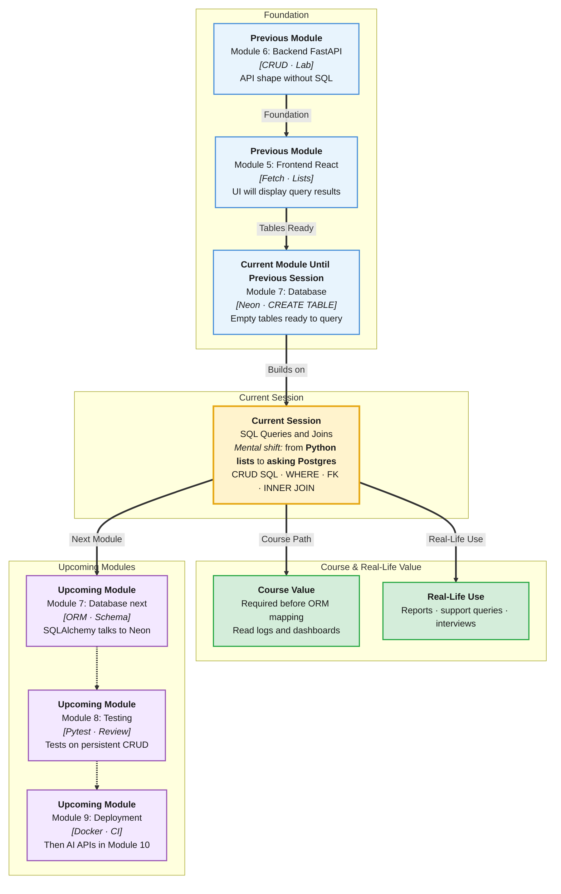

# Pre-Read: SQL Queries & Joins

## Session Mindmap

This diagram shows where this session sits in the course.



## 1. What You'll Learn

In this pre-read, you'll discover:

- How to write **SELECT, INSERT, UPDATE, DELETE**
- How to **filter and sort** with **WHERE** and **ORDER BY**
- What a **foreign key** means between two tables
- How to write one **INNER JOIN**
- How to **practise on sample Neon data**

---

## 2. Detailed Explanation

### Talk to the Filing Cabinet

You created a Neon table. Now you **ask** it questions in **SQL** (Structured Query Language).

**One-line definition:** SQL is the language PostgreSQL understands for read and write.

**Analogy:** SELECT is reading folders. INSERT adds a folder. UPDATE rewrites a page. DELETE removes a folder. WHERE is the search bar. ORDER BY is sort. JOIN is "open two related folders at once."

> **In the Real World:** Analysts at **Amazon** and campus admins at **ERP** teams live in SQL. Backend engineers write the same statements (or an ORM that becomes SQL). Interviews often include a JOIN.

### Why It Matters

- FastAPI will not guess your data. You query it.
- Filters stop you from downloading the whole table
- Foreign keys keep related rows honest

### The Four Writes and Reads

| Verb | Job | Sketch |
|------|-----|--------|
| **SELECT** | Read rows | `SELECT name FROM items;` |
| **INSERT** | Add a row | `INSERT INTO items (id, name) VALUES (1, 'Pen');` |
| **UPDATE** | Change a row | `UPDATE items SET qty = 5 WHERE id = 1;` |
| **DELETE** | Remove a row | `DELETE FROM items WHERE id = 1;` |

**Always** prefer `WHERE` on UPDATE and DELETE. Missing WHERE can change **every** row.

### WHERE and ORDER BY

```sql
SELECT name, qty
FROM items
WHERE qty > 0
ORDER BY name;
```

**WHERE** keeps rows that match. **ORDER BY** sorts the result. This is not Python `if` inside a loop — the database filters.

### Foreign Key

A **foreign key** is a column that points at another table's **primary key**.

Example: `orders.student_id` → `students.id`.

| students | orders |
|----------|--------|
| id PK | id PK |
| name | student_id **FK** |
| | item_name |

The FK says: you cannot attach an order to a student id that does not exist (when the constraint is on).

### INNER JOIN

**INNER JOIN** returns rows where the match exists on **both** sides.

```sql
SELECT students.name, orders.item_name
FROM students
INNER JOIN orders ON students.id = orders.student_id;
```

Students with no orders do not appear. Orders with a matching student do.

### Practise on Neon

Use the Neon SQL editor. Work on **sample** tables the mentor provides (or two small tables you create). Run SELECT first. Then INSERT. Confirm with SELECT. Then UPDATE and DELETE with WHERE. Then one JOIN.

### Messy to Clear

**Messy:** Delete without WHERE. Empty table. Panic.

**Clear:** `SELECT` the `WHERE` first. Then DELETE the same `WHERE`.

### Building Blocks Checklist

- [ ] I can SELECT / INSERT / UPDATE / DELETE
- [ ] I can WHERE and ORDER BY
- [ ] I can explain FK in one sentence
- [ ] I can write one INNER JOIN
- [ ] I practised in Neon, not only on paper

---

## 3. Practice Exercises

**Exercise 1 — SELECT**  
`SELECT * FROM` your sample table. Then select two columns only.

**Exercise 2 — Filter/sort**  
`WHERE` on a numeric or text column. `ORDER BY` that column.

**Exercise 3 — Write trio**  
INSERT one row. UPDATE it. DELETE it. SELECT after each step.

**Exercise 4 — FK sentence**  
Name two tables. Which column is the foreign key? What PK does it reference?

**Exercise 5 — JOIN**  
Run one INNER JOIN. How many rows? Why not more?
