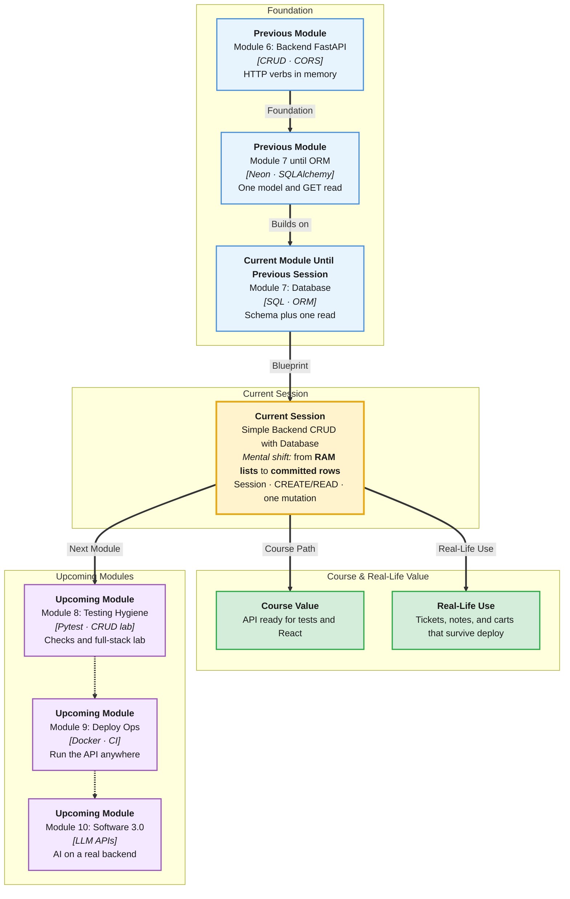

# Pre-Read: Simple Backend CRUD with Database

## Session Mindmap

This diagram shows where this session sits in the course.



## 1. What You'll Learn

In this pre-read, you'll discover:

- How FastAPI **routes share an ORM session** with the database
- How **CREATE and READ** persist rows, not just RAM
- How to add **one UPDATE or one DELETE** against Postgres
- How to **prove data survives** a server restart
- How to **test the flow in Swagger** before touching React

---

## 2. Detailed Explanation

### The Problem You Already Felt

In-memory lists reset when Uvicorn restarts. Users do not accept disappearing tasks.

**Persistent CRUD** means create, read, update, or delete **rows**. The database keeps them.

**Analogy:** A whiteboard is RAM. A notebook is Neon. CRUD writes in the notebook.

> **In the Real World:** **Todoist** and **Trello** would be toys if cards vanished on deploy. Every product you use stores mutations in a database.

**Why It Matters**

- Restarts and deploys keep user data
- Swagger tests the contract before the UI
- One resource done well beats five half-wired tables

**Benefits**

- Real backend portfolio proof
- Clear 201 / 404 habits
- Same session pattern for every future table

### Wire Routes to Sessions

Each request gets a **session** (a short DB conversation), then closes it.

```python
def get_db():
    db = SessionLocal()
    try:
        yield db
    finally:
        db.close()
```

Routes declare `db: Session = Depends(get_db)`. FastAPI injects it.

### Persistent CREATE and READ

**CREATE:** take a Pydantic body → make a model instance → `db.add` → `db.commit` → return the row.

**READ:** `db.get` or `db.scalars(select(Note)).all()` → JSON list or one item.

```python
@app.post("/notes")
def create_note(payload: NoteIn, db: Session = Depends(get_db)):
    note = Note(title=payload.title)
    db.add(note)
    db.commit()
    db.refresh(note)
    return note
```

Keep this under ten lines in your notes. Details live in lecture.

### One UPDATE or DELETE

You do **one** mutation besides create/read. Pick UPDATE **or** DELETE. Do it well.

**UPDATE idea:** load row, change field, commit.

**DELETE idea:** load row, `db.delete`, commit.

Always handle “row missing” with a 404.

> **In the Real World:** **GitHub Issues** PATCH title or DELETE an issue. Same two verbs. You ship one of them today.

### Verify After Restart

1. POST a note in Swagger.
2. Stop Uvicorn.
3. Start Uvicorn.
4. GET the same id.

If the note remains, you left RAM behind.

### Test in Swagger

Open `/docs`. Try POST, GET, then PATCH or DELETE. Read status codes. Do not skip error cases.

**Messy to Clear**

**Messy:** Mix list storage and database in the same route.

**Clear:** Every CREATE/READ/UPDATE/DELETE uses `db` only.

### Building Blocks Checklist

- [ ] I can explain `Depends(get_db)`
- [ ] I know `add` / `commit` / `refresh`
- [ ] I can describe one UPDATE or DELETE
- [ ] I have a restart test plan
- [ ] I can click the flow in Swagger

---

## 3. Practice Exercises

**Exercise 1 — Session**
In two sentences, why we close the session in `finally`.

**Exercise 2 — CREATE**
Order these: `commit`, `Note(...)`, `add`, `refresh`.

**Exercise 3 — READ**
Write the GET path for one note by id. Example: `/notes/3`.

**Exercise 4 — Mutation**
Choose UPDATE or DELETE. Write the happy path in four bullets.

**Exercise 5 — Restart**
Write the four-step restart test. Circle the step that proves persistence.
