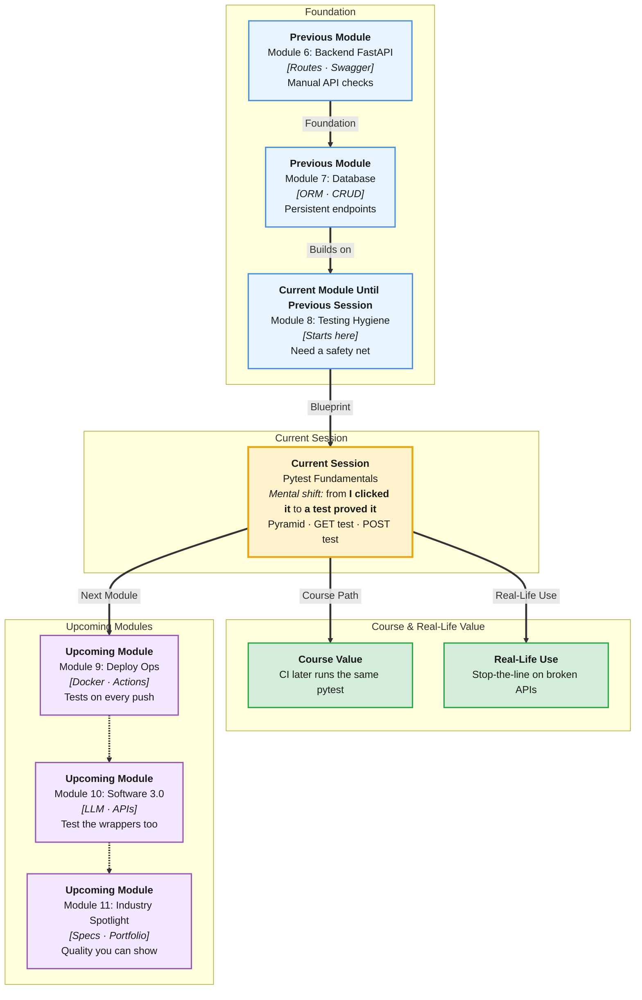

# Pre-Read: Pytest Fundamentals

## Session Mindmap

This diagram shows where this session sits in the course.



## 1. What You'll Learn

In this pre-read, you'll discover:

- **Why automated tests matter** when APIs change every week
- The **test pyramid** in plain words — many small checks, few slow ones
- How to **write a Pytest for one GET**
- How to **write a Pytest for one POST**
- How to **run tests locally** and read pass vs fail

---

## 2. Detailed Explanation

### Why Clicking Swagger Is Not Enough

Swagger is great for learning. It is a poor regression strategy. You will forget a click. The next change will break GET list.

**Automated test:** a small Python function that calls your API and checks the result. **Pytest** runs those functions.

**Analogy:** A cooking recipe with a taste check. Pytest is the taste check you run every time, not only when guests arrive.

> **In the Real World:** **Netflix** and **Stripe** do not ship on “it worked on my laptop.” CI runs tests on every push. Your first Pytest is that habit at student scale.

**Why It Matters**

- Catch breaks before users do
- Refactor without fear
- Show employers you can prove behaviour

**Benefits**

- Fast feedback in the terminal
- Living documentation of GET and POST
- Same skill you will hook to GitHub Actions later

### Test Pyramid in Plain Words

Imagine a pyramid:

- **Bottom (wide):** many fast tests of small behaviour (one endpoint, one case)
- **Middle:** fewer tests that wire a few pieces
- **Top (tiny):** very few slow full-app checks

Today you live at the **bottom**: one GET test, one POST test. That is enough. You are not writing a browser robot.

### One GET Test

You use FastAPI’s **TestClient**. It talks to your app without opening Chrome.

```python
from fastapi.testclient import TestClient
from main import app

client = TestClient(app)

def test_list_notes():
    response = client.get("/notes")
    assert response.status_code == 200
```

**Assert** means “fail the test if this is false.”

### One POST Test

POST sends JSON. Check status and a field you care about.

```python
def test_create_note():
    response = client.post("/notes", json={"title": "Lab"})
    assert response.status_code == 201
    assert response.json()["title"] == "Lab"
```

If your API returns 200, assert 200. Match **your** routes.

### Run Locally and Interpret

```bash
pytest
```

**Passed:** green, tests did what you claimed.

**Failed:** red, traceback shows which `assert` broke. Read the expected vs actual values. Fix the app or the test — decide which was wrong.

**Messy to Clear**

**Messy:** One giant test that POST, GET, DELETE, and prints everything.

**Clear:** `test_list_notes` and `test_create_note` with one job each.

> **In the Real World:** **Google** code review often asks “where is the test?” Two named tests beat a screenshot of Swagger.

### Building Blocks Checklist

- [ ] I can say why tests beat only-manual clicks
- [ ] I can describe the pyramid in one breath
- [ ] I can sketch a GET test
- [ ] I can sketch a POST test
- [ ] I know `pytest` pass vs fail

---

## 3. Practice Exercises

**Exercise 1 — Why tests**
List two bugs a GET test would catch that a human might miss after a rename.

**Exercise 2 — Pyramid**
Draw a triangle. Label bottom “many fast endpoint tests.” Label top “few slow full checks.”

**Exercise 3 — GET**
Write a test function name and one `assert` for `GET /notes`.

**Exercise 4 — POST**
Write JSON body and the status you expect for create.

**Exercise 5 — Output**
A test fails with `assert 404 == 200`. In one sentence, what will you check first?
