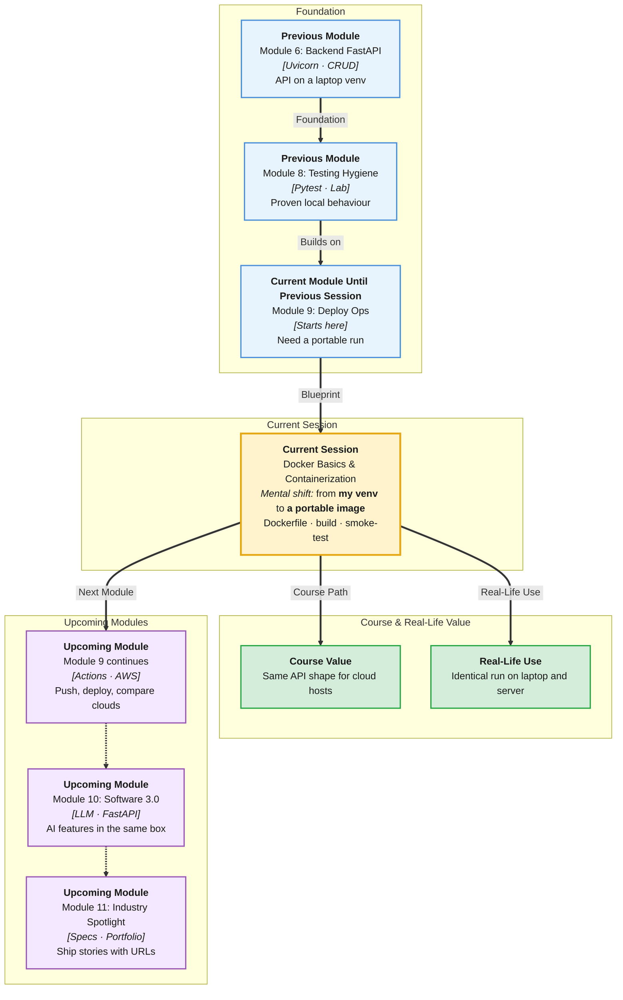

# Pre-Read: Docker Basics & Containerization

## Session Mindmap

This diagram shows where this session sits in the course.



## 1. What You'll Learn

In this pre-read, you'll discover:

- **What problem containers solve** when “it works on my machine” fails
- How to **write a simple Dockerfile** for FastAPI
- How to **build a Docker image**
- How to **run a container locally**
- How to **smoke-test** the API inside that container

---

## 2. Detailed Explanation

### The Laptop Lottery

Your venv, Python version, and OS differ from your teammate’s. The cloud differs again.

A **container** packages the app plus a declared runtime so it runs the same way on each machine.

**Docker** is the common tool to build and run those containers.

**Analogy:** A tiffin box. Food (your FastAPI app) plus a sealed box (image) so it travels without spilling.

> **In the Real World:** **Google**, **Netflix**, and almost every cloud host expect a container or a buildpack that acts like one. **Render** and **Railway** often build from a Dockerfile.

**Why It Matters**

- Same run on laptop and server
- Cleaner deploys next session
- Fewer “install these 12 steps” READMEs

**Benefits**

- Repeatable FastAPI boot
- Isolated from the rest of your OS
- Industry-standard vocabulary: image vs container

### Image vs Container

- **Image:** the recipe baked into a snapshot (read-only template)
- **Container:** a running instance of that image

You **build** an image. You **run** a container.

### Simple Dockerfile for FastAPI

A **Dockerfile** is a text file of build steps. Keep it small.

```dockerfile
FROM python:3.12-slim
WORKDIR /app
COPY requirements.txt .
RUN pip install -r requirements.txt
COPY . .
CMD ["uvicorn", "main:app", "--host", "0.0.0.0", "--port", "8000"]
```

`--host 0.0.0.0` lets you reach the API from outside the container. `localhost` inside the box would hide it.

### Build and Run

```bash
docker build -t notes-api .
docker run -p 8000:8000 notes-api
```

**-p 8000:8000** maps your laptop port to the container port.

### Smoke-Test

Open `http://localhost:8000/docs` or `GET /health` if you added one. If Swagger loads, the containerised API is alive.

You are not learning Kubernetes. You are proving one container works.

**Messy to Clear**

**Messy:** “Install Python, then Postgres drivers, then hope.”

**Clear:** `docker build` + `docker run` + browser check.

> **In the Real World:** **Uber** microservices ship as images. Your one FastAPI image is the student version of that idea.

### Building Blocks Checklist

- [ ] I can explain works-on-my-machine
- [ ] I recognize FROM, COPY, RUN, CMD
- [ ] I can name build vs run
- [ ] I know port mapping
- [ ] I have a smoke-test URL

---

## 3. Practice Exercises

**Exercise 1 — Problem**
Write two sentences on a bug caused by different Python versions.

**Exercise 2 — Dockerfile**
Label each line of the sample Dockerfile: base, files, install, start.

**Exercise 3 — Words**
Is `notes-api` in `docker build -t notes-api .` an image name or a container name?

**Exercise 4 — Ports**
If FastAPI listens on 8000 in the container, what does `-p 8000:8000` do?

**Exercise 5 — Smoke**
List two URLs you could hit to prove the container works.
