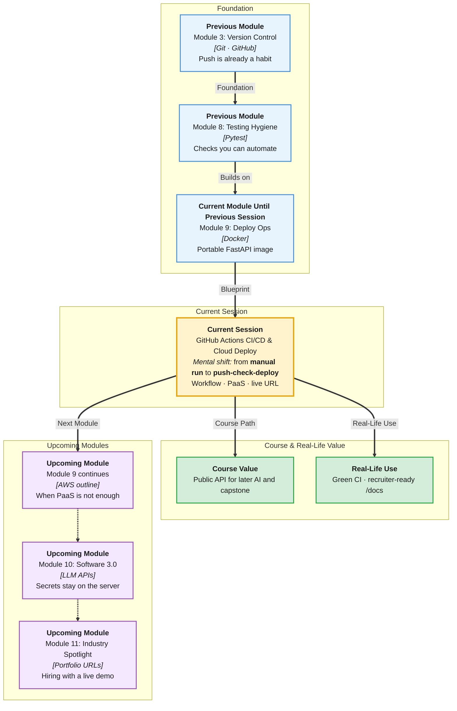

```mermaid
flowchart TB
    subgraph foundation ["Foundation"]
        direction TB
        P1["<b>Previous Module</b><br/>Module 3: Version Control<br/><i>[Git · GitHub]</i><br/>Push is already a habit"]
        P2["<b>Previous Module</b><br/>Module 8: Testing Hygiene<br/><i>[Pytest]</i><br/>Checks you can automate"]
        CM["<b>Current Module Until Previous Session</b><br/>Module 9: Deploy Ops<br/><i>[Docker]</i><br/>Portable FastAPI image"]
    end

    subgraph current ["Current Session"]
        CS["<b>Current Session</b><br/>GitHub Actions CI/CD & Cloud Deploy<br/><i>Mental shift:</i> from <b>manual run</b> to <b>push-check-deploy</b><br/>Workflow · PaaS · live URL"]
    end

    subgraph value ["Course & Real-Life Value"]
        CV["<b>Course Value</b><br/>Public API for later AI and capstone"]
        RL["<b>Real-Life Use</b><br/>Green CI · recruiter-ready /docs"]
    end

    subgraph future ["Upcoming Modules"]
        direction TB
        U1["<b>Upcoming Module</b><br/>Module 9 continues<br/><i>[AWS outline]</i><br/>When PaaS is not enough"]
        U2["<b>Upcoming Module</b><br/>Module 10: Software 3.0<br/><i>[LLM APIs]</i><br/>Secrets stay on the server"]
        U3["<b>Upcoming Module</b><br/>Module 11: Industry Spotlight<br/><i>[Portfolio URLs]</i><br/>Hiring with a live demo"]
    end

    P1 ==>|&nbsp;Foundation&nbsp;| P2
    P2 ==>|&nbsp;Builds on&nbsp;| CM
    CM ==>|&nbsp;Blueprint&nbsp;| CS
    CS ==>|&nbsp;Course Path&nbsp;| CV
    CS ==>|&nbsp;Real-Life Use&nbsp;| RL
    CS ==>|&nbsp;Next Module&nbsp;| U1
    U1 -.-> U2
    U2 -.-> U3

    classDef previous fill:#E8F4FD,stroke:#4A90D9,stroke-width:2px,color:#1a1a1a
    classDef current fill:#FFF3CD,stroke:#E6A817,stroke-width:3px,color:#1a1a1a
    classDef value fill:#D4EDDA,stroke:#28A745,stroke-width:2px,color:#1a1a1a
    classDef future fill:#F3E8FF,stroke:#9B59B6,stroke-width:2px,color:#1a1a1a

    class P1,P2,CM previous
    class CS current
    class CV,RL value
    class U1,U2,U3 future

    linkStyle default stroke-width:3px
```
