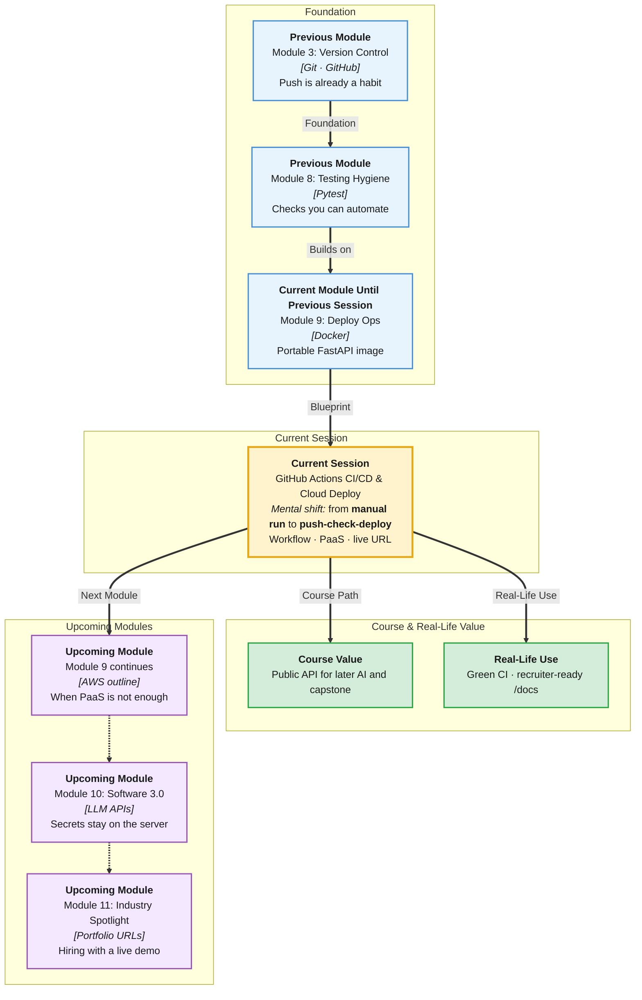

# Pre-Read: GitHub Actions CI/CD & Cloud Deploy

## Session Mindmap

This diagram shows where this session sits in the course.



## 1. What You'll Learn

In this pre-read, you'll discover:

- **CI/CD as a story:** push → check → deploy
- How to **write a simple GitHub Actions workflow** that runs on push
- How to **deploy FastAPI to Render or Railway**
- How to **set basic environment variables** on the host
- How to **verify the live URL** responds

---

## 2. Detailed Explanation

### From Laptop to Internet

Docker made the app portable. Now humans should not click “deploy” every time.

**CI** (Continuous Integration — automatic checks on new code) runs when you push.

**CD** (Continuous Delivery/Deploy — automatic or one-click release) puts a passing build on the internet.

**Plain pipeline:** push to GitHub → workflow runs (for example `pytest`) → host builds and serves the API.

**Analogy:** Airport security then boarding. Checks first. Then the plane (your API) goes live.

> **In the Real World:** **Vercel** already did this for your React app. **Render** and **Railway** do it for backends. **GitHub Actions** is the check factory many companies own themselves.

**Why It Matters**

- Broken main is visible in minutes
- Live URL for mentors and recruiters
- Secrets stay in host env vars, not in Git

**Benefits**

- Same habit as professional teams
- Fewer “it worked locally” surprises
- Demo without sharing your laptop

### A Simple Workflow on Push

File: `.github/workflows/ci.yml`

```yaml
name: CI
on: [push]
jobs:
  test:
    runs-on: ubuntu-latest
    steps:
      - uses: actions/checkout@v4
      - uses: actions/setup-python@v5
        with:
          python-version: "3.12"
      - run: pip install -r requirements.txt pytest
      - run: pytest
```

This is **check**, not full magic deploy. Deploy can be the platform watching `main`.

### Deploy to Render or Railway

Connect the GitHub repo. Pick the FastAPI service. Set start command or Dockerfile.

You already know Uvicorn and Docker. The host runs one of those.

### Environment Variables

`DATABASE_URL` and other secrets belong in the host’s **environment variables** panel. Never commit them.

Local `.env` stays gitignored. Production gets the same **names**, different **values**.

> **In the Real World:** **GitHub** leaked keys make weekly news. Env vars are the beginner-safe pattern.

### Verify Live URL

Open `https://your-service.onrender.com/docs` (or Railway URL). Hit GET. If it loads, you deployed.

**Messy to Clear**

**Messy:** Zip files emailed to a TA.

**Clear:** Push, green check, public `/docs`.

### Building Blocks Checklist

- [ ] I can say push → check → deploy
- [ ] I know where the YAML file lives
- [ ] I can name Render or Railway
- [ ] I know env vars are not in Git
- [ ] I will open the live `/docs`

---

## 3. Practice Exercises

**Exercise 1 — Pipeline**
Write the three words of the pipeline in order.

**Exercise 2 — YAML**
What event starts the sample workflow? (`push`)

**Exercise 3 — Host**
Name one thing you must connect: GitHub repo or a USB stick?

**Exercise 4 — Env**
Where should `DATABASE_URL` live in production?

**Exercise 5 — Verify**
Write the live URL pattern you will click, including `/docs`.
