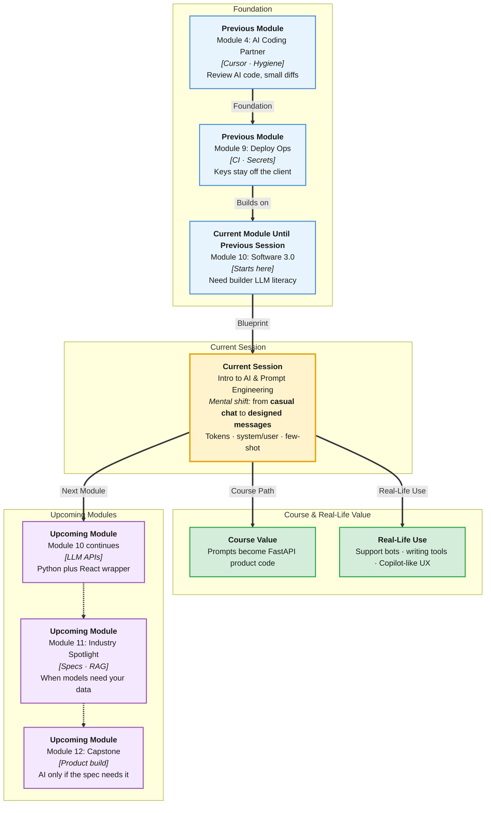

# Pre-Read: Intro to AI & Prompt Engineering

## Session Mindmap

This diagram shows where this session sits in the course.



## 1. What You'll Learn

In this pre-read, you'll discover:

- What an **LLM** is at a **builder** level — a next-token machine you call with text
- **Tokens** and the **context window** in simple words
- How to write a **system prompt** and a **user message**
- **Zero-shot** vs **few-shot** on a small task
- How to **rewrite a weak prompt** into a clearer one

---

## 2. Detailed Explanation

### LLM, Builder Level

An **LLM** (Large Language Model) predicts likely next pieces of text from the text you give it. It is not a search engine and not a guaranteed truth source.

You already used AI in Cursor. Today you name the parts so you can **design** the call, not only chat.

**Analogy:** An autocomplete that can follow instructions for a whole paragraph, not just one word.

> **In the Real World:** **ChatGPT**, **Claude**, and **GitHub Copilot** are product skins on this idea. Builders at **Notion AI** and **Intercom** write prompts as product code.

**Why It Matters**

- Features will wrap models, not only chat tabs
- Bad prompts waste tokens and confuse users
- You must know limits before you trust output

**Benefits**

- Shared vocabulary with AI teams
- Better Cursor prompts too
- Prep for the next session’s API call

### Tokens and Context Window

A **token** is a chunk of text the model reads or writes (often a short word piece).

The **context window** is the maximum tokens of **input + output** the model can hold in one go. Long chats fill it. Old turns may drop.

**Simple picture:** A backpack. Tokens are items. When the backpack is full, something falls out.

You do not need a tokenizer library today. You need the idea: **shorter, clearer prompts cost less and fit better**.

### System Prompt vs User Message

- **System prompt:** standing orders — role, rules, format
- **User message:** this request — the task and the data

```text
System: You extract task titles. Reply as one JSON object with key title.
User: Buy milk tomorrow
```

### Zero-Shot and Few-Shot

**Zero-shot:** instructions only, no examples.

**Few-shot:** instructions plus two or three example pairs.

Use few-shot when format is picky (JSON, tags, tone).

### Improve a Weak Prompt

**Weak:** "Do this better."

**Clear:** "Rewrite this email in 3 sentences. Keep the meeting time. Formal tone. Output only the email."

**Messy to Clear**

**Messy:** One blob of chat with no role and no output shape.

**Clear:** System rules + user data + examples if needed.

> **In the Real World:** **Support** tools at **Zendesk**-class products encode tone in the system prompt so every agent reply is on-brand.

### Building Blocks Checklist

- [ ] I can define LLM without saying “it thinks”
- [ ] I can explain token and backpack/window
- [ ] I can split system vs user
- [ ] I can spot zero-shot vs few-shot
- [ ] I can tighten a vague prompt

---

## 3. Practice Exercises

**Exercise 1 — Builder definition**
Write one sentence: an LLM predicts next tokens from context.

**Exercise 2 — Window**
Why might a very long paste fail or ignore the start?

**Exercise 3 — Split**
Turn “You are a tutor. Explain loops.” into system vs user.

**Exercise 4 — Shots**
Write two example pairs for “classify: bug or feature.”

**Exercise 5 — Rewrite**
Improve: “Make notes.” Add audience, length, and format.
