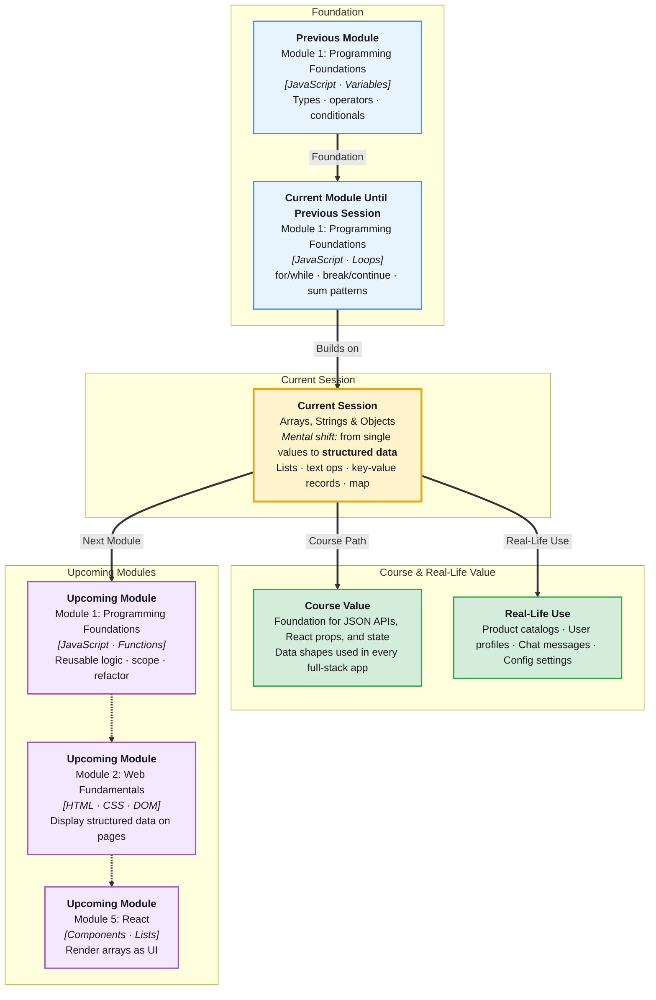

```mermaid
flowchart TB
    subgraph foundation ["Foundation"]
        direction TB
        P1["<b>Previous Module</b><br/>Module 1: Programming Foundations<br/><i>[JavaScript · Variables]</i><br/>Types · operators · conditionals"]
        CM["<b>Current Module Until Previous Session</b><br/>Module 1: Programming Foundations<br/><i>[JavaScript · Loops]</i><br/>for/while · break/continue · sum patterns"]
    end

    subgraph current ["Current Session"]
        CS["<b>Current Session</b><br/>Arrays, Strings & Objects<br/><i>Mental shift:</i> from single values to <b>structured data</b><br/>Lists · text ops · key-value records · map"]
    end

    subgraph value ["Course & Real-Life Value"]
        CV["<b>Course Value</b><br/>Foundation for JSON APIs, React props, and state<br/>Data shapes used in every full-stack app"]
        RL["<b>Real-Life Use</b><br/>Product catalogs · User profiles · Chat messages · Config settings"]
    end

    subgraph future ["Upcoming Modules"]
        direction TB
        U1["<b>Upcoming Module</b><br/>Module 1: Programming Foundations<br/><i>[JavaScript · Functions]</i><br/>Reusable logic · scope · refactor"]
        U2["<b>Upcoming Module</b><br/>Module 2: Web Fundamentals<br/><i>[HTML · CSS · DOM]</i><br/>Display structured data on pages"]
        U3["<b>Upcoming Module</b><br/>Module 5: React<br/><i>[Components · Lists]</i><br/>Render arrays as UI"]
    end

    P1 ==>|&nbsp;Foundation&nbsp;| CM
    CM ==>|&nbsp;Builds on&nbsp;| CS
    CS ==>|&nbsp;Course Path&nbsp;| CV
    CS ==>|&nbsp;Real-Life Use&nbsp;| RL
    CS ==>|&nbsp;Next Module&nbsp;| U1
    U1 -.-> U2
    U2 -.-> U3

    classDef previous fill:#E8F4FD,stroke:#4A90D9,stroke-width:2px,color:#1a1a1a
    classDef current fill:#FFF3CD,stroke:#E6A817,stroke-width:3px,color:#1a1a1a
    classDef value fill:#D4EDDA,stroke:#28A745,stroke-width:2px,color:#1a1a1a
    classDef future fill:#F3E8FF,stroke:#9B59B6,stroke-width:2px,color:#1a1a1a

    class P1,CM previous
    class CS current
    class CV,RL value
    class U1,U2,U3 future

    linkStyle default stroke-width:3px
```
