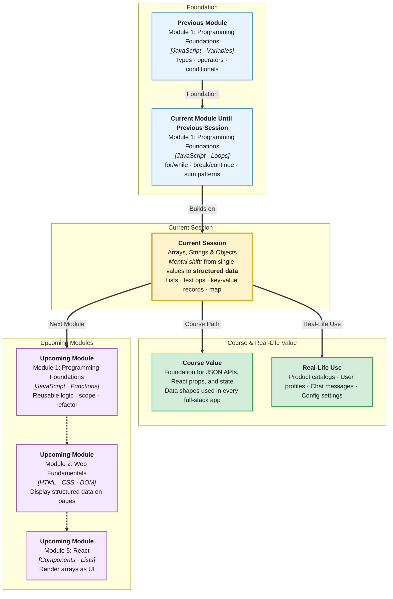

# Pre-Read: Arrays, Strings & Objects

## Session Mindmap

This diagram shows where this session sits in the course.



## 1. What You'll Learn

In this pre-read, you'll discover:

- How to **store lists of values** in arrays and access them by index
- How to **work with text** using common string methods
- How to **group related data** in objects with named properties
- How to **pick the right structure** — array, string, or object — for a simple need
- How to **practice short problems** combining all three in One Compiler

---

## 2. Detailed Explanation

### Three Ways to Hold Data

| Structure | Best for | Example |
|-----------|----------|---------|
| **Array** (ordered list) | Many items in sequence | `[10, 20, 30]` |
| **String** (text) | Words, messages, labels | `"hello"` |
| **Object** (key-value map) | One thing with named fields | `{ name: "Asha", age: 22 }` |

### Arrays — Ordered Lists

Create with `[]`. Access items by **index** (position, starting at 0).

```javascript
const fruits = ["apple", "banana", "mango"];
console.log(fruits[0]); // apple
fruits.push("grape");   // add to end
fruits.pop();           // remove from end
console.log(fruits.length); // count items
```

**`map`** creates a new array by transforming each item:

```javascript
const nums = [1, 2, 3];
const doubled = nums.map(n => n * 2);
// [2, 4, 6]
```

### Strings — Text You Can Slice and Split

```javascript
const msg = "  Hello World  ";
msg.trim();           // remove extra spaces
msg.toUpperCase();    // HELLO WORLD
msg.slice(0, 5);      // "  Hel"
msg.split(" ");       // split into parts
["a", "b"].join("-"); // "a-b"
```

### Objects — Named Properties

```javascript
const user = { name: "Ravi", role: "student" };
console.log(user.name);  // read
user.role = "graduate";  // update
```

### Why It Matters

Apps are built from lists (products), text (messages), and records (user profiles). These three structures appear in every API response you will fetch later.

**Benefits:**
- Organize data instead of dozens of separate variables
- Reuse loop and function skills on real collections
- Prepare for JSON and React props

### When to Use Which?

- **Shopping cart items** → array
- **Email body** → string
- **Single user profile** → object
- **List of users** → array of objects

---

## 3. Practice Exercises

**Exercise 1 — Array**
Create an array of three favorite foods. Print the second item and the total length.

**Exercise 2 — String**
Take the string `"javascript"`. Print it in uppercase and extract `"script"` using `slice`.

**Exercise 3 — Object**
Create a `book` object with `title` and `pages`. Update `pages` and print the whole object.
