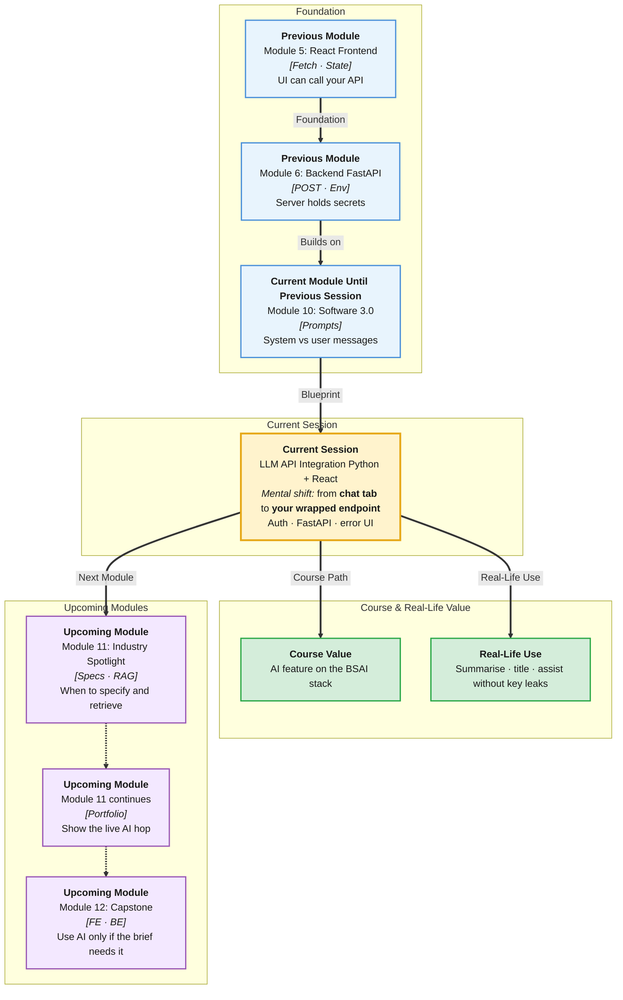

```mermaid
flowchart TB
    subgraph foundation ["Foundation"]
        direction TB
        P1["<b>Previous Module</b><br/>Module 5: React Frontend<br/><i>[Fetch · State]</i><br/>UI can call your API"]
        P2["<b>Previous Module</b><br/>Module 6: Backend FastAPI<br/><i>[POST · Env]</i><br/>Server holds secrets"]
        CM["<b>Current Module Until Previous Session</b><br/>Module 10: Software 3.0<br/><i>[Prompts]</i><br/>System vs user messages"]
    end

    subgraph current ["Current Session"]
        CS["<b>Current Session</b><br/>LLM API Integration Python + React<br/><i>Mental shift:</i> from <b>chat tab</b> to <b>your wrapped endpoint</b><br/>Auth · FastAPI · error UI"]
    end

    subgraph value ["Course & Real-Life Value"]
        CV["<b>Course Value</b><br/>AI feature on the BSAI stack"]
        RL["<b>Real-Life Use</b><br/>Summarise · title · assist without key leaks"]
    end

    subgraph future ["Upcoming Modules"]
        direction TB
        U1["<b>Upcoming Module</b><br/>Module 11: Industry Spotlight<br/><i>[Specs · RAG]</i><br/>When to specify and retrieve"]
        U2["<b>Upcoming Module</b><br/>Module 11 continues<br/><i>[Portfolio]</i><br/>Show the live AI hop"]
        U3["<b>Upcoming Module</b><br/>Module 12: Capstone<br/><i>[FE · BE]</i><br/>Use AI only if the brief needs it"]
    end

    P1 ==>|&nbsp;Foundation&nbsp;| P2
    P2 ==>|&nbsp;Builds on&nbsp;| CM
    CM ==>|&nbsp;Blueprint&nbsp;| CS
    CS ==>|&nbsp;Course Path&nbsp;| CV
    CS ==>|&nbsp;Real-Life Use&nbsp;| RL
    CS ==>|&nbsp;Next Module&nbsp;| U1
    U1 -.-> U2
    U2 -.-> U3

    classDef previous fill:#E8F4FD,stroke:#4A90D9,stroke-width:2px,color:#1a1a1a
    classDef current fill:#FFF3CD,stroke:#E6A817,stroke-width:3px,color:#1a1a1a
    classDef value fill:#D4EDDA,stroke:#28A745,stroke-width:2px,color:#1a1a1a
    classDef future fill:#F3E8FF,stroke:#9B59B6,stroke-width:2px,color:#1a1a1a

    class P1,P2,CM previous
    class CS current
    class CV,RL value
    class U1,U2,U3 future

    linkStyle default stroke-width:3px
```
