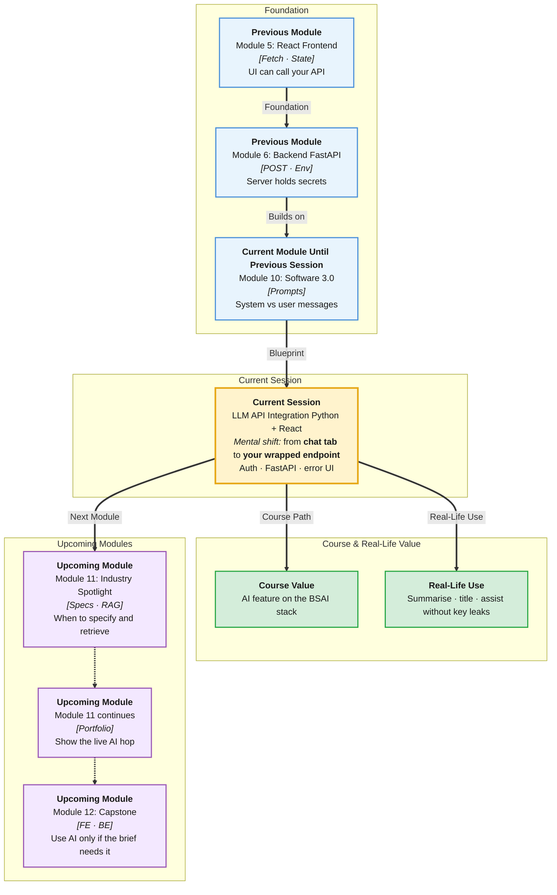

# Pre-Read: LLM API Integration (Python + React)

## Session Mindmap

This diagram shows where this session sits in the course.



## 1. What You'll Learn

In this pre-read, you'll discover:

- How to **call a chat API from Python** with an API key
- How to **hide that call behind one FastAPI endpoint**
- How **React fetch** shows the model’s reply
- How to **show a basic error** in the UI
- Why **prompts and secrets stay off the frontend**

---

## 2. Detailed Explanation

### Why Not Call the LLM from React?

If React holds the API key, anyone can steal it from the browser. They spend **your** money.

**Pattern:** Browser → your FastAPI → LLM provider. The key lives in server env vars.

**Analogy:** A hotel front desk. Guests never enter the vault. Your API is the desk.

> **In the Real World:** **ChatGPT**’s website does not embed the raw provider key in JavaScript for you to copy. **Vercel AI** demos still push keys to the server. Same rule.

**Why It Matters**

- Stolen keys mean surprise bills
- System prompts are product IP
- One backend endpoint is testable

**Benefits**

- Matches how you deployed secrets on Render
- UI stays simple: one fetch
- Errors can be turned into human messages

### Python Call with Auth

You send an HTTP request with a **Bearer token** (the API key) and a messages list (system + user).

Keep provider details in lecture. Conceptually:

```python
headers = {"Authorization": f"Bearer {os.getenv('LLM_API_KEY')}"}
```

Never print the key. Never commit `.env`.

### One FastAPI Endpoint

```python
@app.post("/ai/title")
def ai_title(body: UserText):
    # call provider with system prompt + body.text
    return {"result": text}
```

React only posts `{ "text": "..." }`. It does not send the system prompt.

### React Shows the Result

`fetch` POST → set state with `result` → render a paragraph.

### Basic API Error in the UI

If status is not OK, set `error` state: "Could not reach AI. Try again."

Do not dump stack traces to users.

**Messy to Clear**

**Messy:** `VITE_LLM_API_KEY` in the React app.

**Clear:** only `VITE_API_URL` pointing at FastAPI.

> **In the Real World:** **Perplexity** and **Cursor** keep model access on backends. Students copy that architecture in miniature.

### Building Blocks Checklist

- [ ] I know the three-hop path
- [ ] I can name the env var for the key
- [ ] I can sketch POST `/ai/...`
- [ ] I can show result or error in React
- [ ] I will not put the system prompt in JS

---

## 3. Practice Exercises

**Exercise 1 — Path**
Draw arrows: React, FastAPI, LLM provider.

**Exercise 2 — Auth**
Where is `LLM_API_KEY` read — browser or server?

**Exercise 3 — Endpoint**
Write the JSON body React sends (user text only).

**Exercise 4 — UI error**
Write the sentence you will show on a 500.

**Exercise 5 — Leak hunt**
Name two files that must not contain the key (`App.jsx`, git-tracked `.env`).
