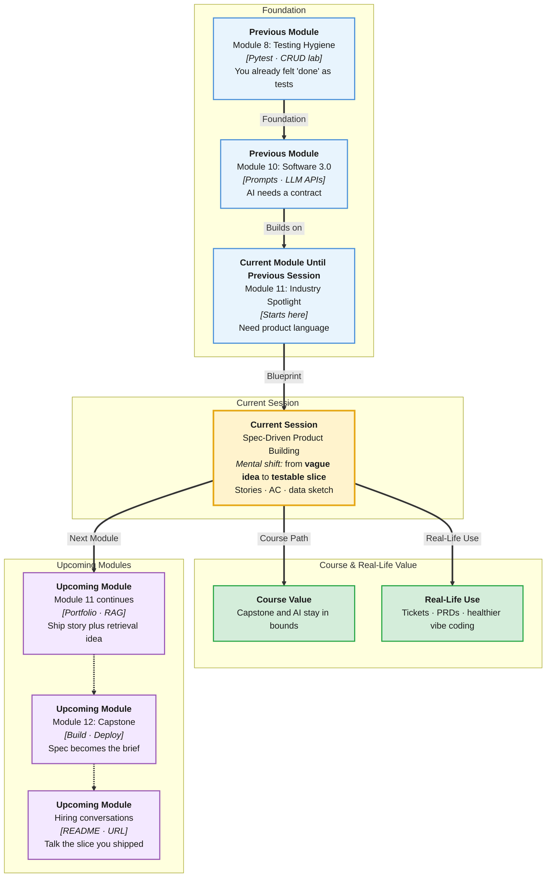

# Pre-Read: Spec-Driven Product Building

## Session Mindmap

This diagram shows where this session sits in the course.

## 1. What You'll Learn

In this pre-read, you'll discover:

- **When to prototype fast** versus **when to write a spec first**
- How to write **user stories** for one small feature
- How **acceptance criteria** make “done” obvious
- How to **sketch a simple data model**
- How to turn a rough idea into a **short implementable spec**

---

## 2. Detailed Explanation

### Two Speeds

**Prototype fast** (sometimes called vibe coding): explore UI and ideas when you do not yet know the product.

**Specify first:** write stories and criteria when several people will build, or when AI will generate large chunks.

**Analogy:** Sketching a poster vs writing a building permit. Posters can be messy. Buildings need measurements.

> **In the Real World:** **Figma** prototypes explore. **Jira** stories ship. Strong teams use both on purpose, not by accident.

**Why It Matters**

- AI will happily generate the wrong app fluently
- Capstone and jobs need “done” definitions
- Data models prevent React/FastAPI drift (you felt this in CRUD lab)

**Benefits**

- Less rework
- Clear demos
- Better prompts because the spec is the prompt

### User Stories

Format: **As a** role, **I want** action, **so that** benefit.

Example: As a student, I want to add a task title, so that I do not forget lab homework.

One feature. Not the whole startup.

### Acceptance Criteria

Tests in English. If they fail, the story is not done.

Example:

- Given I am on the list, when I submit a non-empty title, then the task appears without a refresh.
- Empty title shows an error and does not POST.

### Simple Data Model Sketch

Boxes and fields. `Task: id, title, done`. You practised this with SQLAlchemy. The spec names the fields before code.

### Short Implementable Spec

One page:

1. Problem
2. User stories (2–3)
3. Acceptance criteria
4. Data model sketch
5. Out of scope (what you will not build)

**Messy to Clear**

**Messy:** “AI notes app like Notion.”

**Clear:** one user, one resource, criteria you could test in Swagger and the UI.

> **In the Real World:** **Spotify** two-week squads still write acceptance tests. Interns who can spec a slice get trusted sooner.

### Building Blocks Checklist

- [ ] I can pick prototype vs spec with a reason
- [ ] I can write one user story
- [ ] I can list two acceptance lines
- [ ] I can sketch fields
- [ ] I can keep a spec to one page

---

## 3. Practice Exercises

**Exercise 1 — Mode**
A weekend idea with no users yet — prototype or spec first? Why?

**Exercise 2 — Story**
Write one user story for “mark task done.”

**Exercise 3 — Criteria**
Write two Given/When/Then lines for that story.

**Exercise 4 — Model**
List fields for `Task`. Mark the id.

**Exercise 5 — Out of scope**
Name two features you will not build this week (auth, sharing).
