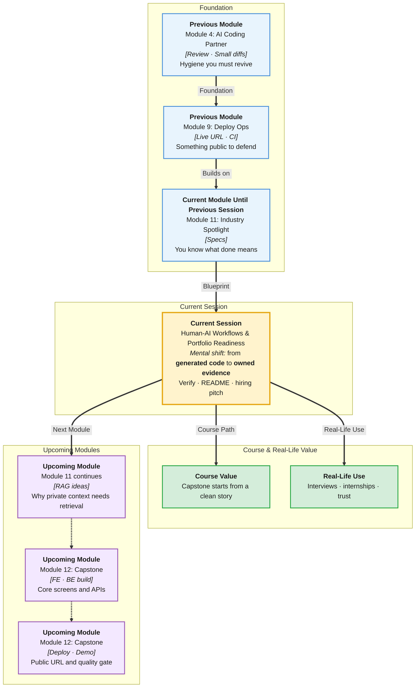

# Pre-Read: Human-AI Workflows & Portfolio Readiness

## Session Mindmap

This diagram shows where this session sits in the course.

## 1. What You'll Learn

In this pre-read, you'll discover:

- How to **review AI output at each step** before you continue
- How to **catch and fix at least one AI mistake**
- How to **polish a README and commit history**
- How to **confirm a live deployment URL** still works
- How to **package the project** for a hiring conversation

---

## 2. Detailed Explanation

### AI Is a Fast Junior

Cursor can write a route in seconds. It can also invent a field you never specified.

A **human-AI workflow** means: generate → **read** → run → **then** next step. Not generate → generate → generate.

**Analogy:** A sous-chef. You still taste the sauce.

> **In the Real World:** **Google** and **Microsoft** publish AI-use rules for staff: review before merge. **GitHub Copilot** PRs that nobody read are a known failure mode.

**Why It Matters**

- Interviews will probe whether you understand your repo
- Broken live URLs kill trust in seconds
- Commits and README are the first impression

**Benefits**

- Fewer silent bugs
- A story you can tell out loud
- Proof you used AI without being used by it

### Review at Each Step

Checklist per AI change:

- Does it match the spec?
- Did I run it?
- Did I keep the diff small?

Reject the rest.

### Catch One Mistake

Typical AI mistakes: fake imports, wrong field names, keys in examples, tests that never assert.

You will be given (or will find) one bug. You fix it. That is the LO.

### README and Commits

**README:** what it is, how to run, env var **names**, live URL.

**Commits:** small, honest messages. Not one dump called `final`.

### Live URL

Click it on a phone or incognito. `/docs` or the React app. If it sleeps, note cold start in the README.

### Package for Hiring

One paragraph: problem, your stack, what you built, URL, what you would do next. Practise saying it in 60 seconds.

**Messy to Clear**

**Messy:** 40 files you cannot explain, dead Vercel link, `asdf` commits.

**Clear:** Spec-sized feature, green CI, live URL, README, story.

> **In the Real World:** **Stripe** interviews often start at the GitHub profile. Hygiene is the handshake.

### Building Blocks Checklist

- [ ] I pause after each AI step
- [ ] I have found one AI mistake before
- [ ] README has run steps and URL
- [ ] I clicked the live URL this week
- [ ] I can pitch in one minute

---

## 3. Practice Exercises

**Exercise 1 — Loop**
Write the four words: generate, read, run, next.

**Exercise 2 — Mistake**
List two AI bugs you would catch by running Swagger.

**Exercise 3 — README**
Draft the “Run locally” section with venv and `uvicorn` in three lines.

**Exercise 4 — URL**
Open your deploy URL now. Write the status code you saw.

**Exercise 5 — Pitch**
Write a 4-sentence hiring paragraph for your CRUD or AI wrapper.
