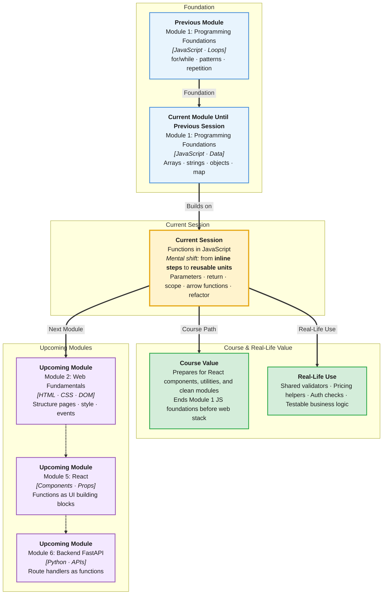

# Pre-Read: Functions in JavaScript

## Session Mindmap

This diagram shows where this session sits in the course.



## 1. What You'll Learn

In this pre-read, you'll discover:

- How to **define and call functions** that do one clear job
- How to **pass data in** with parameters and **get results back** with `return`
- How **local and global scope** affect which variables you can use
- How to write **arrow functions** for short, readable logic
- How to **refactor repeated code** into reusable functions

---

## 2. Detailed Explanation

### What Is a Function?

A **function** (a reusable block of code with a name) is like a kitchen appliance. You give it ingredients (inputs), it does one job, and sometimes gives you a result (output).

Without functions, you copy-paste the same logic everywhere. That is hard to fix and easy to break.

### Defining and Calling

```javascript
function greet(name) {
  return "Hello, " + name;
}

console.log(greet("Asha"));
```

- **Define** once with `function name(params) { ... }`
- **Call** whenever needed: `greet("Asha")`

### Parameters and Return Values

- **Parameters** — placeholders in the function definition
- **Arguments** — actual values you pass when calling
- **`return`** — sends a value back to the caller; also stops the function

```javascript
function add(a, b) {
  return a + b;
}
console.log(add(3, 5)); // 8
```

### Scope: Who Can See What?

- **Local scope** — variables created inside a function exist only there
- **Global scope** — variables declared outside functions are visible everywhere (use carefully)

```javascript
const appName = "LearnJS"; // global

function demo() {
  const x = 10; // local to demo
  console.log(appName); // OK
}
// console.log(x); // Error — x is not visible here
```

### Arrow Functions

Short syntax for small functions:

```javascript
const double = (n) => n * 2;
console.log(double(4)); // 8
```

Use arrow functions when the logic is brief and clear.

### Why It Matters

Functions are how teams build large apps — small tested pieces composed together.

**Benefits:**
- Write once, use many times
- Easier debugging — fix one place
- Cleaner, more readable programs

### Refactoring

**Refactoring** means improving code structure without changing what it does. If you see the same 4 lines twice, make a function.

---

## 3. Practice Exercises

**Exercise 1 — Basic function**
Write `square(n)` that returns `n * n`. Test with `square(6)`.

**Exercise 2 — Arrow function**
Write `isAdult(age)` as an arrow function that returns `true` if age ≥ 18.

**Exercise 3 — Refactor**
You have the same discount calculation twice: `price * 0.9`. Move it into `applyDiscount(price)` and call it twice.
