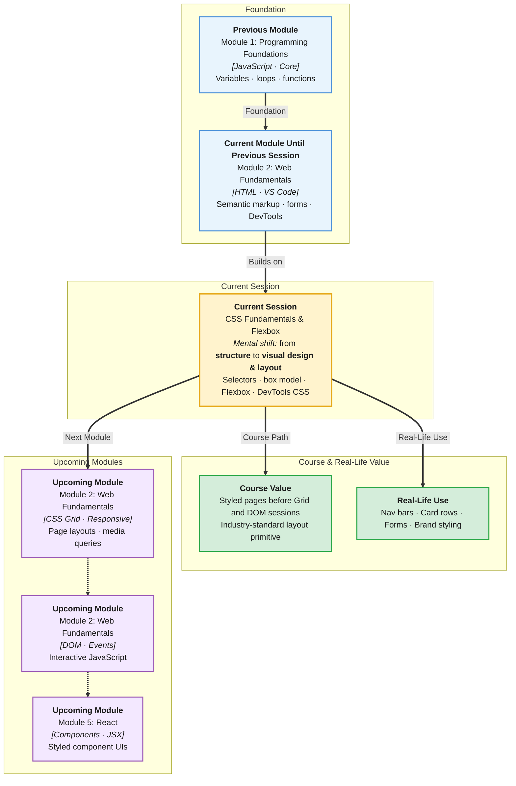

```mermaid
flowchart TB
    subgraph foundation ["Foundation"]
        direction TB
        P1["<b>Previous Module</b><br/>Module 1: Programming Foundations<br/><i>[JavaScript · Core]</i><br/>Variables · loops · functions"]
        CM["<b>Current Module Until Previous Session</b><br/>Module 2: Web Fundamentals<br/><i>[HTML · VS Code]</i><br/>Semantic markup · forms · DevTools"]
    end

    subgraph current ["Current Session"]
        CS["<b>Current Session</b><br/>CSS Fundamentals & Flexbox<br/><i>Mental shift:</i> from <b>structure</b> to <b>visual design & layout</b><br/>Selectors · box model · Flexbox · DevTools CSS"]
    end

    subgraph value ["Course & Real-Life Value"]
        CV["<b>Course Value</b><br/>Styled pages before Grid and DOM sessions<br/>Industry-standard layout primitive"]
        RL["<b>Real-Life Use</b><br/>Nav bars · Card rows · Forms · Brand styling"]
    end

    subgraph future ["Upcoming Modules"]
        direction TB
        U1["<b>Upcoming Module</b><br/>Module 2: Web Fundamentals<br/><i>[CSS Grid · Responsive]</i><br/>Page layouts · media queries"]
        U2["<b>Upcoming Module</b><br/>Module 2: Web Fundamentals<br/><i>[DOM · Events]</i><br/>Interactive JavaScript"]
        U3["<b>Upcoming Module</b><br/>Module 5: React<br/><i>[Components · JSX]</i><br/>Styled component UIs"]
    end

    P1 ==>|&nbsp;Foundation&nbsp;| CM
    CM ==>|&nbsp;Builds on&nbsp;| CS
    CS ==>|&nbsp;Course Path&nbsp;| CV
    CS ==>|&nbsp;Real-Life Use&nbsp;| RL
    CS ==>|&nbsp;Next Module&nbsp;| U1
    U1 -.-> U2
    U2 -.-> U3

    classDef previous fill:#E8F4FD,stroke:#4A90D9,stroke-width:2px,color:#1a1a1a
    classDef current fill:#FFF3CD,stroke:#E6A817,stroke-width:3px,color:#1a1a1a
    classDef value fill:#D4EDDA,stroke:#28A745,stroke-width:2px,color:#1a1a1a
    classDef future fill:#F3E8FF,stroke:#9B59B6,stroke-width:2px,color:#1a1a1a

    class P1,CM previous
    class CS current
    class CV,RL value
    class U1,U2,U3 future

    linkStyle default stroke-width:3px
```
