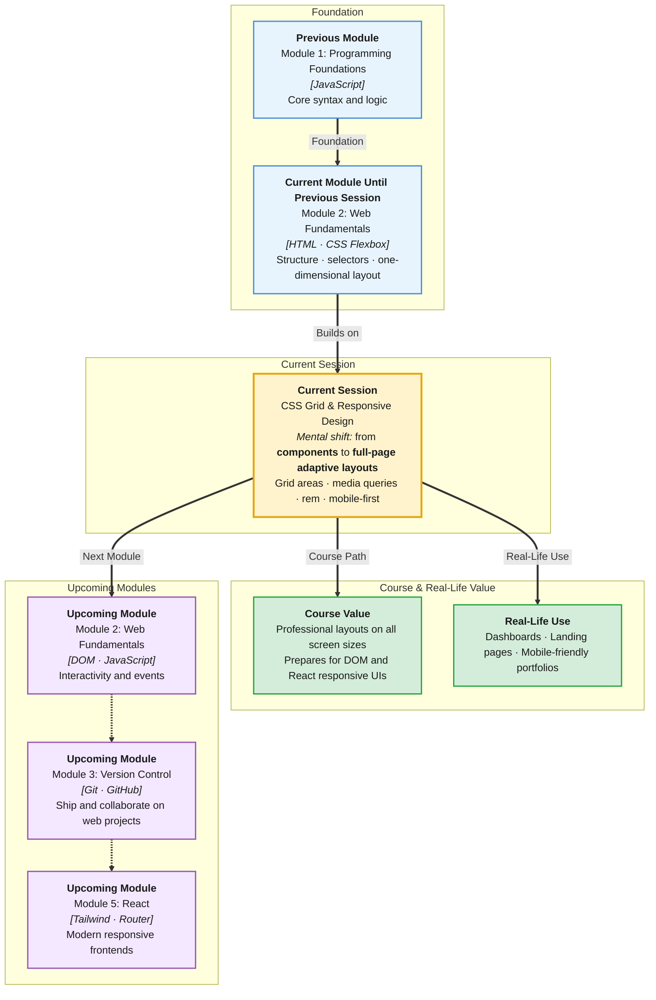

```mermaid
flowchart TB
    subgraph foundation ["Foundation"]
        direction TB
        P1["<b>Previous Module</b><br/>Module 1: Programming Foundations<br/><i>[JavaScript]</i><br/>Core syntax and logic"]
        CM["<b>Current Module Until Previous Session</b><br/>Module 2: Web Fundamentals<br/><i>[HTML · CSS Flexbox]</i><br/>Structure · selectors · one-dimensional layout"]
    end

    subgraph current ["Current Session"]
        CS["<b>Current Session</b><br/>CSS Grid & Responsive Design<br/><i>Mental shift:</i> from <b>components</b> to <b>full-page adaptive layouts</b><br/>Grid areas · media queries · rem · mobile-first"]
    end

    subgraph value ["Course & Real-Life Value"]
        CV["<b>Course Value</b><br/>Professional layouts on all screen sizes<br/>Prepares for DOM and React responsive UIs"]
        RL["<b>Real-Life Use</b><br/>Dashboards · Landing pages · Mobile-friendly portfolios"]
    end

    subgraph future ["Upcoming Modules"]
        direction TB
        U1["<b>Upcoming Module</b><br/>Module 2: Web Fundamentals<br/><i>[DOM · JavaScript]</i><br/>Interactivity and events"]
        U2["<b>Upcoming Module</b><br/>Module 3: Version Control<br/><i>[Git · GitHub]</i><br/>Ship and collaborate on web projects"]
        U3["<b>Upcoming Module</b><br/>Module 5: React<br/><i>[Tailwind · Router]</i><br/>Modern responsive frontends"]
    end

    P1 ==>|&nbsp;Foundation&nbsp;| CM
    CM ==>|&nbsp;Builds on&nbsp;| CS
    CS ==>|&nbsp;Course Path&nbsp;| CV
    CS ==>|&nbsp;Real-Life Use&nbsp;| RL
    CS ==>|&nbsp;Next Module&nbsp;| U1
    U1 -.-> U2
    U2 -.-> U3

    classDef previous fill:#E8F4FD,stroke:#4A90D9,stroke-width:2px,color:#1a1a1a
    classDef current fill:#FFF3CD,stroke:#E6A817,stroke-width:3px,color:#1a1a1a
    classDef value fill:#D4EDDA,stroke:#28A745,stroke-width:2px,color:#1a1a1a
    classDef future fill:#F3E8FF,stroke:#9B59B6,stroke-width:2px,color:#1a1a1a

    class P1,CM previous
    class CS current
    class CV,RL value
    class U1,U2,U3 future

    linkStyle default stroke-width:3px
```
