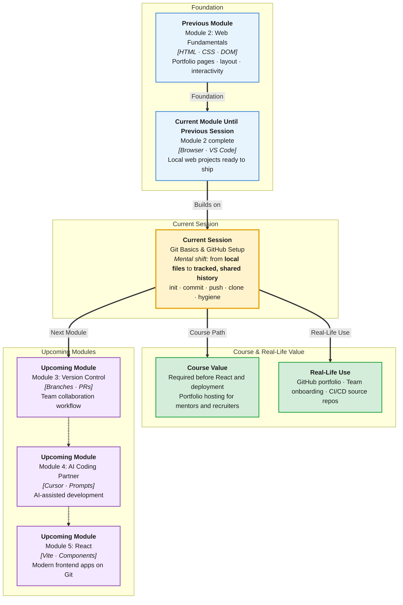

```mermaid
flowchart TB
    subgraph foundation ["Foundation"]
        direction TB
        P1["<b>Previous Module</b><br/>Module 2: Web Fundamentals<br/><i>[HTML · CSS · DOM]</i><br/>Portfolio pages · layout · interactivity"]
        CM["<b>Current Module Until Previous Session</b><br/>Module 2 complete<br/><i>[Browser · VS Code]</i><br/>Local web projects ready to ship"]
    end

    subgraph current ["Current Session"]
        CS["<b>Current Session</b><br/>Git Basics & GitHub Setup<br/><i>Mental shift:</i> from <b>local files</b> to <b>tracked, shared history</b><br/>init · commit · push · clone · hygiene"]
    end

    subgraph value ["Course & Real-Life Value"]
        CV["<b>Course Value</b><br/>Required before React and deployment<br/>Portfolio hosting for mentors and recruiters"]
        RL["<b>Real-Life Use</b><br/>GitHub portfolio · Team onboarding · CI/CD source repos"]
    end

    subgraph future ["Upcoming Modules"]
        direction TB
        U1["<b>Upcoming Module</b><br/>Module 3: Version Control<br/><i>[Branches · PRs]</i><br/>Team collaboration workflow"]
        U2["<b>Upcoming Module</b><br/>Module 4: AI Coding Partner<br/><i>[Cursor · Prompts]</i><br/>AI-assisted development"]
        U3["<b>Upcoming Module</b><br/>Module 5: React<br/><i>[Vite · Components]</i><br/>Modern frontend apps on Git"]
    end

    P1 ==>|&nbsp;Foundation&nbsp;| CM
    CM ==>|&nbsp;Builds on&nbsp;| CS
    CS ==>|&nbsp;Course Path&nbsp;| CV
    CS ==>|&nbsp;Real-Life Use&nbsp;| RL
    CS ==>|&nbsp;Next Module&nbsp;| U1
    U1 -.-> U2
    U2 -.-> U3

    classDef previous fill:#E8F4FD,stroke:#4A90D9,stroke-width:2px,color:#1a1a1a
    classDef current fill:#FFF3CD,stroke:#E6A817,stroke-width:3px,color:#1a1a1a
    classDef value fill:#D4EDDA,stroke:#28A745,stroke-width:2px,color:#1a1a1a
    classDef future fill:#F3E8FF,stroke:#9B59B6,stroke-width:2px,color:#1a1a1a

    class P1,CM previous
    class CS current
    class CV,RL value
    class U1,U2,U3 future

    linkStyle default stroke-width:3px
```
