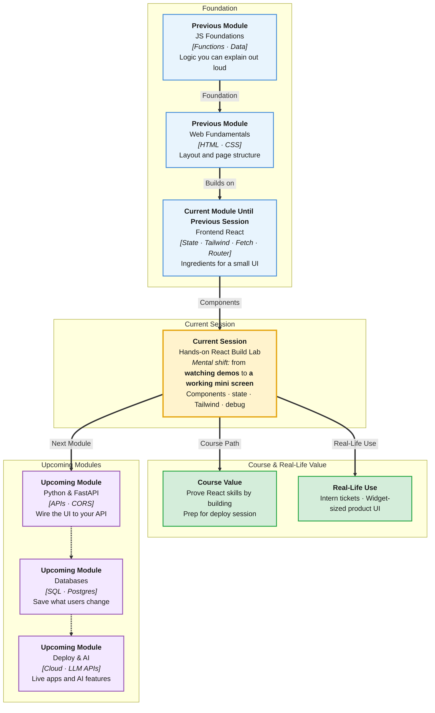

# Pre-Read: Hands-on: React Build Lab

## Session Mindmap

This diagram shows where this session sits in the course.

## 1. What You'll Learn

In this pre-read, you'll discover:

- How to **assemble a small React UI** from components and props
- How to **drive that UI with `useState`**
- How to **style it with Tailwind utilities**
- How to **spot and fix common beginner React errors** with a mentor
- What “**a working mini screen**” looks like by the end of lab

---

## 2. Detailed Explanation

### This Session Is a Workshop, Not a New Library

You already met Vite, components, props, `useState`, Tailwind, fetch, and Router. Today you **build**. The goal is one **working mini screen** on your machine — not a product launch.

**One-line definition:** A mini screen is a small, styled, stateful React UI you can click and explain.

**Analogy:** Cooking class after knife skills. You plate one dish. Mentors taste (review) and fix technique. You do not open a restaurant (no large project).

> **In the Real World:** Intern week-one at **Razorpay**, **Swiggy**, or a **Y Combinator** startup is often “make this card work.” Staff engineers still assemble components, state, and utilities the same way. Lab is that ticket, with a mentor instead of Slack.

### Why It Matters

**Real-world hook:** Tutorials feel easy. A blank `App.jsx` feels hard. Lab is where skill becomes yours.

**Benefits:**
- **Muscle memory** — import, props, setter, `className`
- **Debug confidence** — red console is a clue, not a verdict
- **A demo** — you can screen-share a working UI

### Build a Small UI with Components and Props

Split the screen:

| Piece | Role |
|-------|------|
| `App` | Layout and state owner (keep it small) |
| `Header` or `TitleBar` | Props: `title` |
| `Card` or `ItemRow` | Props: `label`, maybe `done` |

Pass data **down**. Do not invent Redux. Two or three components is enough.

### Manage State with useState

Pick **one** interaction:

- Counter or like
- Controlled text field + live preview
- Toggle (open/closed, light/dark label only)

State lives in a parent or in the screen component. Child can receive `onClick` via props if you already did that; otherwise keep the button in the same file as `useState` to stay safe.

### Style with Tailwind Utilities

Reuse: `flex`, `gap-4`, `p-4`, `rounded-lg`, `bg-slate-100`, `md:flex-row`. No new CSS framework. Restyle until it looks intentional, not until it copies **Instagram** pixel-perfect.

> **In the Real World:** **Notion** and **Linear** UIs look “done” because of spacing and type — not because of extra libraries.

### Common Beginner Errors (Bring These to Mentors)

| Symptom | Likely cause |
|---------|----------------|
| Blank page | Syntax error, missing import, crash in render |
| `class` vs `className` | JSX rule |
| UI does not update | Assigned state instead of setter |
| Input will not type | Missing `value`/`onChange` pair |
| `useState` is not defined | Forgot import from `"react"` |
| Infinite fetch (if you add it) | Fetch not in `useEffect` |
| Router crash | `Link` outside router wrap |

You may use fetch or Router **only if they already work** in your project. They are not required to pass the lab. A styled stateful card is enough.

### Messy to Clear

**Messy:** One 200-line `App.jsx`, inline styles, `document.querySelector` inside React.

**Clear:** Small components, props, one or two `useState`s, Tailwind on JSX.

### Leave a Working Mini Screen

**Done looks like:**

- [ ] Dev server running, no console crash loop
- [ ] At least two components or one component + clear props usage
- [ ] A click or type that changes the UI
- [ ] Tailwind classes visible in the browser
- [ ] You can explain the data flow in 30 seconds

Commit if Git is set up. You will polish README and deploy in the next session — not a requirement here.

### Building Blocks Checklist

- [ ] I know which screen I will build before class (write a 3-bullet plan)
- [ ] I will ask for help after 10 minutes stuck, not 50
- [ ] I will read the error message out loud to my mentor
- [ ] I will not paste a whole AI app I cannot explain

---

## 3. Practice Exercises

Do these **before** lab so class time is building, not rereading.

**Exercise 1 — Plan**  
Write three bullets: layout pieces, one state value, one Tailwind layout class you will use.

**Exercise 2 — Props sketch**  
On paper, `UserBadge({ name })` — what JSX does it return?

**Exercise 3 — State sketch**  
Write `useState` for a boolean `open`. What does the button setter do?

**Exercise 4 — Error drill**  
Which is valid in JSX: `class` or `className`? Why?

**Exercise 5 — Scope check**  
List what you will **not** add today (auth, database, extra libraries). Keep the list visible.
