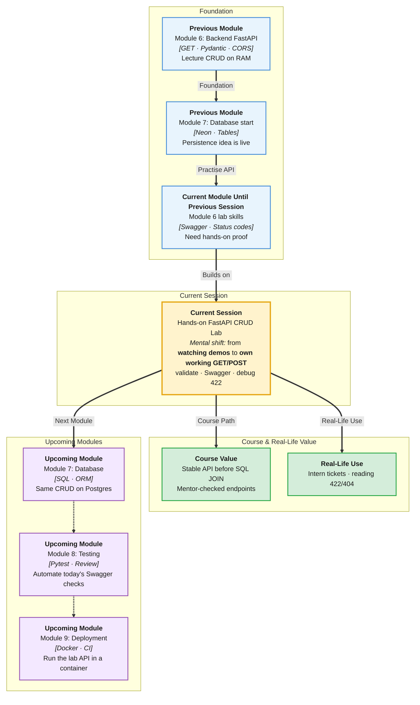

```mermaid
%%{init: {'flowchart': {'nodeSpacing': 42, 'rankSpacing': 52, 'diagramPadding': 16}}}%%
flowchart TB
    subgraph foundation ["Foundation"]
        direction TB
        P1["<b>Previous Module</b><br/>Module 6: Backend FastAPI<br/><i>[GET · Pydantic · CORS]</i><br/>Lecture CRUD on RAM"]
        P2["<b>Previous Module</b><br/>Module 7: Database start<br/><i>[Neon · Tables]</i><br/>Persistence idea is live"]
        CM["<b>Current Module Until Previous Session</b><br/>Module 6 lab skills<br/><i>[Swagger · Status codes]</i><br/>Need hands-on proof"]
    end

    subgraph current ["Current Session"]
        CS["<b>Current Session</b><br/>Hands-on FastAPI CRUD Lab<br/><i>Mental shift:</i> from <b>watching demos</b> to <b>own working GET/POST</b><br/>validate · Swagger · debug 422"]
    end

    subgraph value ["Course & Real-Life Value"]
        CV["<b>Course Value</b><br/>Stable API before SQL JOIN<br/>Mentor-checked endpoints"]
        RL["<b>Real-Life Use</b><br/>Intern tickets · reading 422/404"]
    end

    subgraph future ["Upcoming Modules"]
        direction TB
        U1["<b>Upcoming Module</b><br/>Module 7: Database<br/><i>[SQL · ORM]</i><br/>Same CRUD on Postgres"]
        U2["<b>Upcoming Module</b><br/>Module 8: Testing<br/><i>[Pytest · Review]</i><br/>Automate today's Swagger checks"]
        U3["<b>Upcoming Module</b><br/>Module 9: Deployment<br/><i>[Docker · CI]</i><br/>Run the lab API in a container"]
    end

    P1 ==>|&nbsp;Foundation&nbsp;| P2
    P2 ==>|&nbsp;Practise API&nbsp;| CM
    CM ==>|&nbsp;Builds on&nbsp;| CS
    CS ==>|&nbsp;Course Path&nbsp;| CV
    CS ==>|&nbsp;Real-Life Use&nbsp;| RL
    CS ==>|&nbsp;Next Module&nbsp;| U1
    U1 -.-> U2
    U2 -.-> U3

    classDef previous fill:#E8F4FD,stroke:#4A90D9,stroke-width:2px,color:#1a1a1a
    classDef current fill:#FFF3CD,stroke:#E6A817,stroke-width:3px,color:#1a1a1a
    classDef value fill:#D4EDDA,stroke:#28A745,stroke-width:2px,color:#1a1a1a
    classDef future fill:#F3E8FF,stroke:#9B59B6,stroke-width:2px,color:#1a1a1a

    class P1,P2,CM previous
    class CS current
    class CV,RL value
    class U1,U2,U3 future

    linkStyle default stroke-width:3px
```
