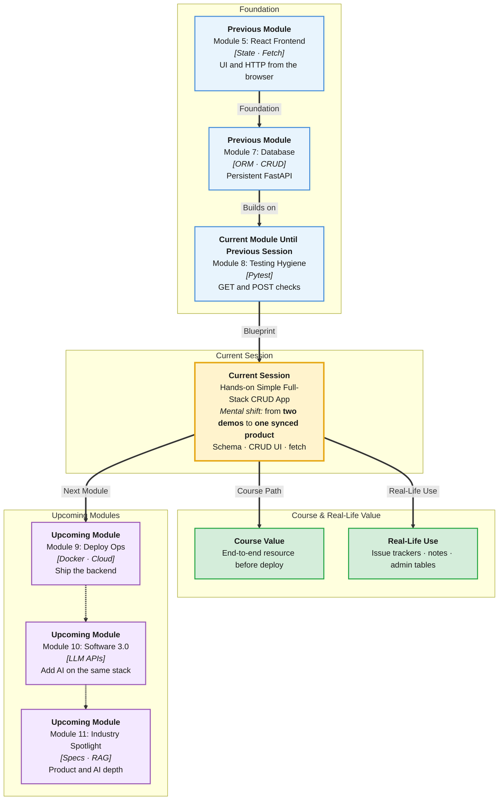

# Pre-Read: Hands-on Simple Full-Stack CRUD App

## Session Mindmap

This diagram shows where this session sits in the course.



## 1. What You'll Learn

In this pre-read, you'll discover:

- How one **shared schema** keeps React and FastAPI honest
- How **FastAPI CRUD** for one resource becomes the contract
- How **React screens** list, create, edit, and delete
- How **fetch** wires the UI to those routes
- How to **verify frontend and backend stay in sync**

---

## 2. Detailed Explanation

### One Resource, Two Sides

Pick **one** resource. Example: `Task` with `id`, `title`, `done`. Both sides use that shape.

**Shared schema** means: the JSON FastAPI returns is the JSON React expects. If the backend sends `name` and the UI reads `title`, the app lies.

**Analogy:** Two teams building a Lego set. Same instruction booklet. That booklet is the schema.

> **In the Real World:** **Figma** design tokens and **Stripe** API objects are contracts. Frontend does not invent field names. Neither should you.

**Why It Matters**

- Bugs hide in mismatched fields
- One resource done end-to-end beats a pretty UI on fake data
- This is the shape of every product ticket

**Benefits**

- Clear demo story
- Easier debugging: Network tab vs Swagger
- Portfolio proof of full-stack thinking

### FastAPI CRUD (One Resource)

You already have persistent routes. For the lab, expose:

- List GET
- Create POST
- Update PUT or PATCH (edit)
- Delete DELETE

CORS must allow the Vite origin. You enabled CORS earlier. Reuse it.

### React CRUD Screens

Keep screens simple:

- **List** — map tasks to rows
- **Create** — form POST
- **Edit** — form that PUT/PATCHes one id
- **Delete** — button that DELETEs then refreshes the list

**State** holds the list. After each success, refetch or update state so the UI matches the database.

### Wire fetch

```javascript
const res = await fetch("http://localhost:8000/tasks");
const tasks = await res.json();
```

Create uses `method: "POST"`, `headers: { "Content-Type": "application/json" }`, and `body: JSON.stringify({ title, done: false })`.

### Verify FE/BE Stay in Sync

Checklist:

1. Create in UI → row appears in Swagger GET
2. Edit in UI → Neon/Swagger shows new title
3. Delete in UI → list and GET agree
4. Refresh the browser → list still matches DB

If the UI shows data Swagger does not, you are still on fake state.

**Messy to Clear**

**Messy:** Hardcoded array in React plus a different field list in Pydantic.

**Clear:** One field list on a sticky note. Both repos copy it.

> **In the Real World:** **Linear** issue fields are identical in API and UI. Sync is the product.

### Building Blocks Checklist

- [ ] I wrote the shared fields on paper
- [ ] I can name four HTTP verbs for the resource
- [ ] I know which React screen uses which verb
- [ ] I can write one fetch call
- [ ] I have a four-step sync check

---

## 3. Practice Exercises

**Exercise 1 — Schema**
Write JSON for one task with `id`, `title`, `done`. Circle names React must use.

**Exercise 2 — Routes**
Match screens to methods: list, create, edit, delete.

**Exercise 3 — Create fetch**
Write the `method` and `headers` for POST.

**Exercise 4 — Edit**
In one sentence, why edit needs an `id` in the URL.

**Exercise 5 — Sync**
After delete, you refresh the page and the item returns. Where is the bug more likely: UI state or backend delete?
