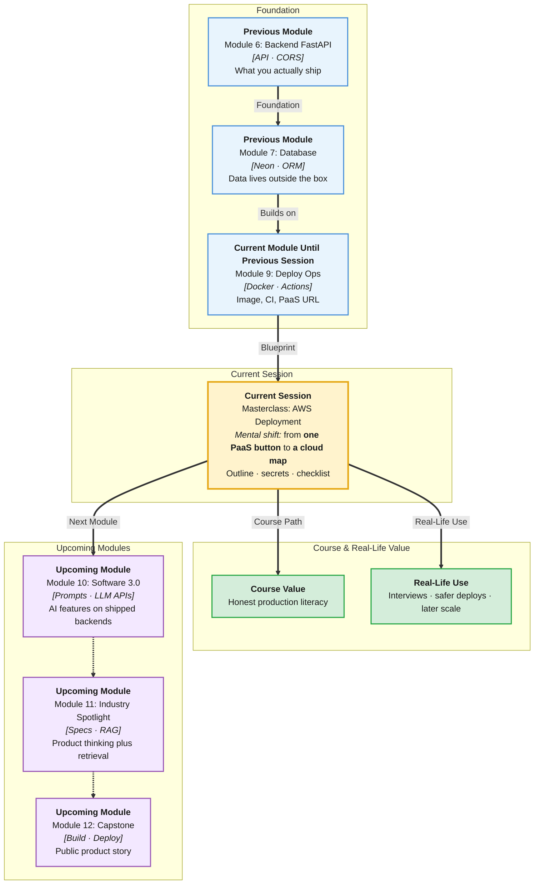

# Pre-Read: Masterclass — AWS Deployment

## Session Mindmap

This diagram shows where this session sits in the course.

## 1. What You'll Learn

In this pre-read, you'll discover:

- **AWS at a beginner high level** — a toolbox of cloud services, not one button
- A **simple outline** for deploying a containerised backend on AWS
- How to **treat env vars and secrets** as sensitive, not as files in Git
- **When Render/Railway is enough** versus when AWS shows up in jobs
- A **short production deploy checklist** you can reuse

---

## 2. Detailed Explanation

### What Is AWS, Plainly?

**AWS** (Amazon Web Services) is a large catalog of rented computers, databases, networks, and extras. You pick pieces. You pay for what you use.

You already used **PaaS** (Platform as a Service — Render/Railway hide servers). AWS is closer to assembling Lego. More power. More ways to get lost.

**Analogy:** Railway is a furnished studio. AWS is a hardware store plus an empty plot.

> **In the Real World:** **Netflix**, **Airbnb**, and huge Indian banks run on AWS or similar clouds. Interns rarely start by inventing a VPC. They still must **speak the names** in interviews.

**Why It Matters**

- Job descriptions list AWS even for junior roles
- You should not fear the console
- You should not pretend you “know AWS” after one click

**Benefits**

- Honest comparison with PaaS
- Safer secret habits
- A checklist that prevents “demo-only” deploys

### Outline: Containerised Backend on AWS (Bird’s Eye)

Stay at outline level:

1. Put the **Docker image** in a registry (AWS has one; others exist).
2. Run that image on a **compute** service that understands containers.
3. Give it **env vars** (database URL).
4. Put a **public HTTPS URL** in front.
5. Watch logs and a simple health check.

You will **not** configure every network knob in this masterclass. You will be able to **tell the story** in order.

### Env Vars and Secrets

A **secret** is a value that grants access: Neon password, API tokens.

Rules you already started:

- Not in Git
- Not in screenshots in Slack
- Different values per environment

AWS adds **managed secret stores** in real companies. Beginner version: platform env vars + least people who can read them.

> **In the Real World:** One leaked AWS key on GitHub can mine crypto on your bill overnight. This is not a scare story for fun. It is a weekly incident class.

### Render/Railway vs AWS for Early Projects

| Early project | Render / Railway | AWS |
|---------------|------------------|-----|
| Time to first URL | Short | Longer |
| Mental load | Low | High |
| Resume keyword | “Deployed API” | “AWS” if you truly used it |
| Best use now | Ship the BSAI backend | Learn map + checklist |

For this course, **PaaS is the default ship path**. AWS is literacy and a later option.

### Short Production Checklist

- [ ] App starts from a container or documented start command
- [ ] `DATABASE_URL` and secrets not in the repo
- [ ] HTTPS URL opens `/docs` or a health route
- [ ] Logs are reachable when it fails
- [ ] You know who can change env vars

**Messy to Clear**

**Messy:** “I deployed on AWS” with no URL and a committed key.

**Clear:** PaaS or AWS, live URL, secrets off Git, checklist ticked.

### Building Blocks Checklist

- [ ] I can define AWS in one sentence
- [ ] I can list the five outline steps
- [ ] I can explain a secret vs a normal setting
- [ ] I can argue PaaS vs AWS for a student app
- [ ] I can recite the checklist

---

## 3. Practice Exercises

**Exercise 1 — Definition**
Explain AWS to a friend who only used Render. Four sentences max.

**Exercise 2 — Outline**
Number the five bird’s-eye deploy steps from memory.

**Exercise 3 — Secrets**
Give two places a database password must **not** live.

**Exercise 4 — Compare**
When would you keep a student project on Railway instead of AWS?

**Exercise 5 — Checklist**
Tick which item you can already prove with your Render/Railway URL.
