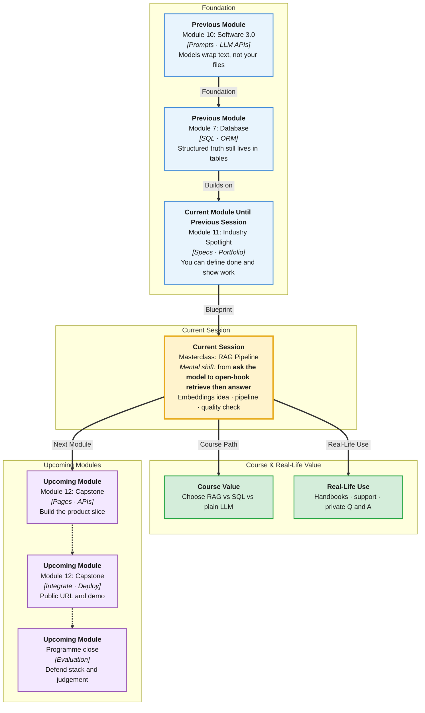

# Pre-Read: Masterclass — RAG Pipeline

## Session Mindmap

This diagram shows where this session sits in the course.

## 1. What You'll Learn

In this pre-read, you'll discover:

- **Why RAG is needed** when an LLM lacks fresh or private context
- What **embeddings** are in plain words
- What a **vector store** is used for
- The **minimal RAG pipeline** from documents to an answer
- **One basic retrieval quality check** at a high level

---

## 2. Detailed Explanation

### The LLM Does Not Have Your Notes

Models are trained on public-ish data up to a cutoff. They do not contain your **Neon** rows, your PDF handbook, or this morning’s policy.

If you paste everything into the prompt, you hit the **context window** and leak private text carelessly.

**RAG** (Retrieval-Augmented Generation) means: **find a few relevant snippets first**, then ask the LLM to answer **using those snippets**.

**Analogy:** An open-book exam. The model is the student. Retrieval is finding the right pages. Generation is writing the answer.

> **In the Real World:** **ChatGPT** browsing, **Notion Q&A** on a workspace, **customer-support bots** at **Zendesk**-class tools — all need a retrieve-then-read pattern. **Google** search-plus-AI is a cousin of the idea.

**Why It Matters**

- Private data must not live only inside model weights
- Fresh facts change daily
- Blind generation hallucinates policy and prices

**Benefits**

- Smaller prompts (only retrieved chunks)
- A place to **update** docs without retraining
- A quality question: “did we fetch the right chunk?”

### Embeddings in Plain Words

An **embedding** is a list of numbers that represents meaning. Similar sentences sit nearer in that number-space.

You do **not** need to implement embedding libraries in depth today. Remember: **text in → vector out**. Similar meaning ≈ closer vectors.

**Analogy:** A library code for “about refunds” so two refund paragraphs get nearby codes.

### Vector Store

A **vector store** saves those number-lists and can **search by similarity**: “give me chunks nearest to this question.”

It is not a replacement for Postgres for all CRUD. It is a **search engine for meaning**, used in the retrieve step.

### Minimal Pipeline End to End

1. **Load** documents (handbook paragraphs)
2. **Embed** chunks (turn text into vectors)
3. **Store** vectors
4. **Retrieve** nearest chunks for a user question
5. **Prompt** the LLM with those chunks + the question
6. **Answer** the user (and preferably cite the chunk)

That is the whole mountain for this masterclass.

### One Basic Retrieval Quality Check (High Level)

Ask: for a question whose answer is **only** in chunk A, did we retrieve chunk A in the top results?

If we retrieved unrelated chunks, the LLM will guess. That check is about **retrieval**, not about fancy model brands.

**Messy to Clear**

**Messy:** “Just put the PDF in ChatGPT.”

**Clear:** chunk → embed → store → retrieve → prompt → answer, plus one retrieval check.

> **In the Real World:** **Klarna** and bank assistants failed publicly when retrieval or policy chunks were wrong. Quality starts with “right page,” not “prettier prose.”

### Building Blocks Checklist

- [ ] I can say when RAG is needed
- [ ] I can explain embeddings without math class
- [ ] I know what a vector store searches
- [ ] I can list the pipeline steps
- [ ] I can describe one retrieval check

---

## 3. Practice Exercises

**Exercise 1 — Why RAG**
Give one example of private data an LLM would not know.

**Exercise 2 — Embeddings**
In one sentence: similar meaning, nearby numbers.

**Exercise 3 — Store**
What question does a vector store answer at retrieve time?

**Exercise 4 — Pipeline**
Order: prompt, embed, load, retrieve, store, answer.

**Exercise 5 — Quality**
Invent one question that should retrieve the “refund policy” chunk only.
