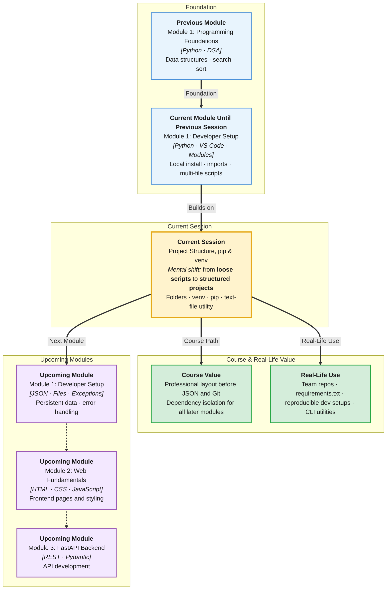

# Pre-Read: Understanding Typical Python Project Structure, pip, Virtual Environments & Practical Utilities

## Session Mindmap

This diagram shows where this session sits in the course.



## 1. What You'll Learn

In this pre-read, you'll discover:

- How a **typical Python project folder** is organized with clear roles for each file
- How to **create and activate a virtual environment** so dependencies stay isolated
- How to **install packages with pip** and track them in `requirements.txt`
- How to **build a small multi-file utility** that reads and writes plain-text data
- How to **debug and run projects** in VS Code with a proper entry point

---

## 2. Detailed Explanation

### From Scripts to Projects

Last session you ran single files and simple imports. Real projects have **folders, data files, dependencies, and an entry point** — the main file you run to start the program.

**Analogy:** A script is one recipe card. A project is a full cookbook with ingredients list, prep station, and serving instructions.

### Typical Project Layout

A beginner-friendly layout might look like:

```
my_utility/
  main.py          # entry point — run this
  utils.py         # helper functions
  data/
    notes.txt      # input or output data
  requirements.txt # list of pip packages
```

| Item | Purpose |
|------|---------|
| `main.py` | Starts the program |
| `utils.py` | Reusable logic |
| `data/` | Files your program reads or writes |
| `requirements.txt` | Records installed packages |

### Virtual Environments (venv)

A **virtual environment** (an isolated Python setup for one project) keeps each project's packages separate.

**Why It Matters:** Project A might need `requests==2.28`. Project B might need a newer version. Without venv, installs clash.

**Create and activate:**
```bash
python3 -m venv venv
source venv/bin/activate   # macOS/Linux
```

When active, your terminal prompt often shows `(venv)`.

### pip and requirements.txt

**pip** is Python's package installer. You use it inside an activated venv:

```bash
pip install requests
pip freeze > requirements.txt
```

**requirements.txt** lets teammates recreate the same environment:

```bash
pip install -r requirements.txt
```

### Building a Practical Utility

Imagine a **word counter** for a text file:

1. Read `data/notes.txt`
2. Count words
3. Write result to `data/summary.txt`

```python
# utils.py
def count_words(text):
    return len(text.split())

# main.py
from utils import count_words
with open("data/notes.txt") as f:
    text = f.read()
result = count_words(text)
with open("data/summary.txt", "w") as f:
    f.write(f"Words: {result}")
```

### Debugging in VS Code

Use breakpoints in `main.py`, run with the debugger, and inspect variables. This beats sprinkling `print` everywhere once projects grow.

**Benefits:**
- Reproducible setups for yourself and teammates
- Clean separation between app code and data files
- Confidence installing third-party tools safely

---

## 3. Practice Exercises

**Exercise 1 — Folder plan**
Sketch a project tree for a "to-do list saver" with `main.py`, `storage.py`, and a `data/` folder. Label each file's job.

**Exercise 2 — venv practice**
Create a folder, run `python3 -m venv venv`, activate it, and confirm `which python3` points inside `venv`.

**Exercise 3 — Read a file**
Write a script that opens `data/sample.txt`, reads its contents, and prints the number of lines. Do not worry about packages yet.
