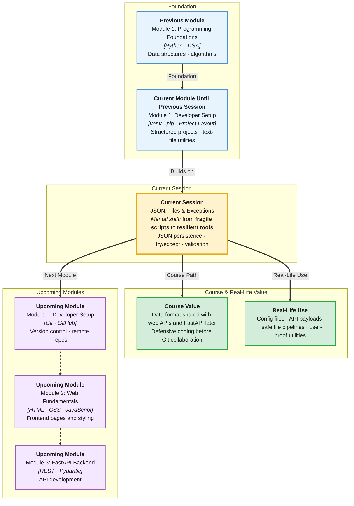

# Pre-Read: JSON Basics, File Operations & Exception Handling

## Session Mindmap

This diagram shows where this session sits in the course.



## 1. What You'll Learn

In this pre-read, you'll discover:

- What **JSON** is and why apps use it to store structured data
- How **Python dictionaries and lists** map to JSON objects and arrays
- How to **read and write JSON files** with the `json` module
- How to use **`try/except`** to handle errors without crashing your program
- How to **validate inputs and file data** before processing

---

## 2. Detailed Explanation

### Why JSON?

**JSON** (JavaScript Object Notation — a text format for structured data) is how APIs, config files, and mobile apps exchange information.

**Analogy:** JSON is a universal packing box. Python dicts, JavaScript objects, and databases all know how to pack and unpack it.

### JSON Structure

JSON uses:
- **Objects** — `{ "key": "value" }` (like Python dicts)
- **Arrays** — `[1, 2, 3]` (like Python lists)
- **Strings, numbers, booleans, null**

```json
{
  "name": "Asha",
  "scores": [88, 92, 79],
  "active": true
}
```

### Python ↔ JSON Mapping

| Python | JSON |
|--------|------|
| `dict` | object |
| `list` | array |
| `str` | string |
| `int` / `float` | number |
| `True` / `False` | true / false |
| `None` | null |

### Reading and Writing Files

You already used `open()` for plain text. JSON adds `json.load()` and `json.dump()`:

```python
import json

with open("data/user.json") as f:
    user = json.load(f)

user["scores"].append(95)

with open("data/user.json", "w") as f:
    json.dump(user, f, indent=2)
```

### Exception Handling

Programs crash when files are missing or JSON is malformed. **`try/except`** catches errors so you can respond gracefully.

```python
try:
    with open("data/missing.json") as f:
        data = json.load(f)
except FileNotFoundError:
    print("File not found — using defaults")
    data = {}
```

**Why It Matters:** Real users mistype paths, delete files, or send bad data. Defensive code keeps utilities running.

**Benefits:**
- Persist structured data between runs
- Share data with web frontends and APIs later
- Build reliable tools that fail with helpful messages, not stack traces

### Input Validation

Before processing, check:
- Does the file exist?
- Is required data present (`"name"` in dict)?
- Are types correct (is `scores` a list)?

Small checks prevent confusing bugs downstream.

---

## 3. Practice Exercises

**Exercise 1 — JSON spot check**
Which is valid JSON: `{'name': 'Asha'}` or `{"name": "Asha"}`? Write why.

**Exercise 2 — Dict to JSON**
Create a Python dict with your name and three hobbies. Use `json.dumps()` to print it as a JSON string.

**Exercise 3 — Safe read**
Write pseudocode (plain English steps) for: try to load `data/config.json`; if file missing, create an empty dict and save it.
