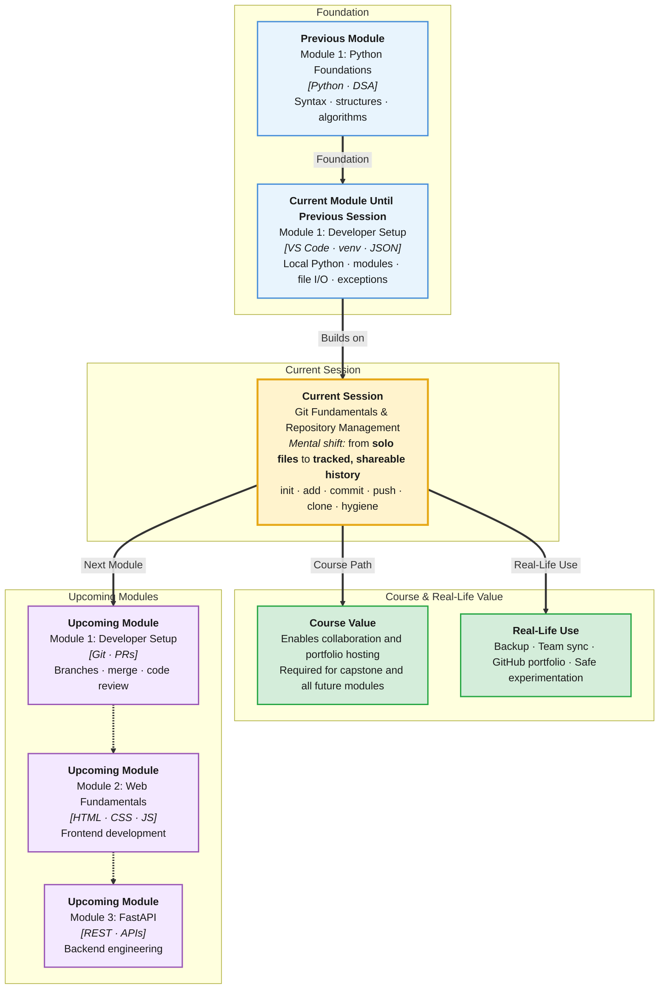

```mermaid
flowchart TB
    subgraph foundation ["Foundation"]
        direction TB
        P1["<b>Previous Module</b><br/>Module 1: Python Foundations<br/><i>[Python · DSA]</i><br/>Syntax · structures · algorithms"]
        CM["<b>Current Module Until Previous Session</b><br/>Module 1: Developer Setup<br/><i>[VS Code · venv · JSON]</i><br/>Local Python · modules · file I/O · exceptions"]
    end

    subgraph current ["Current Session"]
        CS["<b>Current Session</b><br/>Git Fundamentals & Repository Management<br/><i>Mental shift:</i> from <b>solo files</b> to <b>tracked, shareable history</b><br/>init · add · commit · push · clone · hygiene"]
    end

    subgraph value ["Course & Real-Life Value"]
        CV["<b>Course Value</b><br/>Enables collaboration and portfolio hosting<br/>Required for capstone and all future modules"]
        RL["<b>Real-Life Use</b><br/>Backup · Team sync · GitHub portfolio · Safe experimentation"]
    end

    subgraph future ["Upcoming Modules"]
        direction TB
        U1["<b>Upcoming Module</b><br/>Module 1: Developer Setup<br/><i>[Git · PRs]</i><br/>Branches · merge · code review"]
        U2["<b>Upcoming Module</b><br/>Module 2: Web Fundamentals<br/><i>[HTML · CSS · JS]</i><br/>Frontend development"]
        U3["<b>Upcoming Module</b><br/>Module 3: FastAPI<br/><i>[REST · APIs]</i><br/>Backend engineering"]
    end

    P1 ==>|&nbsp;Foundation&nbsp;| CM
    CM ==>|&nbsp;Builds on&nbsp;| CS
    CS ==>|&nbsp;Course Path&nbsp;| CV
    CS ==>|&nbsp;Real-Life Use&nbsp;| RL
    CS ==>|&nbsp;Next Module&nbsp;| U1
    U1 -.-> U2
    U2 -.-> U3

    classDef previous fill:#E8F4FD,stroke:#4A90D9,stroke-width:2px,color:#1a1a1a
    classDef current fill:#FFF3CD,stroke:#E6A817,stroke-width:3px,color:#1a1a1a
    classDef value fill:#D4EDDA,stroke:#28A745,stroke-width:2px,color:#1a1a1a
    classDef future fill:#F3E8FF,stroke:#9B59B6,stroke-width:2px,color:#1a1a1a

    class P1,CM previous
    class CS current
    class CV,RL value
    class U1,U2,U3 future

    linkStyle default stroke-width:3px
```
