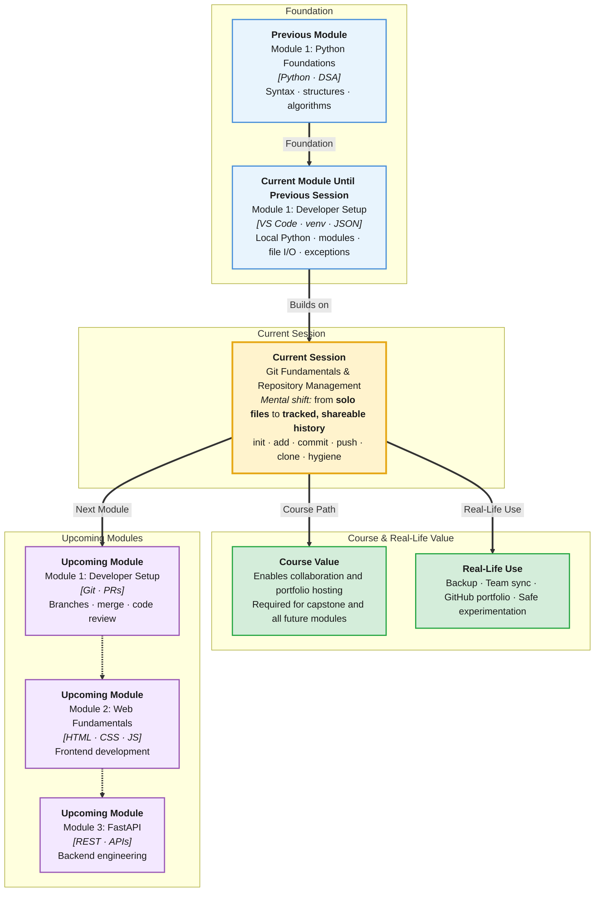

# Pre-Read: Git Fundamentals & Repository Management

## Session Mindmap

This diagram shows where this session sits in the course.



## 1. What You'll Learn

In this pre-read, you'll discover:

- **Why version control matters** when you write code alone or on a team
- How Git **tracks snapshots** of your project over time
- How to run **`git init`, `add`, `commit`, and `log`** on your local machine
- How to **connect a local repo to GitHub** and push your work online
- How to **clone** someone else's repository and work with it locally
- How **`.gitignore`, README, and clear commit messages** keep repos professional

---

## 2. Detailed Explanation

### The Problem Git Solves

Imagine you are building a Python utility. You name your file `app.py`. It works. You add features. Something breaks. You wish you could go back to yesterday's version.

Without Git, people do this:

```
app.py
app_final.py
app_final_FINAL.py
app_final_FINAL_v2.py
```

That is painful. **Version control** (a system that records changes to files over time) fixes this.

**Git** is the most widely used version control tool in the software industry.

**Analogy:** Git is like **save points in a video game**. You can return to an earlier checkpoint if you take a wrong turn.

### Local vs Remote Repository

| Term | Meaning |
|------|---------|
| **Local repository** | Git history stored on your laptop |
| **Remote repository** | Copy hosted online — usually on **GitHub** |
| **Push** | Send your commits from local to remote |
| **Clone** | Download a remote repo to your machine |

**Why GitHub?** It hosts your code in the cloud, backs it up, and lets you share it with mentors, teammates, and recruiters.

### Core Git Workflow (The Daily Loop)

```
edit files → git add → git commit → git push
```

1. **`git init`** — start tracking a folder (once per project)
2. **`git add <file>`** — stage changes (tell Git what to include in next snapshot)
3. **`git commit -m "message"`** — save a snapshot with a description
4. **`git log`** — view history of commits
5. **`git push`** — upload commits to GitHub (after remote is connected)

**Staging area analogy:** Packing a box before sealing it. You choose which items (files) go in this shipment (commit).

### Your First Local Repo (Step by Step)

Open terminal in VS Code (`Ctrl+` ` or `` Cmd+` ``):

```bash
mkdir my-first-repo
cd my-first-repo
git init
echo "# My First Repo" > README.md
git add README.md
git commit -m "Add README"
git log
```

You should see your commit with a message and a long **hash** (unique id).

### Connecting to GitHub

1. Create a **new repository** on GitHub (no README if you already have one locally).
2. Copy the remote URL — looks like `https://github.com/username/repo-name.git`
3. In your local project:

```bash
git remote add origin https://github.com/username/repo-name.git
git branch -M main
git push -u origin main
```

**`origin`** is the nickname for your remote. **`-u`** remembers the link for future pushes.

### Cloning an Existing Repo

```bash
git clone https://github.com/username/some-repo.git
cd some-repo
```

You get the full project and all history. Common when joining a team or starting from a template.

### Repository Hygiene

**`.gitignore`** — list files Git should **not** track:

```
venv/
__pycache__/
.env
.DS_Store
*.pyc
```

**Why:** Virtual environments and secrets should never go on GitHub.

**README.md** — explains what the project is, how to set it up, and how to run it. Recruiters and teammates read this first.

**Good commit messages:**
- ✅ `Add user login form validation`
- ✅ `Fix off-by-one error in search loop`
- ❌ `update`
- ❌ `fixed stuff`

**Rule:** Message should complete: "This commit will ___"

### Why It Matters

**Real-world hook:** Every company uses Git. Your capstone, portfolio, and team projects will live on GitHub.

**Benefits:**
- Undo mistakes safely
- Work on features without breaking main code
- Show hiring managers a clean commit history
- Collaborate without emailing zip files

### Messy to Clear

**Messy:** One giant commit "initial project" with 50 random files including `venv/`.

**Clear:** Small logical commits, `.gitignore` from day one, README with setup steps.

---

## 3. Practice Exercises

**Exercise 1 — Local repo**
Create a folder with `hello.py` that prints your name. Init Git, add, commit with message `Add hello script`. Run `git log`.

**Exercise 2 — .gitignore**
Create `.gitignore` that ignores `__pycache__/` and `.env`. Confirm with `git status` that ignored files do not appear as untracked (create a dummy `__pycache__` folder to test).

**Exercise 3 — GitHub**
Create a GitHub repo and push your local project. Open it in the browser and verify files appear.

**Exercise 4 — README**
Write a README with: project title, one-line description, and how to run `hello.py`.
