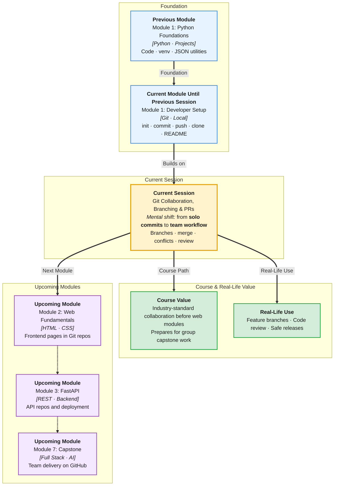

# Pre-Read: Git Collaboration, Branching & Pull Requests

## Session Mindmap

This diagram shows where this session sits in the course.



## 1. What You'll Learn

In this pre-read, you'll discover:

- How **branches** let you work on features without breaking the main codebase
- How to **create, switch, and merge** branches in a standard workflow
- What a **pull request (PR)** is and why teams use it before merging
- How to **recognize and fix a basic merge conflict** with mentor support
- How to **review code** as both author and reviewer on GitHub

---

## 2. Detailed Explanation

### Why Branch?

On a team, `main` (or `master`) usually holds **production-ready** code. If everyone committed directly to `main`, half-finished features would break the app daily.

A **branch** (an independent line of development) is a separate timeline. You experiment on a branch; when ready, you merge back into `main`.

**Analogy:** `main` is the published textbook. A branch is your draft chapter. You merge the draft only after editing and review.

### Essential Branch Commands

```bash
git branch                    # list branches
git branch feature-login      # create branch
git switch feature-login      # move to branch (or: git checkout feature-login)
git switch main               # back to main
```

**Workflow:**
1. Start from updated `main`
2. Create feature branch
3. Commit changes on branch
4. Merge or open PR into `main`

### Merging Branches

```bash
git switch main
git merge feature-login
```

**Merge** combines branch history into the target branch. If both branches edited the same lines differently, Git may report a **merge conflict**.

### What Is a Merge Conflict?

A **merge conflict** happens when Git cannot automatically decide which version to keep.

```
<<<<<<< HEAD
print("Hello")
=======
print("Hi there")
>>>>>>> feature-login
```

**You** choose the correct code, remove conflict markers, then:

```bash
git add conflicted_file.py
git commit -m "Resolve merge conflict in greeting"
```

**Do not panic.** Conflicts are normal. Read both sides. Ask a mentor if unsure.

### Pull Requests on GitHub

A **pull request** (a request to merge your branch into another, with discussion and review) is how teams collaborate on GitHub.

**Typical flow:**
1. Push your branch: `git push -u origin feature-login`
2. On GitHub: **Compare & pull request**
3. Describe what changed and why
4. Teammate **reviews** — comments, suggests fixes
5. After approval: **Merge pull request**
6. Locally: switch to `main`, `git pull` to sync

**Why PRs?** Code review catches bugs, shares knowledge, and keeps `main` stable.

### Pull Before Push

Before starting work or pushing:

```bash
git pull origin main
```

Gets latest changes from remote. Reduces conflicts.

### Code Review Basics

**As author:**
- Keep PRs small and focused
- Write clear description
- Respond to feedback politely

**As reviewer:**
- Read the diff (what changed)
- Ask questions: "What if input is empty?"
- Suggest improvements — do not just approve blindly

**Analogy:** PR is a homework submission; review is the teacher marking it before it goes in the grade book.

### Why It Matters

**Real-world hook:** No serious engineering team merges to production without review. Learning PR workflow now saves painful lessons later.

**Benefits:**
- Parallel work without stepping on teammates
- Documented discussion of every change
- Safer releases and better code quality

### Messy to Clear

**Messy:** Long-lived branch, 40 files changed, huge conflict on merge day.

**Clear:** Short branches, frequent pulls from `main`, small PRs merged often.

---

## 3. Practice Exercises

**Exercise 1 — Branch**
On a practice repo, create branch `add-footer`, add a line to README, commit, switch back to `main`, confirm the line is not there.

**Exercise 2 — Merge**
Merge `add-footer` into `main`. Confirm README change appears on `main`.

**Exercise 3 — PR practice**
Push a branch to GitHub and open a pull request (even if you merge it yourself). Write a 2-sentence PR description.

**Exercise 4 — Review mindset**
On paper, list 3 questions you would ask when reviewing a PR that adds a new Python function.
