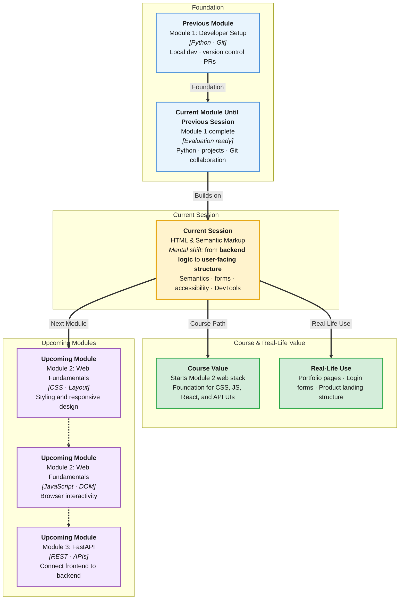

# Pre-Read: HTML & Semantic Markup

## Session Mindmap

This diagram shows where this session sits in the course.



## 1. What You'll Learn

In this pre-read, you'll discover:

- How the **frontend developer role** fits into a full web application
- How to write a **complete HTML document** with proper structure
- How **semantic tags** improve accessibility and readability
- How to build **forms** with labels, inputs, and buttons
- How to use **DevTools** to inspect and validate your HTML

---

## 2. Detailed Explanation

### Where Frontend Fits in a Web App

A typical web application has layers:

| Layer | Technology | Responsibility |
|-------|------------|----------------|
| **Frontend** | HTML, CSS, JavaScript | What users see and click |
| **Backend** | Python, FastAPI (later) | Business logic, data, APIs |
| **Database** | PostgreSQL (later) | Persistent storage |

**Frontend developers** turn designs and requirements into pages that run in the browser. You have already built Python logic and file utilities. Now you learn the **user-facing** side.

**Analogy:** A restaurant — backend is the kitchen; frontend is the dining room guests experience.

### HTML Document Structure

Every page needs a valid skeleton:

```html
<!DOCTYPE html>
<html lang="en">
<head>
  <meta charset="UTF-8">
  <meta name="viewport" content="width=device-width, initial-scale=1.0">
  <title>My App</title>
</head>
<body>
  <!-- visible content -->
</body>
</html>
```

- **`charset`** — character encoding (supports international text)
- **`viewport`** — essential for mobile rendering later with CSS
- **`title`** — browser tab text and bookmark label

### Semantic Tags — Meaning, Not Just Boxes

| Tag | Purpose |
|-----|---------|
| `<header>` | Top of page — logo, title |
| `<nav>` | Navigation links |
| `<main>` | Primary unique content (one per page) |
| `<section>` | Themed group, usually with heading |
| `<article>` | Self-contained content block |
| `<footer>` | Bottom info, links, copyright |

**Why not only `<div>`?** Screen readers and search engines understand semantics. Your code documents itself.

```html
<header>
  <h1>Task Manager</h1>
  <nav>
    <a href="#tasks">Tasks</a>
    <a href="#about">About</a>
  </nav>
</header>
<main>
  <section id="tasks">
    <h2>Your Tasks</h2>
    <p>Coming soon...</p>
  </section>
</main>
<footer>
  <p>&copy; 2026 Task Manager</p>
</footer>
```

### Headings, Links, and Images

- Use **one `<h1>`** per page for main title
- Do not skip levels (`h1` → `h3` without `h2`) without reason
- **Links:** `<a href="url">text</a>` — `href` required
- **Images:** `` — `alt` required for accessibility

### Forms — Collecting User Input

```html
<form>
  <label for="email">Email</label>
  <input type="email" id="email" name="email">

  <label for="password">Password</label>
  <input type="password" id="password" name="password">

  <button type="submit">Log In</button>
</form>
```

**Input types to know:** `text`, `email`, `password`, `number`, `checkbox`, `radio`, `textarea`

**Label rule:** `for` attribute matches input `id`. Clicking label focuses the field.

### Accessibility and Readability

**Accessibility** (designing so people with disabilities can use your site) starts with HTML:

- Semantic structure
- Labels on form fields
- Meaningful `alt` text on images
- Sufficient heading hierarchy

**Readability** for developers: semantic HTML is self-documenting — teammates find `nav` faster than `div class="nav"`.

### DevTools for HTML Validation

1. Open page in browser
2. Right-click → **Inspect**
3. **Elements** panel — live DOM tree
4. Check nesting, missing closing tags, wrong attributes

**Common bugs found in DevTools:**
- Unclosed tags breaking layout
- Form inputs without labels
- Duplicate `id` values (invalid — ids must be unique)

### Why It Matters

**Real-world hook:** Your capstone will have a React or HTML frontend talking to FastAPI. Every API response eventually becomes HTML the user sees.

**Benefits:**
- Foundation for CSS and JavaScript sessions
- Portfolio pages you can show recruiters
- Accessible products reach more users

### Messy to Clear

**Messy:**
```html
<div><div>Login</div><div><input></div></div>
```

**Clear:**
```html
<main>
  <h1>Login</h1>
  <form>...</form>
</main>
```

---

## 3. Practice Exercises

**Exercise 1 — Role reflection**
In 3 sentences, explain how frontend connects to the Python backend you will build later.

**Exercise 2 — Semantic page**
Build a page with `header`, `nav`, `main`, `footer`, and one `section` with `h2`.

**Exercise 3 — Form**
Create a contact form: name, email, message (`textarea`), submit button. All fields labeled.

**Exercise 4 — DevTools**
Inspect your `h1` and write down its parent element's tag name. Fix one intentional HTML mistake and confirm in DevTools.
