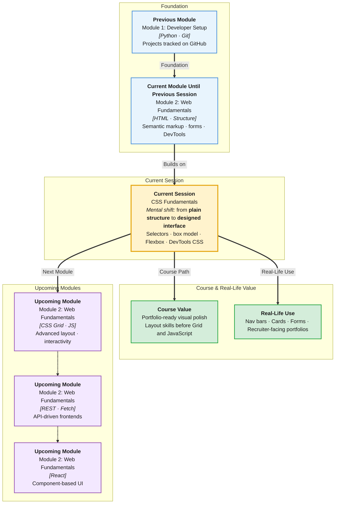

# Pre-Read: CSS Fundamentals

## Session Mindmap

This diagram shows where this session sits in the course.



## 1. What You'll Learn

In this pre-read, you'll discover:

- How to **link CSS** to HTML with internal and external stylesheets
- How **element, class, and id selectors** target parts of your page
- How the **box model** — margin, border, padding, content — controls spacing
- How to style **typography, colors, and backgrounds** on a full page
- How **Flexbox** helps align items in a row or column
- How to **debug CSS** with browser DevTools

---

## 2. Detailed Explanation

### HTML Gives Structure; CSS Gives Style

You built semantic HTML pages. They look plain by default. **CSS** selects elements and applies visual rules.

**Syntax:**

```css
selector {
  property: value;
}
```

Example:

```css
h1 {
  color: #2563eb;
  font-size: 2rem;
}
```

### Linking CSS

**External (recommended):**

```html
<link rel="stylesheet" href="styles.css">
```

**Internal (small pages or quick tests):**

```html
<style>
  body { background: #f9fafb; }
</style>
```

Keep HTML and CSS in separate files for real projects — easier to maintain.

### Selectors

| Type | Example | Use |
|------|---------|-----|
| Element | `p { }` | All paragraphs |
| Class | `.btn { }` | Reusable components |
| ID | `#hero { }` | Unique section |

```html
<button class="btn primary">Save</button>
```

```css
.btn {
  padding: 10px 16px;
  border-radius: 6px;
}
.primary {
  background: #2563eb;
  color: white;
}
```

**Multiple classes** on one element combine styles.

### The Box Model

Every element is a box with four layers:

```
margin  →  space outside border
border  →  edge line
padding →  space inside border, around content
content →  text, image, etc.
```

```css
.card {
  width: 240px;
  padding: 16px;
  border: 1px solid #e5e7eb;
  margin: 12px;
  background: white;
}
```

**Analogy:** A framed photo on a wall — photo (content), mat (padding), frame (border), space to next frame (margin).

**DevTools tip:** Inspect any element — see box model diagram with computed sizes.

### Typography, Color, and Background

```css
body {
  font-family: system-ui, sans-serif;
  font-size: 16px;
  line-height: 1.6;
  color: #1f2937;
  background-color: #f3f4f6;
}

h1 {
  font-weight: 700;
  color: #111827;
}
```

**Hex colors:** `#2563eb` — six-digit code common in design tools.

### Flexbox Introduction

**Flexbox** lines up children in one row or column.

Parent needs `display: flex`:

```css
.toolbar {
  display: flex;
  flex-direction: row;
  justify-content: space-between;
  align-items: center;
  gap: 12px;
}
```

| Property | Effect |
|----------|--------|
| `flex-direction: row` | Horizontal layout |
| `flex-direction: column` | Vertical stack |
| `justify-content` | Spacing along main axis |
| `align-items` | Alignment on cross axis |
| `gap` | Space between items |

**Use case:** Navigation bar, button groups, centering a login card.

### Debugging CSS in DevTools

1. Inspect element
2. **Styles** panel — see applied rules
3. Uncheck rules to test what breaks
4. Edit values live (temporary until you update source file)

**Common issues:**
- Typo in class name
- Forgot to link `styles.css`
- More specific rule overriding yours (strikethrough in DevTools)

### Why It Matters

**Real-world hook:** Users trust polished interfaces. CSS is how you demonstrate craft in portfolio projects.

**Benefits:**
- Transform homework HTML into portfolio-ready pages
- Prepare for CSS Grid and JavaScript DOM sessions
- Understand design handoffs in industry jobs

### Messy to Clear

**Messy:** Inline `style=""` on every tag.

**Clear:** External stylesheet, reusable classes, Flexbox for layout sections.

```css
.page-header {
  display: flex;
  justify-content: space-between;
  padding: 1rem 2rem;
  background: #111827;
  color: white;
}
```

---

## 3. Practice Exercises

**Exercise 1 — External CSS**
Link `styles.css` to your HTML page. Style all `h2` elements with a blue color.

**Exercise 2 — Box model**
Create `.note` class with padding 20px, border 2px dashed gray, margin 16px. Apply to a div.

**Exercise 3 — Flexbox nav**
Build a horizontal nav with three links using `display: flex` and `gap: 20px`.

**Exercise 4 — DevTools debug**
Introduce a deliberate CSS typo. Use DevTools to find why a rule does not apply. Fix it in your file.
