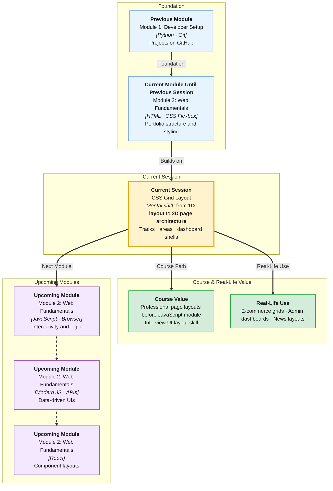

# Pre-Read: CSS Grid Layout

## Session Mindmap

This diagram shows where this session sits in the course.



## 1. What You'll Learn

In this pre-read, you'll discover:

- How **CSS Grid** solves two-dimensional page layout — rows **and** columns together
- How to define **grid rows, columns, and gaps** on a container element
- How **grid areas** place header, main, and footer without float hacks
- How to build a **multi-section page layout** on your existing HTML from earlier sessions
- Why Grid pairs with Flexbox — Grid for page skeleton, Flexbox for component innards
- How production sites like **The New York Times** and **GitHub** use Grid for page structure

---

## 2. Detailed Explanation

### Why Grid Exists

**Flexbox** (from your CSS Fundamentals session) excels at one-dimensional layout — a row **or** a column. But a full webpage needs both: a header spanning the full width, a sidebar beside main content, a footer below everything.

**CSS Grid** (a two-dimensional layout system — rows and columns at once) lets you define the entire page as a grid. Place each section into a cell or named area.

**Analogy:** Flexbox is organizing books on one shelf (left to right). Grid is designing the whole bookshelf — which shelf holds which category, how wide each column is, how tall each row is.

> **In the Real World:** **GitHub's** repository page, **Notion's** dashboard, and **BBC News** homepage use CSS Grid for macro layout. Flexbox handles buttons inside a toolbar; Grid handles the page regions around them.

### Grid Container vs Grid Items

| Role | Element | CSS |
|------|---------|-----|
| **Container** | Parent that defines the grid | `display: grid` |
| **Item** | Direct children placed on the grid | `grid-area` or auto-placement |

```css
.page {
  display: grid;
  grid-template-columns: 1fr 3fr;
  grid-template-rows: auto 1fr auto;
  gap: 16px;
  min-height: 100vh;
}
```

- **`1fr`** — one fraction of available space (flexible unit)
- **`gap`** — space between grid cells (replaces margin hacks)
- **`min-height: 100vh`** — at least full viewport height

### Defining Rows and Columns

```css
.grid {
  display: grid;
  grid-template-columns: 200px 1fr 200px;  /* sidebar | main | aside */
  grid-template-rows: 80px 1fr 60px;       /* header | content | footer */
  gap: 12px 24px;  /* row-gap column-gap */
}
```

| Property | Purpose |
|----------|---------|
| `grid-template-columns` | Column track sizes |
| `grid-template-rows` | Row track sizes |
| `gap` | Spacing between tracks |
| `repeat(3, 1fr)` | Shorthand for `1fr 1fr 1fr` |

### Grid Areas — Named Regions

Instead of counting row/column numbers, name regions:

```css
.layout {
  display: grid;
  grid-template-areas:
    "header header header"
    "sidebar main aside"
    "footer footer footer";
  grid-template-columns: 200px 1fr 150px;
  grid-template-rows: auto 1fr auto;
  gap: 16px;
  min-height: 100vh;
}

header  { grid-area: header; }
.sidebar { grid-area: sidebar; }
main    { grid-area: main; }
aside   { grid-area: aside; }
footer  { grid-area: footer; }
```

Each quoted row is one grid row. Repeated names span columns. This is readable and maintainable.

### Header / Main / Footer Pattern

The most common student project layout:

```css
.site {
  display: grid;
  grid-template-areas:
    "header"
    "main"
    "footer";
  grid-template-rows: auto 1fr auto;
  min-height: 100vh;
}

.site > header { grid-area: header; }
.site > main   { grid-area: main; padding: 24px; }
.site > footer { grid-area: footer; }
```

```html
<div class="site">
  <header>...</header>
  <main>...</main>
  <footer>...</footer>
</div>
```

### Grid vs Flexbox — When to Use Which

| Task | Tool |
|------|------|
| Full page regions | **Grid** |
| Navigation bar items in a row | **Flexbox** |
| Card grid (equal columns) | **Grid** with `repeat(auto-fit, minmax(250px, 1fr))` |
| Centering one button | **Flexbox** |

**Rule of thumb:** Grid for page layout; Flexbox for aligning items inside a component.

### Why It Matters

You built semantic HTML pages and styled them with CSS Fundamentals. Grid transforms a stacked mobile-looking page into a professional multi-section layout — the same structure recruiters expect in portfolio projects.

**Benefits:**
- No float or position hacks for layout
- Named areas make HTML/CSS easy to read
- Responsive patterns (media queries next) build on Grid foundation
- JavaScript sessions ahead assume a solid page structure

### Messy to Clear

**Messy layout:**
- `<br><br><br>` for spacing
- `position: absolute` everywhere
- Sidebar overlaps footer on resize

**Clean Grid layout:**
- One `.site` container with `display: grid`
- Named areas for header, main, footer
- `gap` for consistent spacing
- Main content grows with `1fr`

### Building Blocks Checklist

- [ ] I can explain Grid as two-dimensional layout
- [ ] I know `display: grid` goes on the container
- [ ] I can define rows, columns, and gap
- [ ] I can use `grid-template-areas` for header/main/footer
- [ ] I know when to choose Grid over Flexbox

---

## 3. Practice Exercises

**Exercise 1 — Basic grid**
Create a 2×2 grid with four colored divs. Set `grid-template-columns: 1fr 1fr` and `grid-template-rows: 100px 100px`. Add `gap: 10px`.

**Exercise 2 — Page skeleton**
Take your HTML page from the HTML session. Wrap content in `<div class="site">` with `<header>`, `<main>`, `<footer>`. Apply the three-row `grid-template-areas` pattern above.

**Exercise 3 — Named areas**
Extend to a sidebar layout: `"header header" / "sidebar main" / "footer footer"`. Place navigation links in sidebar, article in main.

**Exercise 4 — Gap experiment**
Try `gap: 0`, then `gap: 24px`, then `gap: 12px 32px`. Note difference between row and column gap in DevTools.

**Exercise 5 — Grid inspection**
Open DevTools → select grid container → enable **Grid overlay**. Screenshot the visible grid lines and label each area in your notes.
