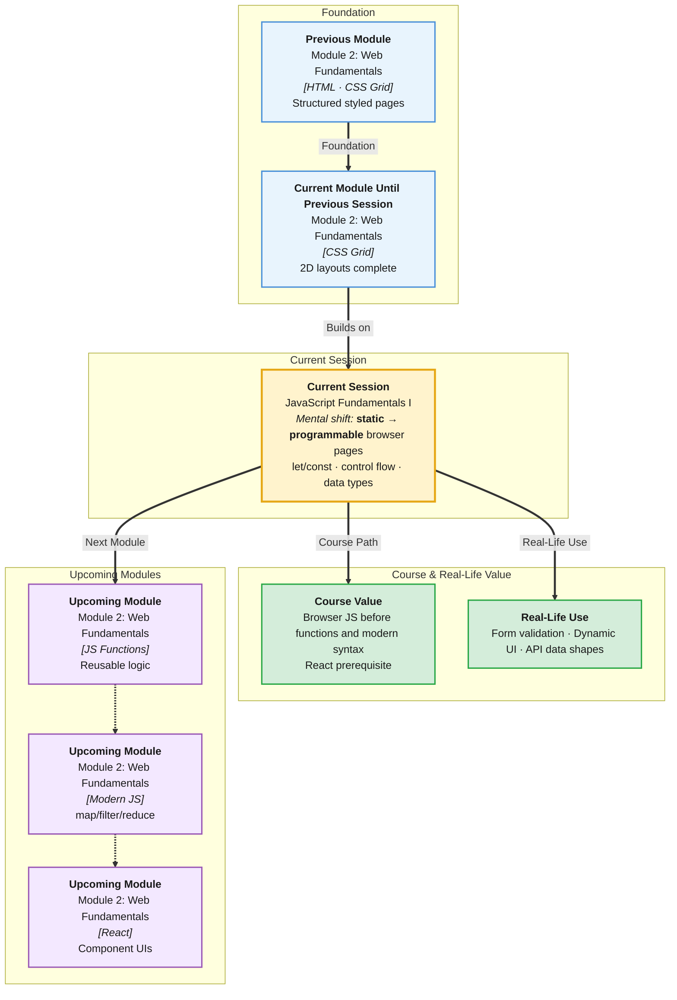

# Pre-Read: JavaScript Fundamentals I

## Session Mindmap

This diagram shows where this session sits in the course.



## 1. What You'll Learn

In this pre-read, you'll discover:

- How to **attach JavaScript to HTML** and use the **browser console** for debugging
- How to declare variables with **`let`**, **`const`**, and why **`var`** is legacy
- JavaScript **primitive types** — string, number, boolean, null, undefined
- How **operators, conditionals, and loops** control program flow in the browser
- How to work with **strings, arrays, and objects** in simple scripts
- Why JavaScript in the browser is your bridge from Python logic to interactive web pages

---

## 2. Detailed Explanation

### JavaScript in the Browser

**HTML** structures the page. **CSS** styles it. **JavaScript** makes it interactive — respond to clicks, validate forms, update content without reload.

Unlike Python in One Compiler, browser JavaScript runs inside **Chrome**, **Firefox**, or **Edge**. You attach a `.js` file to HTML:

```html
<!DOCTYPE html>
<html>
<head>
  <title>JS Lab</title>
</head>
<body>
  <h1 id="title">Hello</h1>
  <script src="app.js"></script>
</body>
</html>
```

```javascript
// app.js
console.log("JavaScript is running!");
document.getElementById("title").textContent = "Hello, IITREICT!";
```

Open the page → Right-click → **Inspect** → **Console** tab. You see your log message.

> **In the Real World:** Every product web app — **Gmail**, **Swiggy**, **LinkedIn** — runs JavaScript in your browser. The console is the first debugging tool every frontend developer uses daily.

### Variables: let, const, and var

| Keyword | Can reassign? | Scope | Use today? |
|---------|---------------|-------|------------|
| `const` | No | Block | Default for values that won't change |
| `let` | Yes | Block | Values that change |
| `var` | Yes | Function | Legacy — avoid in new code |

```javascript
const course = "IITREICT-SE";
let score = 0;
score = score + 10;

// const course = "Other";  // Error — cannot reassign
```

**Analogy:** `const` is writing in pen. `let` is pencil — you can erase and rewrite.

### Data Types

```javascript
const name = "Priya";           // string
let age = 21;                   // number
const isStudent = true;         // boolean
let middleName = null;          // null — intentional empty
let nickname;                   // undefined — not yet assigned
```

**typeof** checks type:

```javascript
console.log(typeof name);       // "string"
console.log(typeof age);        // "number"
```

### Operators and Conditionals

```javascript
const price = 499;
const hasCoupon = true;

if (hasCoupon) {
  console.log("Discount applied:", price * 0.9);
} else if (price > 1000) {
  console.log("Free shipping");
} else {
  console.log("Standard price:", price);
}
```

**Comparison:** `===` (strict equal), `!==`, `>`, `<`, `>=`, `<=`

**Logical:** `&&` (and), `||` (or), `!` (not)

### Loops

```javascript
for (let i = 0; i < 5; i++) {
  console.log("Count:", i);
}

const topics = ["HTML", "CSS", "JS"];
for (const topic of topics) {
  console.log(topic);
}
```

**Python comparison:** Python `for item in list` ≈ JavaScript `for...of`. Python `range(5)` ≈ `for (let i = 0; i < 5; i++)`.

### Strings, Arrays, Objects — Quick Intro

```javascript
const greeting = "Hello";
console.log(greeting.toUpperCase());  // "HELLO"

const skills = ["Python", "HTML", "CSS"];
console.log(skills[0]);               // "Python"
skills.push("JavaScript");

const student = { name: "Ravi", batch: "IITREICT" };
console.log(student.name);            // "Ravi"
student.score = 95;
```

### Why It Matters

You mastered Python fundamentals and built styled HTML/CSS pages. JavaScript connects them — buttons that work, forms that validate, dynamic content before React.

**Benefits:**
- Same programming concepts as Python — variables, loops, conditionals
- Browser console gives instant feedback
- Foundation for DOM, events, fetch, and React later in the programme

### Messy to Clear

**Messy JS:**
- `var` everywhere
- `==` instead of `===` — unexpected type coercion
- Script in `<head>` without `defer` — runs before HTML loads
- No `console.log` when debugging

**Clean JS:**
- `const` by default, `let` when needed
- Strict equality `===`
- `<script src="app.js" defer>` at end of body
- Console logs removed before commit

### Building Blocks Checklist

- [ ] I can link a JS file to HTML and open the console
- [ ] I use `const` and `let` instead of `var`
- [ ] I can write if/else and a for loop
- [ ] I can create and access arrays and objects
- [ ] I can explain one difference between Python and JS syntax

---

## 3. Practice Exercises

**Exercise 1 — Console hello**
Create `index.html` and `app.js`. Log your name and course to the console. Confirm output in DevTools.

**Exercise 2 — Variables**
Declare `const` for your city and `let` for a counter starting at 0. Increment counter three times with a loop. Log final value.

**Exercise 3 — Conditionals**
Write a script that checks if a `score` variable is >= 40. Log "Pass" or "Fail". Test with scores 35 and 72.

**Exercise 4 — Collections**
Create an array of 4 programming languages you know. Loop and print each. Create an object `profile` with `name` and `email` — log both properties.

**Exercise 5 — Page update**
Select the `<h1>` with `getElementById` and change its text to "JavaScript is live!" from your script. Verify in browser (preview of DOM session ahead).
