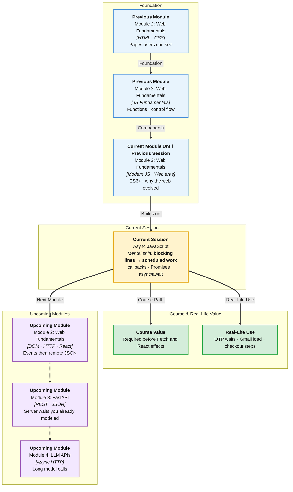

# Pre-Read: Async JavaScript

## Session Mindmap

This diagram shows where this session sits in the course.



## 1. What You'll Learn

In this pre-read, you'll discover:

- How **synchronous** code runs line by line, blocking the next line
- How **asynchronous** code schedules work for later without freezing the page
- How **callbacks** and **Promises** with `then`/`catch` handle "done later"
- How **`async`/`await`** and **`try`/`catch`** make async code readable
- How **`setTimeout`** and Promise patterns work in the **browser**

---

## 2. Detailed Explanation

### One-line definition

**Synchronous** means "now, in order." **Asynchronous** means "start now, finish later, then continue."

### Relatable analogy

Sync is a single-file queue at a ticket window. Person two waits until person one finishes.

Async is ordering food with a buzzer. You sit down. The buzzer rings when the kitchen is done.

The **browser** must stay async for waits. If JS froze the tab for three seconds, buttons would not click.

### Why it matters

> **In the Real World:** **Gmail** loads mail in the background. **Uber** waits for GPS and then the map. **Hotstar** buffers video while you still click pause. None of that is line-by-line blocking.

**Benefits:**

- Pages stay clickable during waits
- You can chain "when data arrives, then update UI"
- You can catch failures without crashing the tab

### Sync vs async execution

**Synchronous:**

```javascript
console.log("A");
console.log("B");
```

Always `A` then `B`.

**Asynchronous with `setTimeout`:**

```javascript
console.log("A");
setTimeout(() => console.log("B"), 0);
console.log("C");
```

You see `A`, `C`, then `B`. The timer callback waits even if delay is `0`.

**Mental model:** JS runs one thing at a time on its main thread. Timers and later network calls **queue** callbacks.

### Callbacks

A **callback** is a function you pass to be called later.

```javascript
function afterWait() {
  console.log("timer done");
}
setTimeout(afterWait, 1000);
```

**Messy:** Nested callbacks ("callback hell") — hard to read.

**Clear:** Promises and `async`/`await` (same idea, cleaner shape).

### Promises, then, and catch

A **Promise** is an object for a future value. States: **pending**, **fulfilled**, **rejected**.

```javascript
const later = new Promise((resolve, reject) => {
  setTimeout(() => resolve("ok"), 500);
});

later.then((msg) => console.log(msg)).catch((err) => console.log(err));
```

- **`then`** — run when fulfilled
- **`catch`** — run when rejected

### async/await and try/catch

**`async`** functions return Promises. **`await`** pauses *that function* until the Promise settles. The rest of the page can still run.

```javascript
async function load() {
  try {
    const msg = await later;
    console.log(msg);
  } catch (err) {
    console.log(err);
  }
}
```

**Python comparison:** Similar idea to waiting, but Python `time.sleep` **blocks** the whole script. Browser `await` waits without freezing other events.

### Browser patterns

Use **`setTimeout`** to delay UI messages. Use **Promises** when you wrap a future result. Next sessions will attach this to **Fetch**. This session stays on timers and Promise chains.

**Final small example:**

```javascript
function wait(ms) {
  return new Promise((resolve) => setTimeout(resolve, ms));
}

async function demo() {
  try {
    await wait(300);
    console.log("ready");
  } catch (e) {
    console.log("failed");
  }
}
demo();
```

### Building blocks

- [ ] I can predict `setTimeout(..., 0)` order with logs around it
- [ ] I can write a Promise and chain `then`/`catch`
- [ ] I can write an `async` function with `await`
- [ ] I can wrap `await` in `try`/`catch`
- [ ] I can explain why the browser needs async

---

## 3. Practice Exercises

**Exercise 1 — Predict order**  
Write `console.log(1)`, `setTimeout(() => console.log(2), 0)`, `console.log(3)`. Predict the output. Run it.

**Exercise 2 — Callback**  
Write `setTimeout` that logs `"hello"` after 800ms. Use a named function as the callback.

**Exercise 3 — Promise then/catch**  
Create a Promise that `resolve("pass")` after 400ms. Log it with `then`. Add `catch`.

**Exercise 4 — async/await**  
Rewrite Exercise 3 as an `async` function with `await` and `try`/`catch`.

**Exercise 5 — Reject path**  
Change the Promise to `reject("fail")`. Confirm `catch` (or `try`/`catch`) logs `"fail"`.
